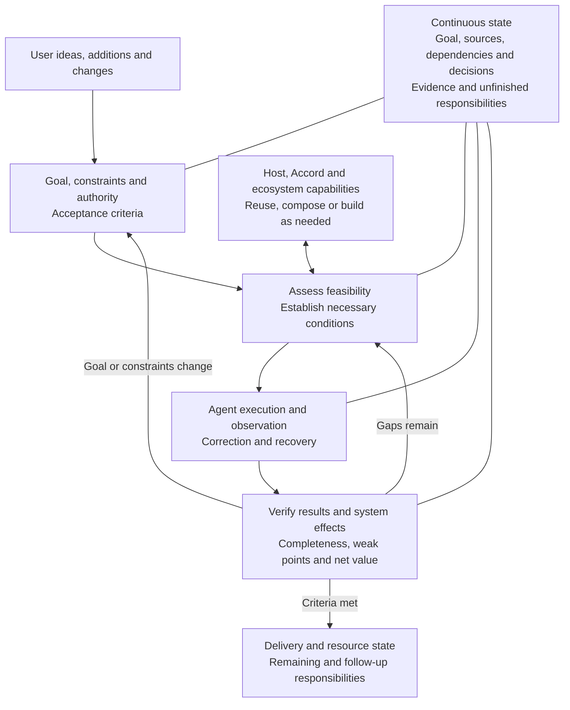

# YIYUAN Accord

<p align="center">
  <a href="https://github.com/yiheng8023/YIYUAN-Accord/actions/workflows/validate.yml"></a>
  <a href="https://github.com/yiheng8023/YIYUAN-Accord/releases/latest"></a>
  <a href="https://github.com/yiheng8023/YIYUAN-Accord/stargazers"></a>
  <a href="https://github.com/yiheng8023/YIYUAN-Accord/network/members"></a>
  
  
  <a href="LICENSE"></a>
</p>

<p align="center">
  <a href="README.md">English</a> | <a href="README.zh-CN.md">简体中文</a>
</p>

Accord provides coordination and reliability support for long-term human–AI collaboration. When a user presents a goal or initial idea, the Agent clarifies the requirements, assesses feasibility, establishes necessary conditions, and owns authorized execution, correction, recovery and result verification. Users should not need to learn tool coordination, configuration, model routing or task handoff first; experienced users retain control over their own actions and changes of direction.

The project is open source and not driven by profit. It aims for industrial and commercial production quality, equitable access and user autonomy. Project decisions are guided by user interests, verifiable value and sustainable maintenance. Commercial funding and platform relationships do not change its supplier independence. Its general collaboration design is separate from host adapters; native and mature external capabilities are used according to their actual value.

> **3.3 is in development; acceptance and publication are unfinished.** This version focuses on OpenAI execution environments with real delivery value and a feasible way to fulfill the necessary collaboration duties end to end. Web or cloud location, plugin installation and Hook support do not individually determine suitability; ordinary Chat is not a default standalone deliverable. Support claims require both a suitability decision and actual acceptance. Claude is outside the 3.3 distribution scope; this implementation focus does not change the project's independence.
>
> The [3.3 consensus node and plan](docs/operations/PLAN-v3.3.md) is the current entry for design, the system diagram, historical disposition, outstanding work and completion criteria. [v3.2.1](https://github.com/yiheng8023/YIYUAN-Accord/releases/tag/v3.2.1) remains a historical release baseline; its exact tag defines its scope and evidence, not 3.3 support.

## What problem it addresses

An Agent may do substantial work while losing the goal, overlooking part of a message, dropping unfinished responsibilities after interruption, or treating local test success as completed delivery. Users then become tool coordinators and recovery operators.

Accord aims to return those duties to the Agent: interpret continuous input, research and establish feasible conditions, compose host, Accord and external capabilities when needed, correct affected earlier judgments and artifacts, and verify outcomes and resource state. Explain only decisions, authorization or personal actions that actually require the user.

These are goals to verify continuously. World-class quality is an ambition; actual maturity depends on ordinary-use results, reliability, user burden and total cost.

## How it works



This overview shows Accord's coordination duties and their feedback relationships. The [detailed system view](docs/operations/PLAN-v3.3.md#稳定关系与动态方法) and [development dependencies](docs/operations/PLAN-v3.3.md#工序与依赖) remain in the consensus plan. Implementation and acceptance progress are described under [current evidence](#capability-limits-and-current-evidence).

Starting conditions, process and results form relationships that can run in parallel, nest and feed back. Semantics explains changes, events trigger relevant reassessment, and negative boundaries protect goals, authority and evidence. Routes remain task-dependent. Deterministic local procedures can be standardized without prescribing one fixed end-to-end SOP.

A plugin is the delivery form for a particular host. Accord's responsibilities span user intent, the host and surrounding capabilities, and actual results. Important decisions, state changes and feedback need working connections, without requiring every call to pass through one proxy or granting authority above the user or host. Confirm the intended outcome when a user action has material consequences and ambiguous intent; respect clear choices and do not silently restore user settings.

Adaptation addresses the environment actually encountered. Accord should use the host's existing authorized capabilities to establish missing conditions, verify that they work and provide recovery paths: a host-assisted bootstrap. Users should not have to reset to default settings. Development isolation helps identify causes; adaptation and bootstrap still require evidence from real tasks.

Knowing its own conditions, maintaining coherence, governing its work, learning, correcting errors, recovering, providing verifiable evidence and improving over time are supporting capability dimensions. Cognitive monitoring and adjustment need working execution, feedback and recovery; engineering bootstrap does not require subjective consciousness. Experience must be validated before reuse, judgments and results remain open to counterevidence, and improvements must detect regressions and allow harmful changes to be reversed. These are [design and acceptance directions](docs/operations/PLAN-v3.3.md#自举的能力维度与证据), not a claim that all eight are implemented.

The current development package participates through a Skill, native event hints and optional task-state mechanisms; repository tools check contracts and evidence. Visibility, invocation, execution and reliable effects are separate. Component count, runtime needs and implementation form follow demonstrated gaps and lifecycle costs.

When its input Hook is enabled, the development package retains received native input text in the existing local task receipt for recovery. Each receipt is bounded to 8 MiB; text is read on demand and follows the receipt's existing task lifecycle. This local copy may contain sensitive text. It is not a complete conversation or progress record, and does not establish new authority. See the [architecture](docs/architecture.md#current-candidate-and-scoped-connections) for retention and failure boundaries.

Host buttons, menus, shortcuts, settings, task and project operations, models, permissions, memory, automations, execution environments and extensions all belong in discovery. The currently exposed tool list is not its boundary. The Agent assesses each capability's purpose and conditions, activates it when useful, and verifies effects and exit state. Coverage does not require enabling everything; unknown is not covered.

Managing the ecosystem is also a core duty: plugins, Apps, Skills and MCP capabilities have combinations, dependencies, conflicts and lifecycles. Check installation, context exposure, connections and running resources separately; choose suitable scope, activate and reuse when needed, and retire unnecessary exposure or activity instead of accumulating global residency. Preserve user choices and dependencies still serving other tasks, and verify actual release. Uninstalling does not establish that content already loaded into context has disappeared.

## Capability limits and current evidence

3.3 has bounded observations for ordinary tasks, input correction, file state, context assessment and controlled takeover. Complete ordinary-entry behavior, autonomous continuity, recovery, environment changes and system impact remain unaccepted. One entry, version or configuration cannot validate another; development scripts, controller assistance and explicit prompts do not demonstrate ordinary autonomous use.

Accord does not train models, expand native context windows or bypass host permissions and interfaces. The Agent investigates feasible alternatives and missing conditions; real limits must still be reported with unfinished responsibilities preserved. A reference core or prompt alone cannot guarantee execution or enforce permissions.

Intervention can add context load, latency, cost, instruction conflict and maintenance burden. Assess net effects on real outcomes; prefer lower burden for equivalent results, narrowing, replacing or retiring intervention when warranted. Trace and correct effects already caused by a faulty component.

See the [consensus node](docs/operations/PLAN-v3.3.md) for outstanding work, the [acceptance view](docs/operations/ACCEPTANCE-v3.3.md) for criteria and the [historical trial record](docs/operations/PROCEDURE-v3.3.md) for qualified observations. The [changelog](CHANGELOG.md) and versioned releases preserve history; old PASS results do not validate changed bytes.

## Installation and maintenance

The [post-release plan](docs/operations/PLAN-v3.3.md#发布后的部署传播与治理) covers host installation, revised communication materials, OpenAI plugin marketplace submission and project governance. Marketplace inclusion is a future objective, not a completed milestone. Long-term administration should rest with the project or an organization, rather than depend on a personal account as the sole point of control.

3.3 has no accepted release for normal installation yet. For a historical version, verify its matching GitHub Release and immutable tag; do not treat a changing development branch as a stable distribution.

An Agent with suitable capabilities can own installation:

> Verify an accepted exact version and the current host conditions, preserve unrelated configuration and plugins, install within my authority and verify actual participation. Prepare any necessary trust decision or personal action before asking me.

Check registration, installed bytes, visibility in the actual task, participation and effects separately. Hooks require their runtime, native events and host trust. Update, rollback and removal need a healthy executor and recovery path; loaded context, installed state and runtime resources have distinct lifecycles. Historical commands and boundaries remain in the [v3.2.1 README](https://github.com/yiheng8023/YIYUAN-Accord/blob/v3.2.1/README.md); recheck current host support before execution.

## Develop, evaluate or contribute

For this branch, start with the [consensus node and plan](docs/operations/PLAN-v3.3.md) and [continuation](docs/operations/CONTINUATION.md); consult the [machine projection](product/development.json) and [architecture](docs/architecture.md) as needed. Frozen 3.1 authority and Golden Tasks are historical inputs, not current development acceptance.

Maintainer checks do not require plugin installation:

```powershell
python -B -m yiyuan_accord verify-development --json
python -B -m yiyuan_accord verify --root . --json
python -B -m yiyuan_accord host-check --adapter codex --root . --json
```

Use `python3` where that is the available launcher. CI exercises Python 3.10–3.14 across Ubuntu, Windows and macOS, with Node 24 for Hook checks. That is maintainer validation, not cross-host behavior acceptance or an end-user Python requirement.

Publication requires matching release notes, committed and pushed in-scope changes, necessary functional/lifecycle/impact evidence, independent review and hosted checks, followed by publication and public verification of the same commit under the bound human authorization. A frozen candidate is not a release receipt.

See [CONTRIBUTING.md](CONTRIBUTING.md), [SECURITY.md](SECURITY.md) and [SUPPORT.md](SUPPORT.md). In an [issue](https://github.com/yiheng8023/YIYUAN-Accord/issues), describe the desired and observed result, exact version, host/entry, relevant customization and human intervention. Never upload credentials or private raw transcripts.

---

## Vision and collaboration

YIYUAN NEXUS will continue to explore human-machine collaboration and related fields. YIYUAN Accord is not intended to exist forever: it will evolve as frontier intelligence, human and machine capabilities, and patterns of collaboration change. Progress in frontier intelligence both gives Accord new capabilities and continually tests its necessity, boundaries, and real-world value. When its mission has been fulfilled, carried forward by better mechanisms, or is no longer needed, the project should be able to conclude responsibly and in an orderly way.

YIYUAN NEXUS currently has one author-maintainer, with limited capacity, time, and resources. We welcome the community to create and advance it together. Within those practical limits, Accord will continue to be maintained and evolved, with progressively broader host adaptation as an ongoing direction. A roadmap direction is not a claim of current support or a commitment to a release date or compatibility outcome.

See [`CONTRIBUTING.md`](CONTRIBUTING.md) to participate. Submit problems and suggestions through [GitHub Issues](https://github.com/yiheng8023/YIYUAN-Accord/issues).

---

## Community

### Contributors

Thank you to everyone who contributes code, reviews, documentation, issue reports, and evidence.

<p align="center">
  <a href="https://github.com/yiheng8023/YIYUAN-Accord/graphs/contributors">
    
  </a>
</p>

### Star history

[](https://star-history.com/#yiheng8023/YIYUAN-Accord&Date)

---

## Project support and legal

### Project and license

The public project and website are [github.com/yiheng8023/YIYUAN-Accord](https://github.com/yiheng8023/YIYUAN-Accord).

The publisher is [yiheng8023](https://github.com/yiheng8023).

YIYUAN Accord is licensed under Apache-2.0.

Commercial use, modification, and redistribution are permitted under that
license; they do not grant permission to present a modified or redistributed
version as official, sponsored, or endorsed.

The canonical public source is this repository. Official versions are
identified by matching Git tags and GitHub Release records, and each standalone
distributed plugin package carries its own `LICENSE` and `NOTICE` after
installation.

The YIYUAN Accord and YIYUAN NEXUS names and symbols remain separate
trademarks. See [`NOTICE`](NOTICE), [`docs/license-policy.md`](docs/license-policy.md),
and [`THIRD_PARTY_NOTICES.md`](THIRD_PARTY_NOTICES.md).

Community help is provided on a best-effort basis under [`SUPPORT.md`](SUPPORT.md).

### Voluntary sponsorship and support

Sponsorship is optional.

It does not purchase a support SLA, priority, release authority, safety guarantee, governance exception, feature commitment, or influence over technical decisions.

If Accord is useful, you may support maintenance through the repository owner's [published PayPal page](https://www.paypal.com/ncp/payment/LNTF8KXGJXMZY).

<table>
  <tr>
    <th width="300">WeChat Pay (CNY)</th>
    <th width="300">Alipay (CNY)</th>
  </tr>
  <tr>
    <td align="center" valign="middle" width="300" height="430"></td>
    <td align="center" valign="middle" width="300" height="430"></td>
  </tr>
</table>

Verify the recipient before paying. See [`SPONSORING.md`](SPONSORING.md) for the complete terms.

### Disclaimer and compliance

YIYUAN Accord is an independent community open-source project.

It is not an OpenAI, Codex, or GitHub product. Those parties do not sponsor or endorse it.

Third-party names and marks belong to their respective owners.

Users remain responsible for reviewing Agent outputs and complying with applicable laws, contracts, host terms, licenses, and organizational policies.

The software is provided under Apache-2.0 on an “AS IS” basis, without warranties or conditions. See [`LICENSE`](LICENSE).

A full project release does not establish production safety or fitness for a particular purpose.
