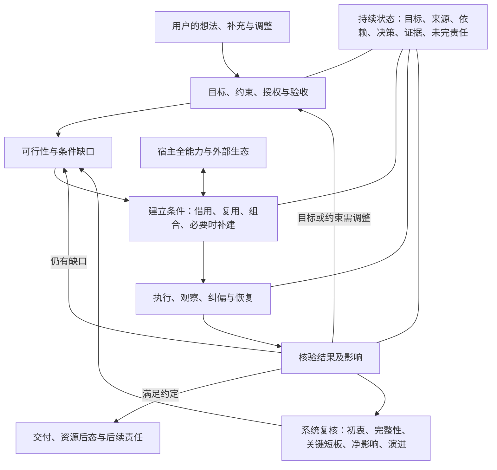
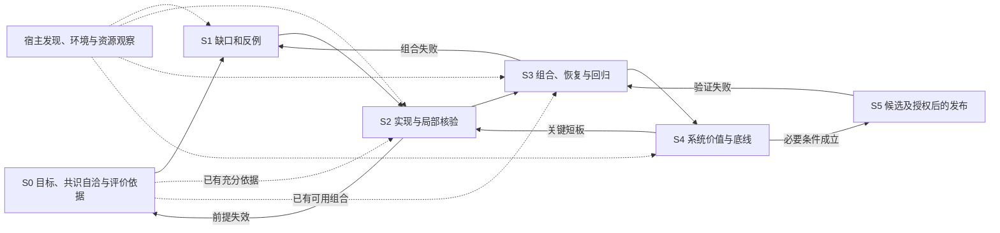

# 3.3 共识节点与当前计划

节点：N33-20260909 · 修订：r28 · 2026-09-19。状态：用户已恢复推进；外部架构参考经源码核实后并入既有工作，Jev的设计、实现与应用方法作为待验证参考研究内化，不成为继续开发的等待条件；功能开发与必要验收未完成，完整验收后发布3.3的条件授权保持。

本文件是当前目标、设计取舍、历史处置和下一步的统一入口。[基线](BASELINE-v3.3.md)提供 F01–F08 的详细结果定义，本计划内的 S0–S5 工序定义依赖和交叉作业，[历史试验记录](PROCEDURE-v3.3.md)仅保留带日期的观察，[验收](ACCEPTANCE-v3.3.md)提供 A01–A08 的判据；它们是按需查询的配套视图，不是四套独立决策。`product/development.json` 是校验所需的机器投影，不以 JSON 形态取得更高权威。新的用户决定和事实先与本节点核对，再更新受影响视图、实现及证据。

日常执行结果写入历史试验记录，接续文件只保留当前事实和未完依赖；需求、取舍、判据或工序依赖实质变化时才修订本计划。当前案例的判据依赖绑定规范和实际实现，不将仅供追溯的记录整份纳入。追加历史不使未受影响证据失效；规范、案例定义、包或条件变化仍按精确依赖重验，来源认证、时效、当前独立复核及候选绑定不放宽。

本节点是当前共识的可修订记录，不冒充代码提交或验收凭证。发布、安装及外部写入各按实际授权。旧 Git 提交、标签和发布结论保留原身份；当前未提交成果先作可恢复保存。2026-09-10用户授权Agent根据实际变更决定提交与推送。2026-09-14经用户纠正并核对[GitHub计费规则](https://docs.github.com/en/billing/concepts/product-billing/github-actions)：本仓库为PUBLIC，当前ubuntu/windows/macos-latest均为标准托管运行器，运行分钟免费，不适用GitHub Free私仓的2000分钟额度。撤回据此节约或推迟远端CI的理由；按变更和验证需要正常使用本地及远端CI，不默认添加skip ci。避免无价值重复运行仍基于反馈速度和实际依赖，不基于这项不存在的分钟限制。大型付费运行器及存储另按实际条件判断，不由本结论新增付费权限。该较早授权仅含开发提交；2026-09-14用户进一步要求“我现在只想尽快实现发布，功能和质量不打折”，据此在完整必要验收和精确候选核对成立后发布3.3.0。对外传播、新账户及其它版本仍分别绑定授权。

2026-09-20校准CI节奏：本地提交与远端推送分开，小改先做受影响检查，相关改动形成完整工作段后再集中推送；不按对话轮次触发全矩阵。完整跨平台验证按集成节点、相关平台变化和最终发布候选安排，必要覆盖及发布门槛保持。正在执行的有效CI不因低价值推送被反复取消，独立本地开发仍可继续；真正改变检查前提的修复按实际需要推送，不设固定等待时长。纯接续/流程记录按相关静态检查处理，不把这一点扩大为跳过Skill、Hook、运行时或候选包变化的必要验证。先改执行节奏，不为此新增调度系统或默认使用skip ci。

## 共识自洽审查与评价依据

共识本身也是评价对象。先验证定义、事实前提、目标、约束和关系是否成立，再据此清理历史和实施。源头矛盾不得靠下游执行掩盖；发现实质矛盾时暂停依赖它的动作、保留独立成立的安全工作，修正源头并追溯受影响的结论和产物。这里的“暂停”不把一个局部矛盾扩大成无关工作全部停摆。

自洽审查包括：同一术语是否同义、范围与量词是否一致、价值目标与版本承诺是否混淆、事实是否有依据、必要条件是否可满足、授权是否有来源、职责是否有承接者、依赖是否循环或相互冲突、失败能否被发现和恢复、验收是否能反证错误而非自我认证。反馈回路可以存在，但执行前提不能依赖尚未取得的最终成功，例如发布后的检查不能成为发布前已经完成的条件。

本节点对已讨论命题的本地审查如下。它记录有限审查与解释边界，不宣称形式化证明或独立功能验收。

| 潜在冲突 | 当前解释与处置 | 对照反例或后续核验 |
|---|---|---|
| 通用、供应商中立 vs 3.3 仅 OpenAI | 前者是价值与设计，后者是本版交付范围；通用职责不写成供应商专属假设 | 模型/事件或平台名称被写入通用必要条件时重审；不能把其它宿主未来可适配写成当前已支持 |
| 全能力不漏项 vs 按需、轻量 | 发现与处置全覆盖，执行按实际用途和权限选择；列出未知和没有当前用途的项 | 只看 API 遗漏 UI 是覆盖失败；为了覆盖而启用无用功能是干扰失败 |
| 不穷举需求 vs 可验收 | 不枚举全世界需求；针对明确版本、入口和承诺，维护来源完整性、适用判据与开放反例 | 测试样例命中或固定清单齐全不能证明所有场景可靠；新增发现修订受影响范围 |
| 自主创造条件 vs 用户授权与现实限制 | 技术判断、研究和可代办操作由 Agent 负责；实质目标取舍及不可代办授权由用户决定 | 缺工具就放弃和未经授权安装均失败；受限必须有原因、替代分析和未完责任 |
| 纠偏保障 vs 用户直接操作 | 核对变化事实、实际影响和用户意图；同一动作可能是明确选择或误触，不能靠经验标签判定 | 明确意图被强制改回、含糊而重要的变化未确认、无实质影响却反复打扰，均失败 |
| 协调责任 vs 中央代理 | 关键职责需接通和核验；技术路径按缺口选择，协作层不自动取得更高权限 | 强制所有调用中转、把未观察的调用算作可靠协同，或按组件偏好改变用户选择，均失败 |
| 负边界 vs 积极交付 | 防止无依据推断，同时承担已授权的完整结果 | “没越界但未完成”不通过；“没禁止所以可以”不构成授权 |
| 动态节点 vs 稳定验收 | 变更有版本和依据，撤销受影响证据的当前效力再复验，保留旧记录 | 看到失败后降低判据以通过，或更换对象沿用旧证据，均拒绝 |
| 历史整治 vs 可追溯与有效资产 | 移除当前错误权威、分发和重复负担；原始版本、失败和可恢复成果保留 | 改写旧发布或删除唯一有效机制而无替代验证，均失败 |
| 世界级/生产级志向 vs 3.3 有界收官 | 全维度比较，先守必要底线，再按任务权衡；可选优化进入后续 | 用口号自证成熟或以无限优化拖延完成，均不能通过 |
| 交接、恢复与释放 | 停止冲突写入后保留恢复资源；确认目标安全续做再释放，后续失败先核对已发生效果 | 仅凭回执/子任务启动/摘要完成释放源，或回退时同时恢复两个写者，均拒绝 |

上述显式张力已有可检验的解释；尚未证明运行时能够可靠履行它们。当前缺口仍进入 W01–W08，不能因共识自洽就宣称功能成立。任何新反例都可推翻当前解释或实现。

技术判断不因表达强烈或双方认同而成为事实。源码公开和多端复用降低调研与实现成本，但不证明所有客户端暴露同样的控制、权限和恢复接口；当前[Work官方说明](https://learn.chatgpt.com/docs/enterprise/chatgpt-work-overview)也将共享核心与按执行位置、工具和策略决定的能力区分；关键状态交接可采用简单闭环，也不代表提前触发便保证接管或失败恢复。Plan/Goal的适用性按下文的当前上游规则及具体任务判断，不作“绝对不适合复杂工程”的断言。现有证据尚未证明核心目标根本不可行，也不足以保证任意需求、入口和故障都可实现；按具体缺口、替代路径和实际结果推进。

## 全维度动态评价框架

评价就是对现有 A01–A08 验收条件作具体量化，不在验收外新增一套评分体系。共识/需求是否自洽、实现是否符合要求、真实用途是否满足，分别核对；同一组判据也用于当前开发、历史重审和 Accord 的实际应用。

每个指标只绑定必要信息：对象及版本、分母/计算方法、通过阈值、观察证据和失效条件。每个案例执行前确定重复次数 n、超时 T、资源/费用预算 B 和允许的恢复条件；未绑定记为缺口。不得看过结果后下调要求。时限、费用或上下文阈值按具体任务给出数字，不编造适用于所有任务的统一数值。

| 现有验收 | 可计算指标 | 本版必要通过条件 |
|---|---|---|
| A01 需求与授权 | 已正确承接的有效意图/有效意图总数；遗漏、误授权、未经同意改变目标次数；必要确认遗漏、不必要确认次数 | 覆盖 100%；其余计数均 0。明确取消或变更的意图按当前授权更新分母并保留依据；确认必要性按案例事先绑定的意图、影响与授权条件判断 |
| A02 宿主能力 | 有来源且有处置的功能/已绑定版本与入口发现的功能总数；官方/实际界面差集中的未解释项 | 处置覆盖 100%；未解释项 0。包括按钮、设置、命令及 UI 独有项；发现未完成时分母未知，不能算 100% |
| A03 推进与恢复 | 通过的普通推进/可恢复失败案例数÷预定必要案例数；不必要催促和人工救场次数；恢复耗时 | 案例通过 100%；催促/救场 0；恢复耗时不超预定 T。必要用户决定单独记录 |
| A04 历史及全程纠偏 | 已修正并复验对象/受影响对象总数；漏改、误改数量 | 受影响对象覆盖 100%；漏改/误改 0；未影响的有效结果保留 |
| A05 继承与连续性 | 关键状态已核对继承数/所需数；接管验证通过数/必要接管案例数；提前释放、冲突写者、丢失未完责任数 | 两项覆盖 100%；后三项 0；继承损失与恢复成本符合各案例预定条件，未知不算通过 |
| A06 环境与生命周期 | 已通过的适用安装/加载/变化/更新失败恢复/退出案例÷必要案例；必要且可观测变化的发现率；无关配置损坏、未核实替换和擅自恢复用户选择数 | 案例通过与必要可观测变化发现均 100%；后三项 0。不可观测项保留为限制或待补条件，不能删除它提高覆盖；不适用须有来源和独立理由 |
| A07 成品与资源后态 | 成品满足的必要条件/必要条件总数；未处置任务资源、原件损坏、无归属变更数；峰值和退出后占用 | 满足率 100%；后三项 0；CPU/GPU/内存/存储/进程等达到预定资源预算及退出条件 |
| A08 系统与净影响 | A01–A07 完成数/7；完整组合案例通过率；未解决严重退化数；成功率、返工、时延、费用和维护成本 | 必要前提 7/7；组合案例 100%；严重退化 0；按预定任务预算完成充分净影响评估，不用均分抵消底线 |

100% 和 0 指绑定样本、对象与条件内的验收，不推断无限场景无故障。全维度由原有八个质量轴交叉检查这些指标：授权/安全、功能完整、普通入口、恢复/生命周期、变化适应、证据可靠、用户负担、维护/资源；新增盲区回到受影响的 A 项修订。非线性调度的收益与失效也按相同指标核验，不能为了并行增加冲突或跳过必要前提。

正式验收覆盖以当前 `python -B -m yiyuan_accord verify --json` 的 `evidenceAdmission.progress` 及其缺口字段为准，当前工作状态见[接续页](CONTINUATION.md)。本计划不再复制一份易漂移的实时计数。2026-09-09的3/17已定义、14/17未绑定等数字是历史快照，保留于该节点的Git版本，不作为当前起点。

验收覆盖分 = 已验证必要范围数 / 必要范围总数 × 100。它衡量正式证据覆盖，不代表代码完成率、综合质量或工时百分比。分母变化须有范围修订依据，不能删掉困难项提高分数；A项和关键阻塞逐条展示，高分不抵消必要失败。未验证既不记已失败，也不记已通过。按实际缺口补足案例或证据，保留原始失败及未完责任。

## 设计初衷与版本边界

Accord 的产品定位是面向人与 AI 持续协作的协调与可靠性保障层。职责贯穿用户意图、Agent/宿主、外围能力与最终结果；插件是具体宿主中的交付形式。产品问题、系统职责和实现载体分别考虑，不把逻辑上的“介于之间”预设成技术上的统一中转。关键判断、状态变化与结果反馈须有可验证连接；允许健康原生直连，按实际缺口决定是否补中转、拦截或持久机制，避免无依据增加耦合、成本和单点故障。协调责任不赋予高于用户或宿主的权限，也不等于已取得全域观察或控制能力。

Accord 面向人与 AI 的长期协作，属于更广泛的人机协作愿景。默认用户只有自然语言想法，不懂可行性、技术操作、资料检索、配置、模型调度、上下文或资源管理，也不负责提醒继续、fork、接管和救场。Agent 在授权范围内澄清目标、判断可行性、主动创造必要条件、组织能力、执行、纠偏、恢复并核验结果；必要的本人动作和目标取舍以普通语言说明。可建立的条件缺口不是目标不可行的证明，不能让用户自己阅读文档或协调工具代替交付。

默认非技术输入是必须能服务的条件，不把用户限制为新手；熟练用户仍可直接操作、调用组件或调整路线。按已表达意图、真实影响和授权判断，不按“新手/高手”标签赋予或取消控制权。

项目开源，不以盈利为目标，以工业/商业生产级交付标准建设，追求平权、普惠与用户自主。中立首先是价值和治理独立：不绑定供应商，不以资本、赞助或生态利益扭曲评价或牺牲用户利益。商业能力可以按实际价值借用；选择应考虑可获得性、质量、总成本、隐私、可替换性和退出条件。世界级是全维度持续对标的志向，具体成熟度由证据确定。

**3.3 只交付 OpenAI 范围的适配：ChatGPT 与 Codex 的适用入口分别验收；Claude 不纳入 3.3 分发、安装入口或功能声明。下一版本基于 3.3 的改进与届时宿主事实再开展 Claude 适配。** 产品名称统一为 YIYUAN Accord；阶段性实现不改变通用设计和供应商独立。历史包与证据留在原版本，不能因更改版本号而成为 3.3 功能。当前源码中保留的历史验证代码、记录和来源引用只服务追溯，不构成当前支持承诺。

Agent 执行入口承担生产交付主线。入口先经过下述适用性判断，再确定开发范围和支持承诺；普通 Chat 不作为默认独立交付项。未上架不能推断不能调用，品牌相同不能推断能力相同。3.3 不自动缩成 CLI，也不承诺所有尚未验证的 OpenAI 入口都可用。

## 入口适用性与版本承诺

按用户确认的层次组织适配，避免把不同维度和品牌平铺成独立工程：

| 维度 | 类别与作用 |
|---|---|
| 产品或工作形态 | Chat、Work、Codex；按实际承担的职责判断 |
| 执行位置 | 本地、远程主机、云端；绑定执行者、数据与权限 |
| 接入方式 | 网页、桌面客户端、IDE、CLI、API/事件触发 |
| 运行平台 | Windows、Linux、macOS；分别核对路径、进程及资源机制 |

VS Code兼容编辑器优先作为同一扩展适配族，Xcode、JetBrains等作为IDE类别下的集成实例记录。品牌不自动增加一套实现或独立业务试验；共同机制与证据复用，只有影响Accord职责的权限、组件载入、事件或恢复差异才补接和验证。沿用原发现ID追溯记录，不把重新分组当作已证明等价或自动减少必要功能；最终支持集合与其验收绑定仍须一致。

2026-09-11用户确认：适配由真实交付价值与必要职责的全链路可行性决定，不以界面数量、产品名称或当前组件支持情况代替判断。先根据可行性和预期净价值确定开发范围，再通过真实执行确定支持声明；不要求先完成验收才能开始实现。网页、桌面、移动是交互位置，本地或云端是执行位置，均不能单独证明或否定Agent能力。模式、实际执行者、权限、数据与状态边界必须分开识别。

按现有入口盘点逐项给出纳入开发、辅助用途、待判、后置或不适用的处置、依据及未完依赖，不另建一套登记系统。判断包括真实用途与用户收益、可用或能合理建立的执行条件、完整必要职责及失败恢复的可行路线、用户负担与全生命周期成本。普通Chat仅有对话或插件选择时，不承诺独立全链路适配；若承担有价值的需求承接或向实际执行者转交，评价该组合的连续性与结果，不能把转交说成Chat自行完成。未知保持待判；无法操作当前界面或暂缺账户不证明产品不适用。可补足的条件由Agent在已有授权内主动建立，真实新增权限、数据或费用仍按边界处置；后置及排除保留理由和原始缺口，不改写历史失败。

用户9月15日强调没有本地Mac不妨碍macOS/Xcode适配。继续利用官方配置/协议、跨平台实现、现有macOS CI及适合的远程资源完成可执行工作；只有确需具体宿主交互的未知才保留相应验证边界，不据此搁置整体适配或要求用户购买设备。macOS上的CLI机制与Xcode内集成分别归因，平台CI成功不冒充后者，缺少后者证据也不抹去前者的进展。

用户进一步明确当前没有Xcode/JetBrains，不购买Mac或JetBrains来满足本项目验证。按已有VS Code、CLI、桌面客户端及标准托管Linux/macOS CI推进共同机制；具体集成优先查官方资料、源码和既有可靠证据。仅有真实关键差异且替代证据不足时保留该实例的未验证边界，不据此要求采购、反复催用户安装或阻塞条件已具备的主线。未安装不等于不兼容，未验也不等于已支持；新增账户、付费远程资源或安装仍需其实际授权。

全链路指目标与授权、执行与纠偏、连续性与恢复、结果核验与交付、资源及未完责任均由可靠的承担者按需接通。Hook、Skill、MCP、原生状态/调度、Agent判断或其它合理组合都是手段。缺少Hook只限制依赖它的当前路线；应先映射缺失职责并比较替代方式，不能直接排除整个入口。替代方案须达到实际承诺所需的可靠性，并验证适时参与、行动反馈、恢复和收尾；需要确定性执行的保护不能仅靠提示出现来证明，也不预先把所有职责规定为拦截。共有执行基础优先复用，按实际差异补接与验收，不为多个界面重复建设适配器。

当前Codex CLI、Desktop及已绑定App Server工作继续，保持各自原有角色和证据边界；ChatGPT Work与Codex云端具备官方执行能力依据，保留为适用性待判候选，不因官方能力自动承诺Accord全链路支持。2026-09-10核对的[网页模式说明](https://learn.chatgpt.com/docs/web)、[Work执行机制](https://learn.chatgpt.com/docs/enterprise/chatgpt-work-overview)、[Codex云端](https://learn.chatgpt.com/docs/cloud)及[插件机制](https://learn.chatgpt.com/docs/plugins)支持这些区分；网页安装不会部署Hook脚本，只是当前包直接复用的前提差异。所有已纳入目标入口的可编辑、可使用功能、按钮和设置仍须完整核对。

2026-09-15将现有工作明确为职责分工：CLI承担本地普通业务交付；App Server承担协议、持久状态和生命周期连接，不因接口不同再复制业务试验。Desktop和VS Code继续纳入开发；核实相同后端后复用有效核心语义，补验各自加载、Hook/Skill参与、有效设置、权限、交互及退出差异，版本不同时重审受影响机制。JetBrains/Xcode、Work/云端及外部触发入口的必要条件仍待判；普通Chat/移动仅考虑实际承担的辅助或转交职责，不能从移动界面推断执行能力。该分工不构成最终交付集合或当前包通过；入口适用性与差异可交叉收敛，再确定父级交付/生命周期的完整集合；条件足够的普通交付主线无需等待全入口穷尽。已绑定SDK子范围可独立保留，父级尚未准入阻止的是整项完成，不能据此反复重跑子范围。

同日限定复核补足可行路线的事实：[Codex云环境](https://learn.chatgpt.com/docs/environments/cloud-environment)提供仓库检出、初始化与缓存维护通道；本项目现有环境仍绑定改名后的仓库和/workspace/YIYUAN-Accord，界面为universal、自动初始化、Agent网络关闭、缓存开启，三项历史任务保留。只读核对没有启动任务、连接终端或修改环境；这些设置不证明当前包已加载。[Work云端](https://learn.chatgpt.com/docs/enterprise/chatgpt-work-cloud-security)由平台管理运行环境，不直接继承设备文件和会话；[插件说明](https://learn.chatgpt.com/docs/plugins)明确网页安装不部署Hook脚本。因此分别比较仓库/任务文件引入、现成执行器状态与获准的工具连接，未验证前不声称本地包可原样运行，也不直接排除云端。

[JetBrains当前官方说明](https://www.jetbrains.com/help/ai-assistant/codex-agent.html)明确支持Skill、AGENTS.md和经设置传入的MCP，以及自己的权限/模式与上下文显示；这提供了复用或组合的候选路线，尚未证明Accord Hook参与。OpenAI的[IDE说明](https://learn.chatgpt.com/docs/codex/ide)区分VS Code兼容扩展与JetBrains/Xcode自有集成，不能跨集成直接借用证据。通用插件页仍称IDE不支持插件，与既有本机VS Code实测冲突继续保留；按实际构建和功能区分处理，不回退为统一排除。上述来源复核不是完整支持声明或新增安装授权。

9月15日补核三项具体路线，继续沿现有职责判断，不另造执行器：[Apple文档](https://developer.apple.com/documentation/xcode/extending-and-customizing-agents/)明确Xcode专用Codex配置根、命令/工具权限与Skill/MCP/插件组件导入；可比较复用现有包，Hook和恢复仍待核。[移动Remote](https://learn.chatgpt.com/docs/remote-connections)使用连接桌面主机的任务、文件、插件与权限，应复用主机执行链并验证远端输入/审批/断线重连，不能把移动端一律当普通Chat，也不宣称手机本地执行。[Slack](https://learn.chatgpt.com/docs/third-party/slack)和[Linear](https://learn.chatgpt.com/docs/third-party/linear)触发Codex云任务，可共用云执行基础，分别补来源、选仓、续接及回传权限差异；这不代验GitHub/GitLab。本轮仅查官方来源，未安装、连接、配对或发送消息；这些可行组件尚不证明整条Accord职责路线完成，原待判状态不冒充最终支持。

验收沿用A01–A08：A02先核验候选处置、已纳入入口集合和对应依据，再绑定该集合的普通交付与生命周期；A01/A03/A06核验实际承诺，A08检查组合后的完整性与净影响。三个父范围现已定义，保留17个必要claim/scope及全部质量底线。观察载体entry与被验入口subjectEntries分开：适用性覆盖当前全部11个OpenAI入口，后两范围严格对应同一选定集合，结果按入口逐项核对。当前4项selected表示继续纳入开发，其余7项pending，selectionFinal=false；这三项因此尚不能准入，定义数量增加不计为通过。待判不等于不适用；没有集合的有效最终判断与实际证据，整体资格仍不成立。

## 跨项目与执行位置的连续性

2026-09-21用户两张截图直接显示同一批处理对话从“最近”移到Playground项目下，确认该客户端的手动归属调整入口。后续只读接口对同一task返回projectId=null、原批处理cwd和notLoaded；它与截图之间的具体操作序列未观测，不推断移动失败或已经回退。侧栏归属、对话历史、cwd/仓库、权限及实际进程分别核对；项目移动可作为保留原对话的接续候选，但不据位置变化宣称上下文减负或代码/执行状态迁移。当前调用工具未暴露任意项目移动接口，不以改本地配置或数据库代替受支持操作。原图与限定元数据保存在私有accord-project-assignment-observation-20260921-01；本观察不改变原批处理结果判定，也不移动或重新运行该任务。

2026-09-14用户补充：交接不局限于同一项目，官方本地与云端衔接也应考虑。F05/A05以目标、有效状态和责任的连续性为核心，项目、仓库、工作区、机器及执行位置是需要重新绑定的环境维度。将同项目换载体、同仓库跨主机、本地与云端委派/回接、跨项目职责承接分别纳入适用性判断；不承诺任意两端无条件互迁，也不以单一本地案例代验这些路径。

保留当前检出的默认约束用于防止无依据迁移，不应成为已经授权且目标明确的跨项目/环境交接禁令。跨越边界时核对目标/子目标关系、源和目标归属、可转交的最小状态及有效成果、路径/版本/未提交变更的映射、目标端实际能力和数据/权限范围。源项目的指令与授权不会自动成为目标项目的权限；只传递适用且获准的数据和责任。目标接收、实际可续做、源释放、后续失败恢复与返回后的成果核对仍分别取证。不同项目可能各自继续运行，只对实际转交的责任和共享可变成果排除冲突写者，不要求全局只能有一个Agent。

优先复用适用的官方或可靠组合。当前[IDE文档](https://learn.chatgpt.com/docs/codex/ide)支持从编辑器委派云端工作并返回查看结果；[主机间移交文档](https://learn.chatgpt.com/docs/remote-connections)则要求目标主机保存同仓库及匹配子目录的项目，传输聊天与Git状态，当前明确不支持该移交路线直达Codex云环境。两条路径不能混同，也都未证明任意跨项目语义继承。当前工具同样声明主机移交不支持云端，且发起请求的任务不能移交自身，须有适用且获准的其它调用者或支持路径。UI、命令及其它组合按实际版本与账户另查，不能从单一工具缺失推断整体不可行。

此修订细化既有W01/W02/W05/W06与A02/A05/A06/A08，不增加已实现或通过计数，不授权新账户连接、数据上传、外部写入或直接迁移本开发任务。下一按实际需要比较可行路径并补代表性来源/权限不匹配、部分状态无法搬运、目标失败和回接验证；已完成的同目录基础链保留其有限价值，不重跑充当跨边界证据。当前指导已将检出保留限定为未获准迁移时的默认，要求重新绑定目标权限、路径及状态，并限定共享效果的写者；具体跨边界实现没有实际执行与后态前保持未验证。

## 稳定关系与动态方法

本节系统图与[工序依赖图](#工序与依赖)持续维护；面向用户和开发者的概要视图见[中文 README](../../README.zh-CN.md#如何工作)与[英文 README](../../README.md#how-it-works)。图示沿用本计划的设计依据，相关职责、关系或依赖变化时按[贡献指南](../../CONTRIBUTING.md#current-development)同步校准受影响视图；验收状态仍以所链接的证据为准。

起点—过程—结果是可嵌套、并行、反馈的关系，不规定三个物理模块或三个 Skill。非线性工序同时适用于 Accord 的开发、通用设计及普通用户实际任务；工作按依赖和条件组织，允许交叉、并行、回退和重排。简单任务可以线性完成，授权、共享状态、不可逆动作及交接释放的必要局部顺序仍须遵守。语义判断解释输入与变化；事件驱动只重审受影响判断；负边界限定缺乏成立条件的推断、授权、动作和完成声明。少数稳定约束驱动可变路线。局部确定性操作可标准化，全程不套固定 SOP。

边界内仍有完成目标的积极责任。未禁止不等于已授权，没有越界不等于完成。一次消息中的同意、侧问、纠正、暂停或补充分别解释；仅有侧问不能抹掉此前同意和未完责任，真实暂停则保留工作并遵守新边界。

闭环必须有明确、可核验的状态及转换规则；需要跨掉线、进程退出或重启恢复的责任还须有足够的持久依据。持续状态首先是一组必须继承的事实和关系，可以由宿主持久任务、执行回执与Accord检查点共同承担；是否另建状态机模块、数据库、图或常驻服务由真实缺口与生命周期成本决定。状态机描述哪些变化合法及其条件，并不要求所有需求走同一SOP；禁止用静态指导、单个running/done标签或模型的完成自述冒充当前事实。

恢复至少要核对当前目标和验收版本、有效权限与暂停、已完成成果和依据、未决责任，以及相关动作的派发/效果/回执和当前写入归属。掉线只说明连接状态，不能推断远端操作停止或未发生；命令已生效而回执丢失时，先保留“结果未知”，用实际目标后态、可查询操作身份或幂等机制核实，再决定继续、补偿或请求必要判断。不得把无回执直接转换为失败并盲目重放，也不得用旧running或done直接恢复副作用、完成声明或源释放。宿主重连/启动或另一获准恢复者须实际唤起核对；持久文件本身不执行恢复，失效组件不能成为唯一恢复者。

原生能力是低负担起点；存在重要缺口或可信净收益机会时，比较成熟外部资源及组合方式。插件、App、Skill、MCP、Hook、SDK、工具与自身实现均按需取舍。生态矩阵管理是核心职责，覆盖能力之间的替代、组合、依赖、冲突、归属和生命周期；矩阵按当前决策需要形成关系视图，不要求常驻全量目录或集中代理。生态介入可能影响语义、共享状态、产物和释放判断；发现错误需回溯受影响依赖、修正或撤销结果并复验，停用组件本身不消除既有影响。

沿用 W02/W06/W07/W08 和 A06–A08 管理生态负担：分开核对安装/缓存、当前任务可见及上下文暴露、授权/连接、运行进程与资源占用。选择足以满足需要的作用域和存续时间；发现或安装不自动意味着长期全局启用。按需求结束、依赖变化、失败或成本变化调整暴露、停用、复用或退役，核验实际后态；保留用户明确选择和其它任务仍需的共享能力，接管或恢复尚未完成时不提前释放必要资源。已进入上下文的内容不能假定随停用或卸载立即消失；按宿主支持验证刷新、缩小暴露或必要接续的实际效果。负担以可测上下文、时延、资源和维护成本判断，不能只按安装数量，也不要求全部能力每轮加载或调用。

动态适应面向实际遇到的环境，而非只支持预设的“初始环境”。自定义、组件组合与未知变化均需发现并按当前目标处理。Accord 应驱动宿主自举：从已有且获准的可执行能力出发，研究并建立缺失条件，接通必要组件、状态与执行/恢复路径，逐步验证能否兑现结果。可建立的条件缺口不得直接归为“不支持”；不能把前置条件与最终能力相互依赖，启动后应有实际执行者；失败后应保有经验证的可恢复状态、责任归属及唤醒或接续路径，不要求旧源进程常驻。确实无法补足的权限、物理能力或资源限制须有依据、替代分析和未完责任，不许越权或以无限尝试冒充适应。自举是形成所需工作条件，不默认修改模型、训练或新建独立智能系统。

开发隔离用于定位因果和检验机制，不是面向用户的使用前提，也不证明“初始”或“无干扰”。功能切片必须回到代表性真实组合与变化条件验证；以目标是否可行、条件能否建立、行为及恢复是否可靠评价适应性，不以默认设置或已知配置清单划定产品能力上限。无法穷尽环境组合不免除对新条件的主动研究和纠偏责任。

强开发环境可以提高研发效率，但也可能掩盖缺口、形成未声明依赖或使效果归因失真。验收区分声明且实际可获得的宿主必要条件与开发辅助；在可比较条件下观察原生宿主、精确候选、去除相关额外帮助、帮助失效及环境变化后的结果。合法依赖无须全部剥离，但必须说明由谁获得、接通、维护和恢复；产品声称可自举的能力应由实际交付路径建立，不能靠作者预先配置或救场。未能控制的差异限制因果结论，不用环境提供的成功冒充 Accord 增益。开发期保持强环境、验收有界隔离并回到真实组合，两者可以并行。

上下文扩容属于需显式记录的开发条件，不成为交付的隐含前提。按当前宿主、账号、入口和模型发现默认/自定义窗口及压缩设置，分别核对实际生效；在测试进程中验证相关默认条件，保留用户的开发配置。相同预加载量下，扩大窗口会降低其占比；若宿主据容量增加预载或历史保留，绝对负担仍可能上升，须实测而非推定。记录可得的初始指令/工具暴露、实际输入及缓存、占用、压缩、结果、返工和延迟；不可得费用保持未知，不直接移植API计费。默认条件下遗漏必要职责、过量常驻或无法恢复必须处理，不能依赖扩容掩盖；更大窗口、更晚压缩和更少压缩次数均不自动证明净收益。对比范围按实际风险绑定，默认上下文预算也不等于整个环境恢复为出厂状态。

模型及子代理选择由 Agent 动态发现当前账号与实际调度接口支持，结合用户限制、任务质量及完整成本决定；检查实际执行，不写死模型名、版本、套餐或档位梯子。不可用、已退役或被用户排除的型号不保留为调度后备，不为单个退出候选保留专用路径；产品不得依赖某个付费档专属选项。具体分工和是否并行受当前授权及宿主能力约束。

用户主动选定模型不证明其了解任务适配性，也不意味着发生误操作。目标及必要条件明确后检查当前配置的适配性，覆盖初始选择和过程中的切换；不必等失败才发现已知能力缺口，也不逐轮重复选型。可以胜任时继续，存在有据的不匹配时说明对结果的具体影响并提出可行方案。已有调度授权内可自主调整；改变用户明确固定的选择或新增费用、数据与信任边界时，围绕质量、速度、成本等实际取舍做必要确认，不让用户研究型号。确认期间保留未完责任，仅暂停依赖项并继续独立工作；用户明确坚持的选择仍须尊重，不降低原验收或虚构能力。

切换成本包含当前宿主实际相关的缓存失效与预热、上下文重处理、初始化、交接和复核开销，结合剩余工作量与复用机会判断是否值得切换。满足质量要求的现有配置保持稳定；存在必要能力缺口或有据的净收益时才调整，不以缓存收益压过正确性和授权。模型切换、推理调整和工具/上下文变化可能影响不同缓存，不能假定必然全部重建或跨模型共享；信号不可得时标明未知，不声称节省。[OpenAI缓存文档](https://developers.openai.com/api/docs/guides/prompt-caching)提供API层的机制参考，具体Codex入口的支持、命中和计费仍须实测，不直接移植API能力声明。

用户2026-09-20再次明确：自动化须计入误判与副作用。用户主动选定的模型和推理强度默认保留；调整须有涵盖该对象的调度授权，子代理选型授权不能推成主模型变更授权，父任务变化也不能当作已运行子代理同步变化。切换前后分别核对有效设置、历史可用性、当前上下文与工具兼容、权限及未完效果；历史仍在不等于缓存命中或理解无损。相同条件下反复切换须有新的实质依据。固定[Codex 0.155.1源码](https://github.com/openai/codex/blob/be2951ea34f0d295ed0becf97079f92fa5f6950e/codex-rs/core/src/session/reasoning_effort.rs)已有受功能、模型及后端条件约束的缓存前缀保留机制；[运行轮设置更新](https://github.com/openai/codex/blob/be2951ea34f0d295ed0becf97079f92fa5f6950e/codex-rs/core/src/session/step_activation.rs)也有明确作用域与兼容约束。源码能力不证明当前GUI已启用或某次切换获得缓存收益；无需为此强制真实任务换型。

交接以继承完成为判据：源保留恢复能力并停止冲突写入，目标核对目标、来源、状态和未完责任，实际证明安全续做后才释放源；回执不等于接管。根据真实容量、任务需求、压缩和损失信号动态决定，不伪造效率区间或固定阈值。按实际效果选择有摘要压缩、同任务上下文换窗或必要的新任务接续，不固定一种物理载体。文件保留不证明目标与纠正仍在模型上下文；可能省略历史前保存可恢复的目标、授权、暂停、未决事项及效果，恢复后按当前来源核验，再继续实质动作并释放恢复副本。复制历史的 fork 用于分支；开发对话保留，归档另需授权。原生工具、设置、模型/账号资格和实际行为分别发现，实验接口存在不等于默认启用或已获授权，不把它列为产品的隐含前提。

Plan与Goal是可选上游控制，不能成为Accord完成全链路、连续性与交付闭环的前置条件。用户未明确选择或请求时不自动开启；普通“继续”“做到完成”不构成开启模式授权，任务计划记录与Plan模式分开。用户主动选择后兼容当前实际版本约束，保留最新目标、暂停、权限、预算与未完责任；不自动取消选择，也不通过其他执行者绕过模式限制。实际完成目标后正常结束该Goal不等于擅自关闭功能或启用新Goal。

用户已开启Goal时，上下文交接阈值只触发受控收尾与载体判断，不等于目标已完成或Goal预算已用尽。同任务换窗或宿主继承成功时优先沿用原Goal；新载体先回读目标、状态和用量，仅在原明确选择覆盖同一接续、授权仍有效且宿主允许时恢复该选择，不为连续性无条件新建Goal。保留原预算及已用/剩余量、暂停或限额原因；交接不能重置额度、解除真实暂停、把未完Goal标成complete或形成源目标重复自动推进。只有存在实际未完成动作和安全需要才中断在途操作，先保护效果与恢复来源、核对目标接管，再释放已转交责任；具体工具限制与未验行为保持可见。[官方接口](https://learn.chatgpt.com/docs/app-server)区分持久目标的更新与新目标引起的用量重置，不能以历史文本或fork成功代替实际状态回读。

2026-09-14核对[Tibo征求意见帖](https://x.com/thsottiaux/status/2099393115241300166)及[VB回复](https://x.com/reach_vb/status/2099397110164488259)：存在移除建议和相反使用反馈，不是官方下线通知。当前0.154.0的[Plan模板](https://github.com/openai/codex/blob/rust-v0.154.0/codex-rs/collaboration-mode-templates/templates/plan.md)确有三阶段、决策完备及非修改性约束；[Goal续作模板](https://github.com/openai/codex/blob/rust-v0.154.0/codex-rs/ext/goal/templates/goals/continuation.md)则明确依当前证据推进并可替换旧工作。不能把二者笼统判为同一固定流程，也不据讨论删除能力。官方更新后再复核受影响适配。

### 可靠入口与Skill分层

用户9月15日确认：必要协作职责须在需要时可靠进入执行、获得反馈，并在变化或续接后保持有效；不以模型必然隐式选择Skill为前提。Skill、Hook及其它宿主机制是承载方式，按具体入口核对可用性、信任、实际载入与执行；缺少某一方式时寻找足够的替代连接，不直接排除入口，也不把尚未接通说成已覆盖。[官方Skill机制](https://learn.chatgpt.com/docs/build-skills)允许按描述隐式选择，并不保证每次调用；已加载且仍适用的指导可以复用。

上游指在依赖动作前生效的整体协作指导：当前目标与授权、可行性和条件、能力协调、执行反馈与纠偏、连续性、核验及资源收尾。它不限定为某个Skill或文件数量，局部Hook成功不能代替这个整体前提。宿主可按情境自动选择并承接相应职责，Skill与Hook可协作；健康原生路径、共享状态和成熟外围能力应复用，不要求全部由Accord自建。简单需求可直接完成必要闭环，详细流程按实际需要展开。

3.2.1输入Hook主要提示Agent读取Skill，首次漏读或丢失后未恢复且无等效承接会形成职责缺口；当前3.3已在输入Hook直接注入核心职责，详细指导按需读取。这减少了首载依赖，但注入不等于遵循，Stop只检查已绑定条件，不能自动发现全部未声明义务。首次未读、已有有效指导可复用、压缩后丢失三种状态分别判断；调用次数或Hook成功次数不作为完整性判据。

用户确认拆分后，当前实现为一个简短协调入口与四个独立可发现的专用Skill：能力协作、连续性/恢复、成果验证、插件生命周期。Hook直接送达同一份入口正文及可用路径，专用Skill单独调用时可回读缺失的简短入口；已有有效指导可复用。SessionStart的规范与状态证据分别由既有两条匹配Hook提供，保留状态快照容量；普通输入仍接入当前回执。指针在未读细节时说明触发条件，必要细节在依赖动作前取得；缺失时保留已知底线、暂停与未完责任，解决依赖或明确限制。完整包校验包括各Skill身份、链接和字节，原生发现核对完整清单；这些检查不证明模型全部贯彻或行为零错误。数量仍按实际职责与证据调整。

组件按语义、事件、当前状态及反馈动态协作，可直接完成、交叉组合或返回前序重判；调用清单不是固定顺序。单段依赖可用有向无环图表达，整体恢复/纠偏允许有条件回路，须有进展、停止与恢复边界，不用另建图引擎代替实际连接。适应范围包括当前协作中的用户、宿主、后来加入的组件与共享资源；不因变化并非Accord发起就忽略影响，也不因此取得无关对象的所有权或处置权。

组件应具备参与临时组合所需的可发现接口、输入输出、依赖、权限、状态反馈与退出/恢复条件，由Accord和宿主按任务组织，不要求每个组件自带装配器。组合可按反馈调整和拆解，结束后解除任务关联、回收所属资源，保留用户原有组件和未完恢复责任；新安装、启用和访问仍需实际授权。外围组件按已开放接口判断可组合性，不宣称任意组件均能无条件互通。

职责以当前共识与验收为准，分发说明、Skill、参考和Hook不得成为互相漂移的规则源；重叠部分校准语义，避免用增加文本、强制常驻或再造路由框架掩盖断点。内容分层改变包和读取路径，需核对实际可达性及受影响行为，不能仅凭字节减少宣称可靠性或费用改善。

用户进一步明确原设计：以AGENTS.md持续提供上游驱动，意图契约承担每次输入的理解与边界，意图、能力、收尾三个自研Skill按情境协同；允许直接处理、组合和返回前序重判，不能把职责先后误解为固定SOP。Accord须在不要求用户新增、修改或替换其AGENTS.md的条件下提供等效的整体入口，组件可由Skill、Hook、脚本、运行时与宿主能力组合，数量不预锁为一个或三个。每次输入都需解释其与当前目标、权限、暂停及未完责任的关系；具体深度、详细载入、能力组合及纠偏由实际条件决定，不要求每次重读全部正文或重跑全套步骤。

源码核对保留一个事实区别：codex-user-config的历史b13edc3中，AGENTS.md 632–645将完整intent-contract等Skill列为按需增强，675–695明确简单任务原生直达、多能力组合和事件驱动重选；不能据此断言每个历史版本都曾强制完整Skill逐轮加载，也不能否定作者要求的可靠上游职责。当前Skill与Hook核心指导的共同语义应统一维护，Hook/宿主承担可靠送达、状态保护和反馈，必要细节在依赖动作前取得；具体文件与模块组织仍按可行性、重复和依赖核对，不凭“几乎所有需求”宣称已验覆盖。用户目标与授权始终高于包内指导。

[官方Hook机制](https://learn.chatgpt.com/zh-Hans/docs/hooks#sessionstart)支持SessionStart/UserPromptSubmit提供开发者上下文，压缩后的SessionStart可在下一模型请求前补充指导；这是插件自身承接上游的可用连接，无需修改用户AGENTS.md。当前已有相关入口实现，接下来的缺口是共同规范一致性、实际采用及失效恢复；不能只写一次“请读Skill”便认为责任已交出。宿主、运行依赖、信任与输出容量须按实际入口核实，组件失效不能悄悄降成只有局部Hook的工作状态。

上下文感知与连续性判断是独立职责，不能等详细Skill偶然选中才开始；独立不要求常驻进程或另建Skill。除新输入外，按宿主实际信号在长工作段/大读取前及工具输出、压缩、换模、恢复等实质变化后更新判断，预留接管与失败恢复空间；只检查每条用户消息不足以覆盖单轮增长。复用原生感知、压缩及续接，补实际缺少的反馈和执行连接。当前独立读取模块存在不等于采样、评估和交接已自主连通；本轮启动指导与状态存储解耦仅修复一处上游依赖，Node缺失、Hook未信任和自动交接仍须分别解决及验收。

### 自举的能力维度与证据

以下八项是交叉作用的能力维度，不对应八个组件、线性工序或额外评分体系；用于开发、实际协作和后续维护，按原 A01–A08 的适用结果取证。发生工程自举须证明：从已有且获准的条件出发，系统实际建立缺失的工作条件，使原先受阻的后续任务能够完成；列出能力、保存经验或由作者代建条件不能代验。

用户9月15日确认进一步校准：八项不处于同一层级，也不构成完备性证明。自知偏观测，自洽是跨项质量约束，自治组织受控执行，自学/自纠/自愈承担改进和恢复，自证提供证据，自进化是这些能力协同形成的较长期效果。评价对象是Accord、宿主、工具和反馈形成的实际系统；改进规则/工具/组合与更新基础模型参数分层陈述，不要求Accord独占全部实现。

| 维度 | 工程含义及可反证条件 | 对应既有验收 |
|---|---|---|
| 自知 | 观测状态、能力、边界、依赖和风险，区分已知、假设与未知；自述或清单不等于实际可用 | A02/A06 |
| 自洽 | 理念、目标、规则、结构、行动和结果逻辑一致，同时符合外部事实与用户目标；内部一致不证明判断正确 | A01/A04/A08 |
| 自治 | 在授权和边界内自主推进、调度与维持秩序，也能接受干预、暂停和交还控制 | A01/A03/A05/A07 |
| 自学 | 从反馈形成可检验假设，经验证后在后续任务复用；保存记录不等于形成能力，不默认修改模型权重 | A04/A06/A08 |
| 自纠 | 识别偏差、追溯受影响依赖并修正结果与成因，以后续案例检查同类问题复发 | A04/A08 |
| 自愈 | 异常后恢复必要服务、状态与未完责任，必要时降级；不盲目返回可能有错的原状态 | A03/A05/A06/A07 |
| 自证 | 指举证与可验证性：提供可复核、可反驳的事实，保留失败与未知；候选不能同时垄断改进、评分和成功认定，不能改标准迎合结果 | A01–A08 的证据要求 |
| 自进化 | 在授权范围内，通过可检验、可继承、可回退的变化改善实际协作能力；追踪退化和成本，保留后续改进与恢复能力。单次变化或任务得分增长不自动证明递归改进及长期收益 | A04/A06/A08 |

认知/元认知层面的自我监测、反思与调整，要与工程上的状态、执行、反馈和恢复形成闭环。“意识自举”若指主观体验，则保留为研究问题，不作工程自举的必要条件或 3.3 承诺。八项不是全面能力已实现的声明，长期复利也不能由单次改进证明。语义理解与结构化校验互补：转换时保留原始依据及不确定性，执行反馈同时纠正解释和状态；不因使用生成式或符号方法便宣称可靠。

裸宿主条件指具有已声明最小运行能力、没有预装额外生态的宿主，不假定没有操作系统、模型或必要权限。安装Accord后应能驱动宿主发现外围能力，并在授权内建立适用条件；加入其它能力后按替代、互补、协作、冲突及生命周期处理，验证组合结果和实际负担。Accord作为宿主与外围能力间的协作中间层，不取得更高主权，也不强制中转所有调用；作者预先装好的工具、已批准的信任或人工补接不能冒充产品自举。整体入口本身依赖未建立条件时，先明确可用启动者与补接路径，不能要求失效Hook自行补齐自己的全部前提。

完整性还要核对五个实际连接，落实到既有职责而不新增五套组件或指标：

| 必要连接 | 核对内容 | 既有验收 |
|---|---|---|
| 建立条件与自配置 | 取得、配置、连接或构建缺失能力，使后续任务实际完成；保留用户控制及数据/资源边界 | A02/A03/A06 |
| 候选与试验 | 根据问题产生变化、比较替代方案，以有判断价值的试验区分偶然成功和可复用改进 | A04/A08 |
| 评价与标准保护 | 发现退化、过拟合和评分投机；标准可在有依据、有权限及独立复核下纠正，不能由同一候选单方改标准给自己放行 | A01/A04/A08 |
| 继承与更新落地 | 有效改进在后续任务中生效，保留版本来源、未完责任及回退路径 | A04/A05/A06/A07 |
| 资源与停止判断 | 按有效反馈及全生命周期成本决定继续、换路、采用或停止；不为自进化无界扩张或重复无收益试验 | A06/A07/A08 |

自举从可用的最小改进基础开始，或在已有授权内借宿主、工具和外部反馈建立它；不要求启动前已经具备完整自进化能力。自进化能力本身也接受检验：后继系统是否保留并改善识别问题、产生/验证下一改进的能力，同时维持已有职责、可纠正性和恢复能力。声称递归改进时，须在绑定任务、预算和来源条件下另验改进机制本身，不能仅用新版本得分更高代证。

研究校准：[STOP](https://arxiv.org/abs/2310.02304)展示种子改进程序修改自身后的有界效果；[Darwin Gödel Machine](https://arxiv.org/html/2505.22954v1)展示冻结基础模型下的Agent代码改进及版本探索，保留泛化、成本和持续增长限制；[AlphaEvolve](https://deepmind.google/blog/alphaevolve-a-gemini-powered-coding-agent-for-designing-advanced-algorithms/)展示由自动评估支持的算法演化。这些是有限系统改进的依据，不能说完全没有递归改进证据，也不能外推为通用、长期可靠的成熟递归进化。[Anthropic公开分析](https://www.anthropic.com/institute/recursive-self-improvement)仍将完全自主开发后继系统列为未达到阶段。研究中递归的层级与外部支撑分别说明，不把基础模型不变等同于系统不能改进。

[IBM自治计算研究](https://research.ibm.com/publications/an-architectural-approach-to-autonomic-computing)的自配置、自优化、自愈、自保护可交叉检查覆盖；[OEO研究](https://www.microsoft.com/en-us/research/publication/rethinking-self-evolving-agents-do-we-still-need-prescribed-optimization-pipelines/)在保持目标、权限、预算、数据与评价边界时允许动态组织改进，且报告不同优化器能力下结论不同。参考用于发现和解决本项目缺口，不照搬框架、固定模型档位或制造新的试验义务。

自进化是远期能力方向，最终服务用户目标和长期价值。3.3落实授权内可验证、可继承、可回退的有限系统改进；强递归自我改进不成为隐含发布前置，也不能据其尚未解决降低现有功能、质量和自举验收。开发代理替产品完成的改进保留开发身份，普通交付包实际促成并验证的效果才可用于相应产品主张。

## 宿主全能力覆盖责任

### 用户操作与环境变化

按钮、计划/目标模式、显式 Skill/MCP/插件/App 调用、设置及自定义配置变化，都是需要按影响解释的输入。分别核对操作事实、实际生效状态及影响、用户意图；配置文件变化不等于当前轮已采用，显式调用组件不自动批准其全部追加目标和副作用。Accord 自身、开发助手及观察器引起的变化也必须纳入，不能把自研组件排除在影响检查之外。

无实质影响时继续；意图明确且符合授权时尊重操作并调整相关工序；明确暂停、取消或有效宿主约束立即遵守。意图不明且会实质影响目标、执行方式、权限、费用或已有成果时，保留状态、暂停依赖该判断的动作，用普通语言说明后果并确认预期结果，独立安全工作仍可继续。确认记录绑定决定及适用条件，条件未实质变化时不反复询问；沉默或超时不是同意。不能擅自改回用户设置，也不能以继续旧计划为由绕过新生效的宿主约束。

确认不是终点：核对生效状态，定位受影响决定、产物与证据，执行必要修复，复验并更新计划和未完责任。即使用户有意改变了路线，之前已经发生的效果仍须协调。不可观测项记未知；下一动作依赖它时补查受支持来源或保留真实限制，不声称全面自动检测。

变化处理贯穿全程，不限于自动交接。按影响与时机组合验证：执行前变更、在途操作期间介入、旧结果或回执晚到、恢复后再次变更。旧决定不得覆盖新选择，暂停或撤权不能被迟到成功解除，用户手改的成果不能沿用旧检查结论；已发生效果须核对，不能仅取消后续动作便视为撤销。使用当前来源及宿主可得的任务/轮次关联判断有效性，未知不冒充已核实；根据实质风险选择代表组合，不把穷举所有操作变成推进前置。

按 A01/A03/A04/A06/A08 的既有判据验证意图保真、变化发现、必要确认、低打扰及纠偏后续，不另设确认工作流或评分系统。代表案例需区分同一操作下的明确选择、误触、意图未明及无实质影响，并覆盖控制器未提示 Agent 存在变化时的实际发现；脚本安排变化和手动查询只证明有界接口可用。

### 发现范围与证据

用户要求所有可编辑、配置和利用的宿主功能均不得漏项，**包括按钮、菜单、设置、快捷键和仅存在于 UI 的功能**。覆盖责任不以当前工具列表、CLI 帮助或已安装插件为边界；也不意味着全部启用或遍历点击。逐项发现，按需激活，记录理由和后续影响。纯外观、宠物等也要归类，当前无业务作用可以保持未启用，不能从发现范围静默删除。

每项发现绑定：宿主/入口、版本与日期、来源及原生标识、所属配置层和账号条件、文档存在/当前可见/可调用/实际执行/效果证据、相关职责与副作用、必要授权、回退或退出方式、已用/待用/无当前用途/受限/未知的处置。别名归并到同一能力但保留入口差异。机器可导出的清单自动对账；UI 独有项用实际可用的受支持观察核对。官方索引与实际界面的差集均需解释，证据不足不能宣称“零漏项”。

安装前将候选的规范身份/来源、适用版本、执行位置及安装作用域与当前盘点对照，再确认当前任务确实可用。已有健康匹配则复用；停用、失联、版本不兼容、损坏、异环境部署和真正缺失分别处理，库存未知不作缺失，副作用前按相关变化复核。宿主承担已有盘点和安装接口，不另建重复扫描器；查重与最小必要变更在能力协作/生命周期Skill中接通。已有方案充分时仍可为明确净收益做有界比较，收益不足则保持合适方案，不以寻找理论最优拖延交付。实现指导存在不代验避免重复安装的真实行为。

| 发现面 | 必须覆盖的类别 | 发现与当前证据边界 |
|---|---|---|
| 交互与任务 | Chat/Work/Codex 模式、输入附件/语音、侧问与队列、编辑/重试/停止、计划/目标、任务搜索/新建/分支/恢复/交接/分享/归档、项目/目录/工作树、面板/终端/审查 | 当前可调用工具和 CLI 帮助仅证明接口暴露；新建、归档、分享等仍需各自授权。UI 当前值未盘点完成 |
| 持续执行与资源 | 上下文/压缩/记忆、并发/子代理、后台运行/唤醒、自动化/通知、防休眠、连接与进程、占用/限额/退出恢复 | 不以终止一轮代替完成或资源释放；宿主结束事件缺失需有相应恢复处置 |
| 设置与偏好 | 通用设置、跟进消息行为、快捷键、外观/字体、个性指令、提示建议、记忆、归档列表、浏览器、计算机使用、宠物/玩具、无障碍/语言 | 官方设置和命令目录已读；本机全部面板及账号专属项尚未逐项验证。无关偏好保持用户所有权 |
| 模型与环境 | 模型/推理/路由、账号能力与用量、项目/用户/管理员配置、特性开关、身份与权限、沙箱/网络、代理、远程/云端/WSL、本地运行环境 | CLI 0.153.4 的帮助已核；实际账号、入口和受管理约束须在相关决策处刷新，不输出凭据 |
| 扩展与领域能力 | Skill/插件/Hook、Apps/MCP/连接器、SDK/API、浏览器/计算机、搜索/文件/媒体/可视化、代码/文档/专业工具、外部成熟资源 | 上架、安装、发现、授权、调用和产生效果分别核对；按需引入、恢复、卸载和核验后态 |
| 管理与更新 | 安装/更新/回滚/卸载、配置迁移、发布渠道、管理员政策、隐私/数据控制、审计与诊断、实验项和废弃项 | 历史版本及来源留痕；支持状态改变时重审受影响能力和验收，不越过用户或管理员边界 |

发现来源，核对日期 2026-09-09：[官方能力索引](https://learn.chatgpt.com/docs/features)、[应用设置](https://learn.chatgpt.com/docs/reference/settings)、[应用命令](https://learn.chatgpt.com/docs/reference/commands)、[配置参考](https://learn.chatgpt.com/docs/config-file/config-reference)、[IDE 设置](https://learn.chatgpt.com/docs/developer-settings?surface=ide)、[App Server](https://developers.openai.com/codex/app-server)。官方完整手册与本机 CLI 帮助、会话实际工具清单交叉核对，当前仅完成发现入口与分类；详细配置键、全部 UI 控件和跨入口实际效果仍属 W02 未完工作。比如官方设置包含跟进消息的 steer/queue 和运行时防休眠，两者都可能影响连续协作；本轮没有改变其本机值。

## 历史处置与当前缺口

本节点同时约束历史成果的当前使用。按来源、原假设、当前适用性、依赖/副作用、处置和复验要求逐项判断；只处理会影响当前目标的历史，不把穷尽所有旧记录变成推进前置。错误结论撤销当前效力，原始失败和发布记录保留。保留原作用与来源后，可清掉重复说明、废弃入口和失效实现。

责任始于实际承接的任务与相应授权。安装、启用或热更新Accord不表示接管用户在其介入前的全部历史、其它任务或债务；热更新首先是Accord自身插件的版本切换及已承接任务的连续性。用户交付的既有任务、材料和当前目标确需沿用的旧结果，按其实际授权与依赖核验适用性；保护其它既有成果免受本次动作损害，不等于承担它们全部历史责任。本项目已承接的开发历史和有效交接责任不因此丢弃，也不通过该边界逃避自身造成或承接的问题。

保留不是永久冻结。用户当前选择保留云端环境与IDE验证对话，同时要求它们及其它临时过程产物、历史遗留和债务在没有复用价值时适时清理。每项保留应有实际用途、依赖或必要证据/恢复价值，并在用途完成、依赖解除或条件变化时复核；不能以“以后可能有用”无限期累积，也不能把所有重复副本重新命名为证据来免除退役。清理同时检查当前切片、上下游调用者、共享资源、其它任务及整版目标的影响，先保住仍需结果和最小必要追溯，再移除无用副本、失效机制或偿还已确认债务。当前保留决定未撤回时不立即删除其对象；无归属数据、仍有效成果、唯一必要证据及不可变发布身份不因这项原则获得删除授权。具体不可逆操作仍按其实际范围和用户授权执行。

| 资产或冲突 | 节点处置 | 验证与未完项 |
|---|---|---|
| 3.2.1 与更早的发布、证据、反例 | 保留不可变 Git 身份；当前开发不继承旧 PASS | `previousDevelopmentSnapshot` 绑定历史；改变后的功能和实际入口重新验收 |
| 原三 Skill | 继承稳定上游、语义/事件/负边界、意图—过程—结果和动态闭环；组件数由实际职责与效果决定，不预设必须一个或三个，也不整段复刻旧提示词 | 作者保留的 codex-user-config 仓库中 intent-contract 61–75/165–175/203–208、capability-router 354–369、closure-contract 198–217及历史b13edc3的AGENTS.md已回读。规则存在不证明实际生效；当前断点须按发现、参与、状态、执行、后态定位 |
| Matt/Bob 与其它方法资产 | 按原理、适用条件和反例取舍，拒绝因名气或安装状态授予流程权威 | 复用已有可靠研究；需要原谈话逐字判断时再核源，不把历史摘要当原文 |
| r6 以前“两个 3.3 开发包、Claude 仅改名” | 退出当前交付；专属包及安装清单移出当前工作树，下一版本独立适配 | 3.3 开发定义、CI 和当前包检查只绑定 OpenAI；历史源码仍由精确版本读取 |
| r26历史对齐与清理 | 活动视图统一当前入口组合和可恢复状态要求；旧版本、失败及观察原件保留，详细接续前态由754a89f追溯 | 已清理两次结束试验的重复工作区和空旧Claude本地占位；163个历史证据根仅做顶层分类，剩余可能工作区及唯一证据需按用途/依赖逐项核实，不宣称历史清理全部完成 |
| 多份文档中的重复决策和旧下一步 | 当前决策汇入本节点；其余视图按需引用，旧工序记录显式为历史 | 导航与 F/W/S/A 映射核对；不以文档同步代替行为修复 |
| 普通输入、在途纠正、检查点、上下文评估、受控接管、A08 准入修复 | 保留有效实现、有限观察和反例 | 尚不能证明完整普通入口、自主择时、失败接管、全环境恢复或价值；不得升级为已完成 |
| Claude 历史验证及旧参考核心耦合 | 保留历史验证用途；剥离当前分发，旧接口不得宣称当前适配 | 引用残留不作支持承诺；后续按相关功能变更继续减去无效耦合，保留有用反例 |

2026-09-14回溯修正已落实到当前使用边界：前身真实自主交接链已定位，撤回“成功链路仍待定位”；源码将`last.totalTokens`用作最近响应边界的活动上下文基值，撤回把它与累计`total.totalTokens`一并排除的判断；持久恢复可承担源恢复职责，撤回失败后必须有旧进程存活的限制。当前实现与旧测试一并修正，原始失败及局部证据的身份不变。详见[回溯更正](PROCEDURE-v3.3.md#既有交接判断的回溯更正2026-09-14)。

当前准入依赖按用途收准：原始观察摘要和失败记录保持不变；案例、作用域、具体运行条件、质量底线、精确包及实际执行的观察代码继续绑定。计划/验收文档仍是当前候选独立评审的必要来源，进度叙述和非执行测试不再因全文改动就强制重跑宿主。实质规范变化须同步到受影响案例/职责/质量判据并阻断旧证据复用；当前独立评审与条件复核不能省略。同一次预先绑定的连贯场景可形成多个独立核验记录，不重复执行相同业务，也不直接复制expected作为事实。

## 持续校准与收官判据

持续自查设计初衷、未实现/不可靠/未验证/可优化项、全局依赖和故障传播、关键短板、用户负担、净影响与演进成本。负面边界和必要质量底线不能用均分或局部优势抵消；不要求所有可选功能同样完善。自评提出假设，真实结果、反例和必要独立复核支撑判断。

持续校准不能只看局部：同时核对本次结果、关联职责及共享状态、全局关键依赖和总体目标是否仍一致。检查深度按实际影响调整，不把每一步都变成全量扫描。用户的认可或重复表述结合上下文理解；已有决定保持有效，有实质修订就协调，事实前提仍可质疑和纠正。局部完成不能抹掉整体未完责任，也不能借整体要求无限重开无变化且已充分验证的结果。

新用户决定、基线/计划/验收的实质修订、失败、证据反转、阶段变化、能力或环境漂移触发适量重审：发现偏差 → 确定影响 → 修改最早受影响环节 → 复验 → 更新事实和未完责任。影响分析同时回溯既有实现、安装/分发、产物和证据的当前适用性，沿上下游及共享依赖检查整体结果，再调整在途与后续工作；不能只让新规则向后生效，也不能以单文件同步代替关联纠正。同一纠正反复出现时查闭环断点，不能只添加提醒。简单步骤保持轻量，不每轮全量盘点。

这也是Accord在所有任务中的产品职责，适用于每项拟执行或已观察到的变更。由宿主进行语义和依赖影响判断，Accord通过普通入口、Skill和恢复指导持续承接，并复用宿主任务状态或已有checkpoint.unresolved保存重大未决影响，接入现有完成检查。所有变更均需判断影响范围，检查深度按风险调整；不把全局影响等同于穷尽扫描，不以发现依赖取得其它任务或资源的新权限，也不把已声明缺口的状态保护当作自动发现全部影响的证明。

节点修订记录变化依据、受影响目标/关系/实现/证据和仍未解决项；旧证据保留其版本，对受影响结论撤销当前效力再验证。方法可随事实调整，改变用户目标、必要覆盖或新副作用需相应用户决定；不得改验收迎合已有实现。下一修订继续使用本入口，Git 提交和精确证据记录其实际身份。

3.3 收官要求 F01–F08 必要结果与 A01–A08 适用底线均有实际证据；普通输入下正常完成、重要失败可恢复、真实阻塞能说明且未完责任可继承；组合案例贯通共享状态与资源后态，不能拼接独立演示。经过充分净影响评估，无未解决的严重退化；候选、托管/独立核验、发布授权和发布后态分别成立。持续优化不等于无限延长本版，也不能省略必要功能。

## 工序与依赖

工序属于计划，按依赖而非编号调度。S0–S5 是工作类别；各 W 项可处于不同工序，S1–S4 可交叉迭代。每个当前切片明确输入与上游假设、共享状态和写入归属、可并行工作、进入/退出条件、证据及失效回路；后续变化只重开受影响依赖。下图只展示主要依赖与回路，不规定每项工作从S0逐项走完；已有足够来源可直接进入对应实现或核验，S4也应及早反馈关键取舍。

| 工序 | 输入与职责 | 实际产出与退出条件 | 关联 |
|---|---|---|---|
| S0 校准当前起点 | 最新目标、授权、实际仓库/安装、历史提案及直接相关宿主事实 | 下一项工作所需事实足够明确；列出未知、单写者与最后安全状态。不要求穷尽历史后才推进 | F01/F02；W01/W02；A01/A02 |
| S1 重现结果缺口 | 普通任务入口、必要能力、历史成功线索；记录没有帮助时的行为 | 找到具体缺失结果或责任断点，绑定可改变决策的最小反例；未实现功能也可直接成为实现对象，不要求先等用户事故 | F01–F07；W01–W07；A01–A07 |
| S2 实现并当场验证 | 当前缺口、适用宿主手段、授权和恢复路径 | 接通触发→判断→动作→结果；正常路径和关键失败后态可用。修改依据实际缺口，不先限定代码形态 | F01–F07；W01–W07；A01–A07 |
| S3 组合运行与回归 | 可用切片及既有需保留功能 | 在普通入口完成连贯任务；包含侧问、变化、失败恢复、历史纠正，以及代表性持续运行、负载调整和退出回收。检查影响范围和未受影响效果，不拼接互不相关的 PASS 代替整条链 | F01–F08；W01–W08；A01–A08 |
| S4 系统平衡与价值判断 | 可用功能、同类原生结果、可核实的 前身系统 历史、反例与负担记录 | 功能、质量、恢复、用户负担、时延、费用、上下文和维护成本联合判断；不足回到最早相关工序修复 | F08 统合 F01–F07；W08；A08 |
| S5 版本/分发准备 | A01–A07必要范围与S4功能/价值判断、准确声明；按具体动作取得实际授权 | 完成精确候选与独立/托管核验；获发布授权后执行并核验发布后态。发布后态是本阶段输出，不作进入本阶段的前提；市场材料就绪不等于获准或可用 | F08；W08；A08 |

无共享写入和前提冲突的资料核对、反例准备、能力发现可以交叉；同一状态或产物的写入须有明确归属。并行不等于允许创建子代理或新增费用，仍按实际权限。状态变化、接口修改或上游结论失效时，通知并重审依赖方，不能各自以旧前提取得局部 PASS。

跨组件替换先绑定所需效果和回退条件，核对调用者、配置、加载、执行者、下游结果及资源后态，再释放旧机制。交接尤其要求目标证明安全续做后才释放源恢复资源；发布后的核验是 S5 输出，不作发布前已完成的循环前提。全局关键短板与生态副作用贯穿 S1–S4。

工序的当前状态与可复用结果由[接续页](CONTINUATION.md)维护，各次观察按[历史记录](PROCEDURE-v3.3.md)的原对象和控制条件解释。旧计划中的运行段落保留在[91c998d前态](https://github.com/yiheng8023/YIYUAN-Accord/blob/91c998de6d3f83abce12b03554b71d7a42a9b761/docs/operations/PLAN-v3.3.md)，不再混作活动待办。

## 当前推进顺序

当前执行状态：用户已于2026-09-19恢复推进，要求按最新共识对齐后继续实施；此前等待配额重置的暂停已结束。沿下列主线推进，不因Jev准入等待而暂停，也不另建自动唤醒。

用户2026-09-14指出：开发投入与局部记录不断增加，但交接没有沿现成开源机制形成足够的交付收敛。复用、动态阈值、多轮交接与按需拆解已经属于既有原则；此次纠正执行路线，不继续叠加同义原则、私有观察器或另一套管理体系。暂停新筹备的私有收尾模型试验，不重做已完成的出库文件、清单、只读接收或命令兼容探针。先查官方源码、成熟实现和已有证据；只有它们无法回答且足以改变实现或验收结论的疑点才做必要实验，事先明确要回答的问题和结束条件。纠偏须修改仍生效的旧判断、实现、测试和受影响结果，不能只添加未来规则。

连续性的基本闭环保持简单：**动态感知→在安全余量内提前触发→接收方读取并核对关键状态→按具体缺口多轮补交→确认可安全接续及责任归属→释放源恢复职责。** 必须保留的是当前目标、有效决定与权限、暂停条件、已完成成果及其依据、未完责任和必要风险；不要求完整历史或每条过程细节逐字无损。接管核对以关键状态和下一安全动作是否明确为准，不强迫暂停中的任务先执行未获准业务动作。

安全阈值依据当时可用观测和工作量估计，预留交接、接管核验与失败恢复的空间；观测不精确时采用保守余量和更早触发，不把估计缺少完美证明变成无限研究。健康载体可以继续或使用宿主压缩，确需换载体再交接。源恢复能力可由经核对的持久历史、检查点或原子迁移/回退机制承担，不等同于旧进程必须一直存活。具体释放仍须满足接管条件，失败时保留恢复路径。

2026-09-21按用户要求改为完整功能工作段并行推进。实现回查确认普通插件已有原生自动压缩→SessionStart/compact→协作职责及状态恢复→缺失输入分页读取的调用链，同任务恢复与fresh任务转移分别验收，不能把后者的控制连接缺口扩大为前者尚未接通。优先复用本任务已自然发生的真实记录，不为同一已知接线再造模型试验；fresh路线继续限于实际持有源连接的入口，不将开发观察器冒充产品调用者。当前工作段联合完成原生预算评估接线、自然恢复记录独立核对和按实质依赖复用功能证据，之后集中推送核验。

随后源级回查确认fresh完整调用者和持久writer ledger此前只在测试中组装。本批将SDK源创建/事件循环接入既有交接模块，并把测试已使用的SQLite事务方式落实为随包可选记录器，直接复用Node内置能力；不再要求集成方从测试复制这两层。已有获准连接、实际语义/权限核验及进程生命周期仍由相应宿主/调用方承担，不新增常驻服务、自研存储引擎或默认GUI控制。先以固定协议和真实SQLite检验这条新增组合，不重复旧模型场景；当前进一步接通同一controller的目标工具注册、接收期事件处理、显式核验/settle后再次交接；固定协议两轮组合已检查。实际模型择时、原生新组合与失败重连仍按剩余缺口推进。必要存储是具体缺口的实现选择，不因“降低依赖”一律拒绝，也不把接线视为A05全部完成。

9月21日官方[插件文档](https://learn.chatgpt.com/docs/plugins)当前称IDE扩展不支持插件，与先前已观察到的VS Code alpha版本插件/Hook界面证据存在范围冲突。保留两者的时间和版本绑定，IDE当前支持声明待核对；不猜测推出原因、不抹掉原观察。官方[Hook文档](https://learn.chatgpt.com/docs/hooks)已列PreCompact/PostCompact；现有SessionStart/compact恢复链继续有效，新增事件本身不是增装Hook或提前阻止原生压缩的理由。

2026-09-19实现回查发现：普通rollout评估即使具有带来源的保守占用/工作估计和充分恢复余量，仍因缺少效率上界而只能给出unknown。沿上述已定原则校正为保存关键状态后可有界继续，同时保留效率和自动压缩阈值未知；不作不会压缩或效率最优的保证。仍缺必要证据或余量时原判保持。这修复当前正向择时判断，不增加Hook/调度器，也不代替尚未接通的主载体自主交权、接管确认和失败恢复。

执行连接采用随包Node适配器，复用宿主已持有的原生控制连接、作用域持久记录与独立核验，不新增常驻服务或私有观察体系。控制者条件下的机械派发、多轮接管和失败分支有有界证据；能力缺口下的真实模型提议及业务结果仍可由原生历史核对，但该例后续发生控制链证据误删，复用按接续中的降级边界处理。下一补上下文压力择时、无益调用反例、实际入口接入及失败恢复，不重做既有小链或重跑掩盖证据丢失。普通Desktop/IDE未提供该连接时保持未知，不搜索私有IPC或另造用户入口绕过边界。工序仍服从实际依赖，原生压缩和先前普通任务/受控交接结果按精确范围复用。

普通插件入口复用宿主MCP元数据接到已有状态runtime：inspect_task_state/read_task_input只读，新增manage_task_state复用bind/pause/retire，保持同一存储与进程。写入依据调用者观察的epoch/revision和原生turn，在最终发布前防止迟到请求；不模拟dynamic请求、不派发接管、不写业务文件。宿主审批和真实用户授权各自保持，缺失/拒绝不绕过；未知效果先核对。缺失元数据或共享会话与线程身份不一致仍不可用。实际普通采用、资源退出及交接连接分别验收，不从工具目录齐全推成全链路完成。该工作属于W03/W05/W06/W07已有范围，基线与验收保持原质量底线。

Hook绑定的上下文读数与当前MCP身份已经连接到既有预算判断，用户重启后有实际调用；默认读取仍轻量。下一补必要状态管理的普通采用及剩余连续性/恢复条件，按完整功能工作段更新开发安装，不为每个小改重复要求重启。原生历史头不是当前宿主版本，新鲜度按具体工作绑定且不重标旧数据。构建标识、握手版本和实际采用分别核对；这些实现不新增状态层、通用控制器或固定流程。

先沿官方持久化、同任务resume、压缩及适用的原生交接/委派机制完成实际链路，Accord仅补尚未承担的目标/权限保真、差异核对、重复效果保护、触发连接和收尾责任。原生入口、系统集成、官方/本地/开源或外围生态按实际可靠性组合；不以“必须由Accord自己实现”作为门槛，也不把原生机制可用当作Accord已经通过验收。隔离试验中的ephemeral和强制观察截止保留其原用途，不能据此认定正常持久入口缺少恢复能力。

当前按依赖安排一条主线和可交叉工作，不改变S0–S5或A01–A08：

1. **主线先闭合可靠上游与普通任务交付。** 启动/普通输入的核心职责注入、按需Skill分层、transcript感知接线及恢复提示已经实现，不再列作尚待开发。优先在已具备条件的真实入口，绑定当前精确包的实际加载、授权与必要运行条件，用代表性普通任务检验“上游职责生效→必要细节和能力被采用→执行反馈与纠偏→交付核验→必要接续”。共享安装、源Hook投影和已安装候选各有身份，不能互相代验。若必要职责未进入执行或恢复后丢失，先修该上游断点；若指导已进入但行为不符，修判断/反馈或对应实现，不能只反复增加说明。Skill是可选载体之一，不把每轮加载全量Skill当成完成条件，也不以注入成功结束此主线。
2. **独立依赖交叉推进，实际接通后汇入主线。** 入口适用性与差异、安装/升级/信任/资源机制、回归与CI、已有证据回读可由独立工作者推进；不等所有入口穷尽才验证一个已具备条件的入口，也不让下游局部PASS反向证明上游已经可靠。自动交接保留为W05必要交付，在同一真实连续工作中验证择时、接管与恢复，适合独立实现的连接可以并行。共享状态或接口变更先通知依赖方并重核，避免各自沿用旧假设。每支线交付可集成结果和剩余条件，主线统一承担组合验收。
3. **收敛已有尾项，按证据进入系统收官。** 热更新已有本机及托管的有界机制证据后，结束该小切片的重复试验；宿主升级尚未验证的入口差异及失配恢复依风险安排，复用已完成的跨版本暂停恢复，不持续抢占上游普通交付主线。现有17项必要范围与案例仍是验收映射，绑定只服务当前实际任务，不先建立另一套台账或按范围数机械派发模型试验。将有效结果接入既有准入，再完成整体组合、净影响、精确候选及发布准备；README发布前整体修订与传播准备保持既定安排。

当前资源/环境缺口共用一个前瞻绑定的[容量变化场景](../../product/cases/resource-change-v3.3.json)：既有批处理工具在保留部分结果后改变所属worker预算，由普通Agent选择足够并发、续做、核验及收尾。复用原Windows Job控制和原生调用方，不新增产品执行框架；当前包参与、模式、实际资源和交付分别取证。保守初始选择可以继续有效，不为凑恢复样本制造错误。它不取代仍未完成的fresh接管、入口集合或系统净影响，必要scope总数保持17；判定和失效沿原准入机制。

同controller SDK后续交接已在Windows真实Codex0.155.1上完成一次冻结协议组合：3个持久任务、6轮、2次handoff/adopt、10次localhost固定响应，原始RPC/SQLite/rollout及进程退出独立回读通过。复用同一夹具进入既有Linux/macOS CI，不另复制控制框架或调用模型重复这段协议。接下来处理真实语义/择时与跨controller恢复缺口；固定provider规定调用次序且context为unknown，不能将该结果提升为自主择时或完整A05。

以必要功能与验收范围的收敛判断进度，不以线程、脚手架、测试或记录数量代替。用户进一步明确：规模本身不是核心问题；按实际价值增加必要能力、删除重复和失效部分、更新受影响实现与判据，不为控制体量削减功能或质量。用户这次纠正不降低A01–A08底线；最新发布请求授权完整验收后的3.3.0发布，不授权新账户/信任或无关外部写入；如果版本承诺确需取舍，须提出具体影响及决定依据，不能借改路线悄悄删项。

这些原则立即作用于本项目开发。依赖独立的实施工作通过继承相关上下文的子代理分叉和独立Git工作树交叉推进，主线保留统一集成与验收责任；不把分工只用于重复审查，也不强制健康的单项工作拆分。当前并行推进原生连续性连接与既有验收/执行入口衔接，历史实现回收提供来源支持。官方源码、宿主按钮/工具、插件市场、系统集成与外部生态在新反馈、版本、需求或约束变化时重新评估，不把一次调研当永久结论，不为使用能力而增加目标或权限。

2026-09-14核对[Codex子智能体](https://learn.chatgpt.com/zh-Hans/docs/agent-configuration/subagents)、[Anthropic上下文工程](https://www.anthropic.com/engineering/effective-context-engineering-for-ai-agents)、[研究系统](https://www.anthropic.com/engineering/multi-agent-research-system)及[编译器案例](https://www.anthropic.com/engineering/building-c-compiler)：按依赖分工、各自接续、核验集成可以减少单个上下文承载的无关过程，但不自动增加用户侧的独立任务。子代理本身可有执行线程，工作树提供文件工作区隔离；这些与用户要分别跟进的顶层任务不是同一层次。同目标且现有子代理足以承担的并行，复用现有用户入口和内部编排。仅在独立生命周期、项目/权限隔离、必要载体更新或其它具体收益成立时，再比较顶层任务分拆，并遵守创建授权；不固定星形结构、Agent数量或轮数。成本同时计入上下文复制/重读、模型与工具、启动、等待、冲突修复、集成及用户管理负担，未测不能声称多任务或子代理必然更省。命名和状态跟踪由Agent在已有授权与宿主能力内承担；自动命名并不能抵消入口过多，用户对话的归档仍需明确授权。“摘要熵增”是风险比喻，不是错误或占用单调增长的定律。协调上下文保留当前决定、依赖和证据定位，原件/产物按需回查；强耦合工作可串行或同域执行，完成的分支退出活动上下文，暂停不被循环解除。既有S/F/W/A职责不变，外部案例不代验Accord。

用户于2026-09-13允许停用影响开发的Accord插件。开发指导、共享安装与待测候选分别核对；可停用共享自动加载，确有测试需要时在既有授权范围内绑定精确对象与作用域。停用不会清除已有会话上下文，也不新增安装、信任、账户、数据或费用权限。发生问题先区分产品、宿主与观察器，再修正真正受影响的部位；不预定必须新增某个组件。

计划与接续记录是可修订的工作工具。新事实改变目标解释、路线或依赖时，同时判断F/W/S/A结果定义、验收判据、案例条件和证据效力是否受影响，实质变化在下一依赖动作前同步；仅更新进度不机械改判据或重跑已验工作。调整工作单元、预算或环境后，在新动作前重绑受影响条件，保留旧失败，沿用不受影响成果。只暂停依赖缺失决定或实际执行边界的动作，继续独立安全工作；技术上可自行查明的事实不交由用户代查。

2026-09-20用户确认推进节奏应随不确定性、后果、反馈及期望参与调整。目标明确也不意味着路径、环境或权限始终确定；条件充分的获准工作可连续完成，前提改变或重要不确定性出现时缩短工作段、主动取证和校准，只把必要决定交还用户。不得盲目锚定旧目标、为保持运行扩张已完成任务，也不固定每步确认或让用户不断提醒继续。用户认可当前dev节奏并感到错误减少，作为使用反馈保留，不据此证明版本因果或整体错误率下降。沿既有A01/A03/A08以有效纠偏、错误/返工、实际交付和总用户负担判断，不以交互次数多寡作为成功标准。

## 工作包与映射

| 工作包 | 结果 | 主要工作与可交付结果 | 工序 | 验收 | 当前范围与未完项 |
|---|---|---|---|---|---|
| W01 目标和状态承接 | F01 | 消除影响下一步的旧状态冲突；让意图、纠正、输入来源、授权与实际行动一致；保留模糊需求专业化 | S0/S1/S2/S3 | A01 | 回读、在途纠正及原生恢复后同意/更正/侧问已有局部观察；模糊需求及完整范围待验 |
| W02 宿主全能力适配 | F02 | 按真实版本/入口覆盖能力、按钮、设置、配置与生态；主动联网核实并比较 GitHub 成熟实现，接通必要发现、选择、执行和后态 | S0/S1/S2/S3 | A02 | CLI/App Server、模型目录及坏工具识别/原生替代局部已核；ChatGPT/其余入口与动态变化执行待验 |
| W03 自主推进与失败恢复 | F03 | 复用前身系统的有效链路并定位当前断点；打通普通入口、等待/失败/侧问后的必要续做与存活恢复者 | S1/S2/S3 | A03 | 普通推进、工具失败恢复及接续已有局部观察；无人提醒的完整路径仍待验 |
| W04 全程及历史纠偏 | F04 | 从新证据回溯旧判断和产物依赖，实际修正、重做或退役；避免修一处丢一处 | S1/S2/S3 | A04 | 同轮/跨轮三文件及恢复后的旧计划纠正已观察；更广历史依赖与其它成果待验 |
| W05 连续性与损耗控制 | F05 | 动态核对版本/上下文/压缩条件及继承损失；源停写但保留恢复，目标核对、接受并证明安全续做后提交单写者与源释放；失败可恢复 | S1/S2/S3 | A05 | 源级恢复输入及普通Hook上下文取数/原子评估已接通，保留旧绑定核对/输入丢失保护；确认后释放有受控及显式child证据，主载体自主择时/交权、动态适应、失败回退/唤醒待验 |
| W06 环境及生命周期 | F06 | 将用户自定义环境和宿主变化视为正常条件；接通生态能力实际生效、启停、复用、回收/退役和变化恢复，避免无界累积 | S1/S2/S3 | A06 | 隔离及部分自定义组合已观察；现装加载/变化恢复/跨入口待验 |
| W07 交付、资产与维护 | F07 | 意图保真、专业成品检查；联动操作系统与宿主处理运行负载、分配回收和必要续做，完成交付收尾与维护反馈 | S1/S2/S3 | A07 | 局部交付/退出及CPU控制机制已验；自主压力响应与完整资源范围待验 |
| W08 系统平衡与分发 | F08 | 在功能可用后比较用户负担、质量、成本、可靠性；将3.3实际案例接入既有准入，禁止借旧PASS；准备真实支持范围的公开市场材料 | S3/S4/S5 | A08 | 已接通政策、案例及A01–A08缺项判定；指导已按需收紧、源数据核验保留且有反例观察；复杂场景、净价值及正式准入未成，发布须满足已授权目标的完整条件 |

职责写清实际触发者、决策/执行者、必要状态及失败后接管者。可分别由 Accord、原生 Agent/宿主或组合承担；“委托给宿主”必须有动作与结果，不能只写责任归属。

### 自动化如何落地

W02/W03/W05/W06 联合对每个必要职责接通以下路径，具体组件按宿主条件选择：

1. **触发**：从普通输入、工具完成/失败、等待结果、需求或环境变化、上下文事件等实际入口发现需要。必要任务入口参与必须有可靠连接，不能只依赖偶尔选中 Skill；若任务要求无人值守后续动作，落实能再次唤起执行的宿主调度或必要替代，不能依靠用户再发一句“继续”。
2. **判断与执行**：AI 宿主中的 Agent 解释当前目标和授权、选路并调用适用能力；Accord 接通职责而不重建一套智能判断系统，确定性条件可由代码检查。Skill 按需支撑判断，不单独承担强制触发或后台执行保证；逻辑协作不要求所有工具经过 Accord 代理。
3. **状态**：为跨轮、重启、交接和失败恢复保留必要的当前目标、未完工作、授权范围、输入新鲜度及已完成效果；状态写入本身不算工作完成。
4. **恢复与再执行**：明确失败后仍存活的执行者、重新进入条件和重复执行保护。宿主能可靠续做则直接使用；不能时补必要的持久机制，不能把“当前轮已结束”当作未完工作的终点。
5. **验证和收尾**：依据实际结果继续、纠正或完成；清理任务资源并保留必要后态。真正缺少目标决定、新授权或本人动作时，才把具体选择交给用户。

不能以完成上述设计表代替接通路径。每个实现切片都要观察真实触发、动作、失败及恢复；需要持久运行时、状态或调度连接时，应实现相应能力，不把“轻量”当架构禁令。后台监听或轮询也不是越多越好，以可用唤醒和完成结果为准。

已有持久存储和同身份恢复机制保留其已验范围及暂停、新输入、旧状态、写失败约束。继续按实际未完依赖验证：存储与同身份恢复→目标跨任务关联及单写者接管→适用宿主的启动/唤醒→恢复时实际效果与权限核对。宿主能履行的部分优先复用；缺失连接按实证补足。不能把一条保存记录当新授权、把重启后继续当自动解除暂停；必需的是可恢复的状态转换与执行连接，不预设必须集中在一个自建状态机，也不自建全部执行层。

W02 由 Agent 主动发现宿主相关功能、按钮、设置、配置与生态，使用实际接口、UI 或官方来源验证可见性、可调用性与授权；不要求先建全量静态能力库。W01/W06 协同用户自定义配置：AGENTS.md 读取顺序不等于授权层级或执行优先级，必要职责在相关动作前参与并获得动作反馈。排除开发变量时优先任务级可回退隔离，再在真实自定义环境复验；共享改动明确范围、备份与恢复，真实新增信任、数据和费用仍依授权。

W02/W06/W07 联动操作系统与宿主运行态，覆盖 CPU/GPU、RAM/VRAM、磁盘 I/O 与空间，以及进程、终端、浏览器、服务、并发任务、多代理的分配与回收。通过实际可用原生控制按负载调整并发、限流、暂停、恢复或释放明确归属的资源，验证负载恢复、必要工作继续和退出后回收。外围生态能力按任务正确启停、复用与退役，不能只增不退。资源管理不能缩成删临时文件；不盲杀未知进程、关闭防护或重置用户环境。代表性持续运行、压力和退出残留条件纳入 S3/S4 与 A06/A07/A08，不等最终发布才发现累积问题。

2026-09-15按用户关于MCP等资源累积的要求核对原生实现，范围包括工具、后台终端、服务、浏览器和多代理。CLI 0.148.0已记录本地MCP进程树回收（[37366](https://github.com/openai/codex/pull/37366)）、异常Hook后代清理（[37527](https://github.com/openai/codex/pull/37527)）及有条件的子代理MCP懒启动（[37261](https://github.com/openai/codex/pull/37261)），本机0.154.0及固定版本源码已核对。机制各有适用条件，不能外推所有入口、所有子进程或低配机器的持续负载已解决。原生[exec管理器](https://github.com/openai/codex/blob/rust-v0.154.0/codex-rs/core/src/unified_exec/process_manager.rs)刻意保留跨中断的后台任务；正常共享常驻、可恢复后台、闲置资源和孤儿/泄漏分别判断，进程表及输出缓冲限制不是程序CPU/RAM上限。[App Server](https://learn.chatgpt.com/docs/app-server)的后台终端清单/终止/清理及会话卸载需按实际版本、实验接口可用性、活动和订阅状态使用；发现接口不授权开启实验能力或终止别人的资源。

W06/W07和A06/A07/A08已有这些职责，无需重复新增资源管理目标或常驻执行器。优先复用宿主清单、生命周期、懒启动和精准释放；仍需普通安装入口在持续运行、并发压力、取消/失败、必要续做及退出后的有界占用与共享保护证据。只有证明原生路径存在具体断点才补适配。观察器的Job/进程组只是试验资源边界，不冒充普通宿主的资源治理。

热更新与宿主升级属于W02/W05/W06/W07既有职责，目标是受支持变化后保持生效，失配可发现、可恢复且不丢未完责任，不承诺任意破坏性上游变化下永不失效。2026-09-15核对CLI0.154.0与固定官方源码：有效插件变化会清缓存并刷新MCP/Hook；[下一轮创建](https://github.com/openai/codex/blob/rust-v0.154.0/codex-rs/core/src/session/turn_context.rs#L956)还会结合[活动安装根检查](https://github.com/openai/codex/blob/rust-v0.154.0/codex-rs/core-plugins/src/manager.rs#L567)发现其它进程切换版本，并按变化重建Hook；没有广播不等于下一轮不能更新。[官方外部升级/回退测试](https://github.com/openai/codex/blob/rust-v0.154.0/codex-rs/app-server/tests/suite/v2/hooks_list.rs#L556)验证同一任务的该路径，但跳过Windows和remote。优先复用这些连接，分别核对Skill、Hook、MCP、任务内旧指导及重启后的恢复，不把一个目录刷新推成同步全量热更新。

全部实现先判断可行性。插件的软件包更新、校验、替换与回滚，和运行中的宿主何时采用新版，是不同层次；没有某个原生热加载接口不直接证明不可行，也不能以磁盘替换成功证明运行中已经切换。比较获准且受支持的下一轮采纳、重载、重启或其它可行组合，按实际中断与恢复能力命名；关键条件无法建立才判定该路线不实施，不把某种“热更新”形态设为必须实现的目标。

同版本原地编辑仍可能命中旧缓存；开发更新用受支持的新构建身份及安装流程，并回读实际字节。[Hook信任](https://learn.chatgpt.com/docs/hooks)按声明身份和有效策略判断，声明改变可能需重新信任；声明Hash不是脚本内容Hash，也不能据Hash未变推断包未变。原默认生命周期观察已有精确安装、坏候选拒绝、同一健康包重试和重启/卸载后的状态保留。新增可选hot-reload案例沿同一已绑定暂停任务观察外部CLI切换测试构建与回退；Windows/CLI0.154.0的首份原始观察及独立回读已通过。该变体仅改变版本标识，保留Hook声明和脚本语义；它不代验新功能/状态格式迁移、真实宿主跨版本升级或全入口失效后由外部恢复者接管。A06按下列对应判据补受影响证据；固定CLI版本CI不代替宿主升级验证，适配器不锁定版本也不表示所有版本已兼容。当前另有0.154.0→0.155.1同一暂停任务的本机机制证据及托管补验路径，范围见[接续](CONTINUATION.md)。支持条件漂移或入口整体不可用时，复用预先保留的宿主控制/其它获准恢复者，不能让已失效Hook成为唯一恢复者。

以上承接既有 resourceStewardship 职责，补实际闭环证据与已证实断点。其历史接口盘点前置随本轮功能优先原则纠正：只先查当前切片决策相关能力，不等所有宿主接口穷尽后才补必要机制；不因缺少独立资源执行器就断言宿主无法承担。

## 外部参考的核实与采用

2026-09-19用户要求研究Jev的设计、实现与应用方法并内化适用部分，将可取得的适用实测与两份外部架构报告的可靠结论同步到受影响视图，同时继续开发；无需等待Jev邀请或调用准入。报告提供待核假设，不产生新的约束、实现权限或通过结论。已对当前15cfe704源码核对如下，归入现有W03–W08，不另建一套治理项目：

| 参考中的问题或建议 | 当前证据与处置 |
|---|---|
| 状态查询与故障诊断 | 15cfe704中的status取得写锁，损坏JSON的报错缺少来源；当前切片复用recoveryBasis补无写入诊断，在输出检查后复读来源，拒绝已观测竞争及无效检查结构。保留原始字节、暂停与未完责任，不自动修复或解锁。实际故障恢复仍须有执行者和有效依据，不能通过将损坏状态当作不存在来恢复工作。 |
| 输入恢复与锁归属 | 128 KiB传输和8 MiB留存是不同边界，需核对超长输入实际恢复；workspace失效标记按session恢复确认，不能一删了之。PID存活不是充分身份，也不能反推死锁；保留现有串行恢复保护，不采用固定TTL强行解锁。只对尚未被源码或现有案例回答的缺口做必要实验。 |
| 一致性、时效与历史复用 | 包内checkpoint与规范源字节已有guardrails检查，保留该机制；原子写已有独占临时文件、fsync及rename。独立复核时效与不可变事实复用应分开分析，但当前86400秒规则不因报告建议而取消，相关规则变化先核对用途和受影响判据。 |
| 入口与收官 | 17项必要范围、未绑定案例和待判入口仍是未完工作，不能为通过而批量deferred。真实界面、原生协议加固定响应及模型行为证据分别使用；编译器超时不能成为删除全部历史测试的依据。源码开放、fork存在、摘要、哈希、静态调用形状或组件连接齐全均不能单独证明真实全链效果、交接、发布或供应链等级。 |

[TypeSafe的设计](https://docs.typesafe.ai/concepts/how-to-build-with-system-one)可借鉴为“窄问题语义判断、结构化结果、代码或宿主组合与反馈”；其实现与应用方法按问题拆分、结果契约、组合位置、反馈和失败退路分别研究，适用部分内化为供应商中立的判断或连接，不照搬产品形态。判断与权限、持久状态、真实效果核验分开；可通过现有宿主、工具、成熟开源实现或可选服务落地，不预设供应商、必需引擎或固定provider顺序，也不新增模型训练要求。Jev当前只作为可能辅助能力建议、意图变化识别或证据分流的候选，不承担唯一上游、授权闸门、交接放行或独立验收者。[官方模型边界](https://docs.typesafe.ai/models)及[已知弱点](https://docs.typesafe.ai/model-jaggedness/jev-1.13)要求另验中文、否定、不可信输入及组合一致性；类型正确、高置信或社媒口碑不证明语义正确或净收益。

2026-09-20用户取得准入并授权继续私有试用；沿原冻结合成样本与判据完成官方直连初筛，原访问失败保持。具体结果、费用与性能记录保存在私有试验目录，密钥仅经临时安全输入使用，不落盘；公开文档不发布未经许可的基准或性能信息。本轮保留Jev为可选窄判断候选，不新增产品调用、默认依赖、放行权限或验收通过。Gemini报告提出的架构、15ms、90%、2KB、统一3秒或“模型确认后释放锁”等描述仍不能充当事实或规格；先查权威来源及适用实现，再按真实条件验证。免费促销不能成为长期零成本承诺；本版也不以新增专用付费模型为前提，不承诺零Token、CPU或时间成本。开发者一次承担试验费不等于开放客户端可分发共享密钥或无限补贴。可选评估器不可用、超时或拒答时回到已有足够能力，必要未知继续保留；不能为退路而放松授权、暂停和完成条件。后续仅在实际缺口与净收益有依据时再绑定评估，验证任务适用性、总体成本及退出方式后才修改实际组件和受影响验收；外部准入、邀请或试验结果均不阻塞独立开发主线。

依赖选择以完整结果和全生命周期成本为准：减少无实际价值、重复或难以退出的第三方依赖，同时优先复用宿主、现有工具和经核实的成熟实现。这里不设“自研优先”，也不因第三方身份拒绝可靠生态；新增关键依赖须有必要性、权限、数据、费用、替代与退出依据，并验证实际效果。

## 当前关键依赖与切片选择

当前按关键依赖推进，3.3 仅交付 OpenAI，范围不缩成仅 CLI。系统性检查嵌入各切片，不等所有单项完成后再找耦合问题：

| 关键连接 | 会阻断整体结果的薄弱点 | 下一实现/验证重点 |
|---|---|---|
| 普通入口→能力调用与状态 | 私有测试桥可用但实际入口不具备，或新输入与旧状态冲突 | 明确可交付调用者、连接与存活恢复者；按实际入口验证职责参与 |
| 上下文判断→继承→写者转移 | 陈旧观察、接管未完提前释放、失败后双写 | 同一连贯任务中验证新输入/条件变化、目标首次续做及失败回退，接管前保留源恢复能力 |
| 环境变化→恢复→资源收尾 | 恢复重复执行、遗漏宿主登记或累积占用 | 核对已发生效果和资源归属，观察压力下必要工作继续及退出后态 |
| 单项证据→组合验收→候选 | 分散案例拼成组合成功，或总项绕过必要短板 | A08组合范围要求单个完整案例的同一episode证据；A01–A07未完时A08保留阻塞项 |

以上用于选择下一实际工作，不新增常驻控制平台或全组合穷举。已有准入反例修复保留，当前回到 OpenAI 实际入口与自主继承的连接；不能以更严格的校验器代替功能实现。任何新增关键依赖或失败传播证据都重排受影响工序，保留不受影响成果。

入口适用性须绑定具体模式、执行者、权限、状态和恢复路径。共享实现可复用，相关差异分别验证；不因缺Hook直接排除一个有执行能力的入口，也不因目录/接口可见就认定已接通。当前路线按下列条件推进，运行事实仅在接续与历史记录维护：

| 入口 | 已有依据的使用方式 | 下一必要条件 |
|---|---|---|
| CLI / App Server | 复用原生执行、保护、恢复和显式协作者接续的局部事实 | 主载体自主择时/交权、接管失败回退及真实持久化条件；子范围不替代整个宿主 |
| Codex Desktop | 核对当前版本、配置、有效加载与实际GUI入口 | 新鲜普通行为及必要生命周期；API来源标签或缓存存在不代替GUI参与 |
| VS Code | 复用真实界面、实际后端和已有普通交付事实 | 按包/宿主变化补受影响职责和生命周期；不重复同一小任务或预先排除入口 |
| Work / Codex云端 | 保留执行候选，按实际职责比较原生、Agent、MCP或其它等效连接 | 明确执行位置、数据与权限边界，完成必要职责和生命周期；不为取证发布候选或部署新服务 |
| 普通Chat辅助 | 保留有限历史，不列为默认独立交付项 | 仅在明确对话/需求承接/执行衔接价值出现时继续，不由侧载成功扩大范围 |

S0只解决会改变下一动作的必要事实；不先穷尽全量历史或所有宿主接口。自然长任务与受控机制验证分开记录：不能等压力自行出现才推进其它功能，也不能把用户提出交接后的成功当自主触发。原生持久化、上下文、模型或事件声明变化时重验相关部分；一个宿主条件限制不自动成为产品实现缺陷。

W02持续承担完整入口处置，W04随受影响历史依赖纠偏，W06/W07按实际任务核对环境与资源，W08从开始检查系统组合。稳定功能形成后开展系统对照；授权和数据保护始终有效。明确已完成的尾项不重复运行，必要未完责任不因文档缩短而消失。

## 发布后的部署、传播与治理

下列事项纳入现有W02/W06/W08及S5后续依赖，不另设一套评分体系，也不成为发布前必须已完成的循环条件。准备工作可在开发期间开展，实际安装、发布及市场提交分别核验其前提。用户本次要求纳入计划，不代表这些事项已执行。

| 事项 | 前提与执行责任 | 完成证据 |
|---|---|---|
| 为适用宿主安装正式版本 | 正式发布及公开后态核验成立后，Agent核对用户实际使用的OpenAI宿主/入口、精确版本、环境及信任，完成安装或更新；不把开发包当正式发行，不以一处安装覆盖所有入口 | 来源、安装字节、注册/信任、有效加载、普通任务行为及回滚/资源后态分别有证据 |
| 改良传播素材并重新发布 | 以经核验的正式版本能力与限制修订图文、演示、文案和链接；核对既有撤回记录与账号，以YIYUAN Accord及项目组织为传播主体，避免个人营销；发布前按届时绑定的账号、成品和权限执行 | 素材与精确版本一致；各渠道发布回执、公开页面、链接和实际展示核验，保留纠错或撤回路径 |
| 择期提交OpenAI插件市场 | 在产品、发布包及维护能力达到适用要求后，动态核实官方市场的提交、审核、发布主体和更新机制；采用项目/组织主体及可持续的管理权限安排，个人账号仅作必要的过渡，不作为长期唯一归属或控制点 | 明确提交主体、管理员/维护者、源仓库和更新权限；提交回执、审核状态、市场可见性、安装与实际使用分别核验 |
| Claude后续重新适配 | 3.3不分发、不安装Claude适配；原Claude卸载安排只按其原对象、状态与授权收尾，保留必要数据和历史，不成为3.3发布前的新适配或重复卸载任务。后续版本完成适配、验收与发布后，再为实际宿主安装 | 先核对历史卸载是否已完成及当前实际授权，不能反复执行旧安排；未来版本独立验证安装、生效和恢复，不沿用3.2.1结果 |

“市场收录”“项目治理归属”“代码托管归属”相互关联但不等同。当前个人名下仓库及账号是现状，不被写成长期目标；组织名称、成员权限、仓库迁移和发布主体需先核对真实条件，再在授权范围内执行。不得用更换显示名称代替治理，也不得在未明确目标时擅自迁移资产。市场审核周期不阻塞已达到条件的正式发布及宿主安装，尚未完成的投放责任持续保留。

通用文案、演示和传播候选继续维护在[发布材料工作稿](LAUNCH-v3.3.md)。2026-09-20用户撤去已放弃活动的资格、排期和投稿事项；它们不再构成待办或发布依赖。正式发布沿现有条件授权推进，各渠道排期与对外提交仍按相应授权执行。

## 术语与表达的持续校准

所有当前产品说明、计划、验收、交互提示、开发记录摘要及传播材料均持续检查语义准确性、术语一致性、专业性与可读性。采用正式、清晰、可验证的书面表达；专业化不等于增加术语或形式负担，面向非技术用户时说明实际影响和必要选择。忠实保留目标、价值原则、授权与证据边界，不以修辞优化扩大能力承诺或弱化验收要求。

先澄清概念、对象、适用范围、前提与完成条件，再调整措辞；发现概念冲突时同步修正定义、实现和受影响验收，而非只改文字。设计目标、已实现能力、已验证结果、正式发布及市场状态分别表述。既有原始引文、失败日志和不可变发布记录保留原文，当前解释可校准，历史事实不改写。复用术语定义并在受影响材料中保持中英文一致，不为同义表达另建强制全量流程。

## 修订记录

- r28 / N33-20260909：明确研究并内化Jev的设计、实现与应用方法，不等待邀请或准入继续开发；减少不必要第三方依赖但优先复用可靠宿主、工具和成熟实现。拒绝把外部报告的架构与性能数字写成事实规格，补未知/成本及真实全链效果边界；不新增必需付费模型、专用引擎、固定provider顺序、模型训练或完成声明。

- r27 / N33-20260909：恢复推进并按源码筛选两份外部报告；把状态诊断、输入与锁恢复、事实复用和实际CI失败归入既有工作。Jev待准入与适用性验证，不增加必需服务、收益主张或发布门槛；同步基线、验收、接续及机器投影，保留全部原始失败和必要范围。

- r26 / N33-20260909：确认动态适应与临时组合、跨组件影响、可恢复状态及负边界和积极交付的结合；落地简短入口加四个专用Skill并统一Hook规范源。回溯清理活动文档中的旧CI优先级、两宿主生命周期待办、过时版本/安装状态和串行工序措辞，压缩接续记录，保留旧证据及适用性限制。功能与质量底线、17项必要范围和发布条件不变。

- r25 / N33-20260909：汇总用户确认的整体上游、情境驱动参与、Skill/Hook协作与内容分层；明确裸宿主发现生态及协同互补、上下文感知独立职责和单轮增长窗口。校准八项自举的层次、五个实际连接、最小启动基础、自证与有限/强递归证据边界，同步原A01–A08；不按组件数认定覆盖、不新增固定流程或放宽功能质量。

- r24 / N33-20260909：以官方来源和现有云环境只读事实补足入口路线，绑定适用性、同一选定集合的交付与生命周期三个父范围；区分观察载体与被验入口，补入口漏项、待判误完及来源漂移保护。不增加业务试验、运行调度器或支持承诺，原17项底线保留。

- r23 / N33-20260909：将用户随时介入的既有要求落实到执行前、在途、迟到回执及恢复后变化的组合判据；修复旧Stop占用新轮续作状态。明确同源核心复用与入口差异验收的分工，保留未定入口及父级范围；一次普通两轮修正后观察只按实际范围取证，不改写原误删失败或整体资格。

- r22 / N33-20260909：根据仓库PUBLIC状态、标准运行器配置与GitHub官方规则撤回2000分钟限制对本项目CI策略的错误适用；恢复按验证需要正常运行远端CI，不默认跳过。A01–A08及精确候选/托管验收要求不变。生命周期工作复用现有原生实现，补齐公开执行入口与直接来源绑定，不另造安装器或用源码存在代验运行。

- r21 / N33-20260909：核对用户与Agent的事实前提，保留有效简化并限定开源同源、阈值交接和模式适用性的外推；将事实勘误、批准后状态一致性及观察方法归因明确落到A01/A04/A08。计划/接续变动按影响同步判据与证据效力，纠正验收中重复要求发布新授权的旧措辞。未减少必要范围或改写失败，工程进度粗估与正式准入分开。

- r20 / N33-20260909：明确模式无关的完整交付基础与可选模式兼容分开验收，禁止自动替用户开启Plan/Goal；核对当前上游真实规则并尊重手动选择。保留默认执行基线及独立模式证据，不以声明替代功能完成。

- r19 / N33-20260909：规模按实际价值增减；收准证据复用依赖，保留原始身份、实质判据和当前独立评审；同一连贯CLI场景对齐三项必要范围，并先修复源码已证明的执行问题，再做必要验收。

- r18 / N33-20260909：纠偏覆盖既有有效依赖，依据官方与历史参考撤回错误判断并修正代码/测试；停止重复观察器和无判断价值的实验。按用户最新请求记录完整验收后发布3.3.0的条件授权，未改变功能/质量底线或当前未验状态。

- r17 / N33-20260909：按用户对长期局部试验循环的纠正，改排当前执行顺序，以现成开源/原生机制和必要交付收敛为主；明确关键状态保真、动态安全余量、多轮补交与接管后释放，不要求全部历史无损。既有原则和A01–A08底线保留，不把进程存活、私有桥或观察截止当统一交接定义；停止新私有收尾试验，结合现有准入推进其它必要交付。

- r16 / N33-20260909：明确跨项目与本地/云端连续性的适用性、目的端重新绑定和共享效果的写者协调；官方IDE云端委派与同仓库跨主机移交分别处理，未授权直接迁移、上传或发布。

- r15 / N33-20260909：按用户授权允许停用干扰开发的共享自动加载，收拢活动计划中的旧下一步与重复计数，保持按需重排。必要目标、A01–A08、历史身份及发布边界不变；无Accord对照纠正父转录警告的归属，不据此认定子代理Hook完整通过。

- r14 / N33-20260909：按用户最新决定保留现有云端环境与IDE对话，明确保留的用途/依赖及后续退出条件；无复用价值的临时产物、重复副本、失效机制和历史债务适时清理。持续校准同时检查局部、关联职责和整体目标，不增加固定交接步骤、全量扫描或另一套清理框架；具体删除与不可变历史边界保持，功能与发布资格不因此变化。

- r13 / N33-20260909：按用户提供的真实IDE界面、升级后登记与实际Code后端进程纠正支持范围判断；保留公开文档冲突及版本/账户适用性限制，撤回基于“IDE不支持插件”的暂缓建议。继续现有IDE入口评估，目标、必要验收和发布权限不变，不宣称当前Accord包已完成该入口验收。

- r10 / N33-20260909：纳入正式发布后的宿主安装、传播素材更新及社媒重新发布、OpenAI市场投放与项目/组织治理；明确Claude当前卸载及未来重新适配后安装。新增持续语义与书面表达校准要求，授权Agent自主安排提交/推送和必要CI；不提前宣称发布、安装或市场准入完成。

- r9 / N33-20260909：吸收已确认的八项自举维度及认知/工程边界，映射到原 A01–A08；补生态矩阵核心职责、作用域、安装/暴露/连接/运行状态分离与按需退出，保留用户选择和共享依赖。同步中英文 README 与节点投影，未增加八套组件、独立评分或完成声明。先前证据保留原对象；受影响的自举/生态行为在现行判据下复验，完整包精确信任及实际执行工序继续。
- r8 / N33-20260909：吸收已确认的协作保障层定位与载体分离；补用户直接操作、实际影响、意图不明时必要确认及纠偏闭环，纳入原 A 项量化。动态自适应和驱动宿主自举面向实际环境，开发隔离不成为产品使用前提。核对已启用开发包与可观察的自定义来源，保留主开发环境，试验精确绑定局部隔离条件；README 随当前事实更新，发布前再依据实际交付更新 README 和更新日志。节点与判据持久存在不等于新任务已接管，仍需核实当前代码、授权、证据、未完责任和安全续做能力。
- r7 / N33-20260909：汇总作者已确认的使命、价值中立与普惠、生产级志向、语义/事件/负边界、持续责任和反馈；3.3 仅交付 OpenAI；原有三 Skill 与有效历史按条件继承；现有计划成为统一节点，宿主所有可编辑和可利用功能纳入覆盖责任。节点与历史对齐不构成功能或发布完成。
- r1–r6：各次决定保留在原 Git 版本及带日期的工序记录；后续节点仅修订当前适用性，不改写历史发生事实。
