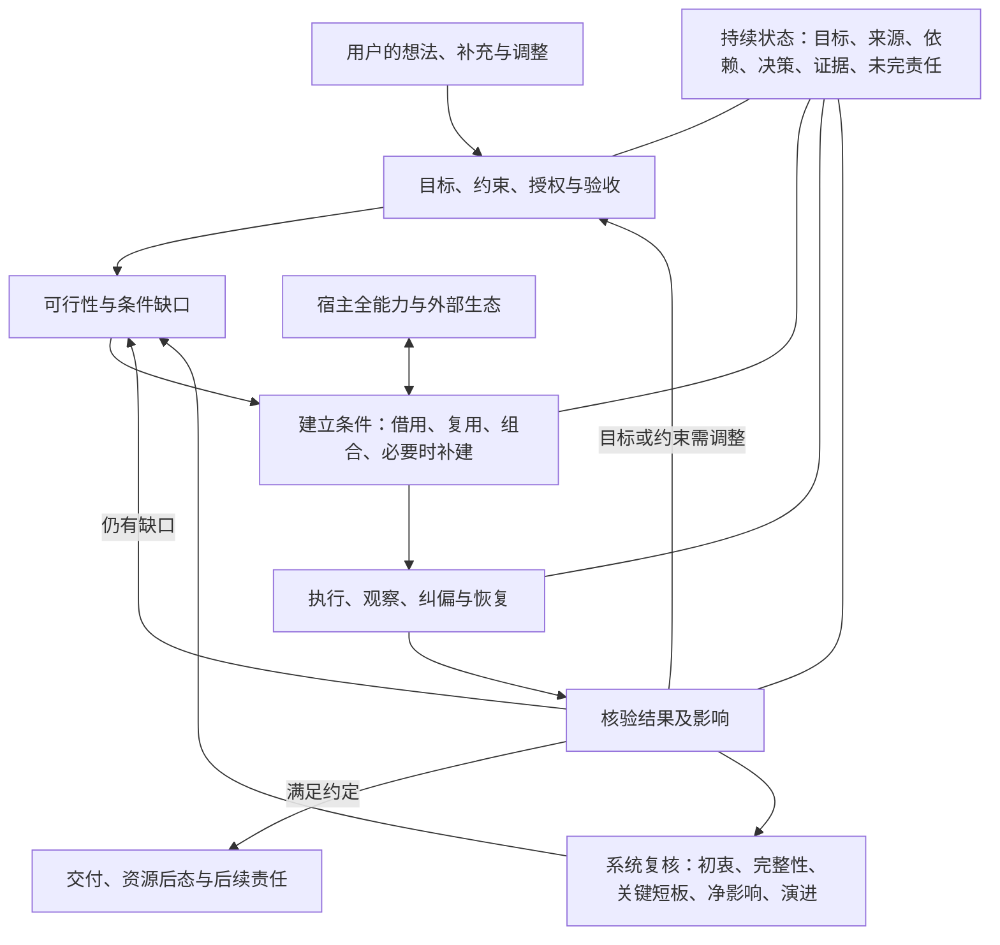
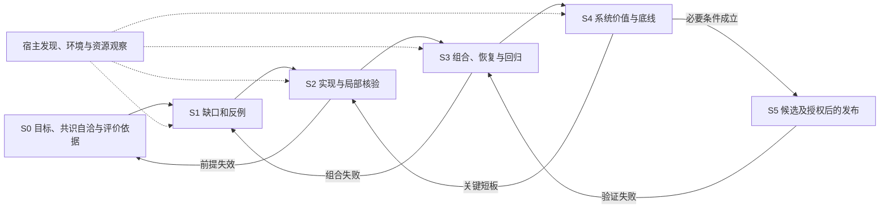

# 3.3 共识节点与当前计划

节点：N33-20260909 · 修订：r15 · 2026-09-13。状态：保持整体目标和验收底线，按实际缺口重排工作，允许停用干扰开发的共享插件；功能开发未完成，发布未授权。

本文件是当前目标、设计取舍、历史处置和下一步的统一入口。[基线](BASELINE-v3.3.md)提供 F01–F08 的详细结果定义，本计划内的 S0–S5 工序定义依赖和交叉作业，[历史试验记录](PROCEDURE-v3.3.md)仅保留带日期的观察，[验收](ACCEPTANCE-v3.3.md)提供 A01–A08 的判据；它们是按需查询的配套视图，不是四套独立决策。`product/development.json` 是校验所需的机器投影，不以 JSON 形态取得更高权威。新的用户决定和事实先与本节点核对，再更新受影响视图、实现及证据。

日常执行结果写入历史试验记录，接续文件只保留当前事实和未完依赖；需求、取舍、判据或工序依赖实质变化时才修订本计划。当前案例的判据依赖绑定规范和实际实现，不将仅供追溯的记录整份纳入。追加历史不使未受影响证据失效；规范、案例定义、包或条件变化仍按精确依赖重验，来源认证、时效、当前独立复核及候选绑定不放宽。

本节点是当前共识的可修订记录，不冒充代码提交或验收凭证。发布、安装及外部写入各按实际授权。旧 Git 提交、标签和发布结论保留原身份；当前未提交成果先作可恢复保存。2026-09-10用户授权Agent根据实际变更决定提交与推送；优先完成本地CI，将GitHub CI集中于必要验证节点，避免碎片化推送导致重复运行。此授权不等于正式版本发布或立即对外传播。

## 共识自洽审查与评价依据

共识本身也是评价对象。先验证定义、事实前提、目标、约束和关系是否成立，再据此清理历史和实施。源头矛盾不得靠下游执行掩盖；发现实质矛盾时暂停依赖它的动作、保留独立成立的安全工作，修正源头并追溯受影响的结论和产物。这里的“暂停”不把一个局部矛盾扩大成无关工作全部停摆。

自洽审查包括：同一术语是否同义、范围与量词是否一致、价值目标与版本承诺是否混淆、事实是否有依据、必要条件是否可满足、授权是否有来源、职责是否有承接者、依赖是否循环或相互冲突、失败能否被发现和恢复、验收是否能反证错误而非自我认证。反馈回路可以存在，但执行前提不能依赖尚未取得的最终成功，例如发布后的检查不能成为发布前已经完成的条件。

本节点对已讨论命题的本地审查如下。它记录有限审查与解释边界，不宣称形式化证明或独立功能验收。

| 潜在冲突 | 当前解释与处置 | 对照反例或后续核验 |
|---|---|---|
| 通用、供应商中立 vs 3.3 仅 OpenAI | 前者是价值与设计，后者是本版交付范围；通用职责不写成供应商专属假设 | 模型/事件或平台名称被写入通用必要条件时重审；不能把其它宿主未来可适配写成当前已支持 |
| 全能力不漏项 vs 按需、轻量 | 发现与处置全覆盖，执行按实际用途和权限选择；列出未知和没有当前用途的项 | 只看 API 遗漏 UI 是覆盖失败；为了覆盖而启用无用功能是干扰失败 |
| 不穷举需求 vs 可验收 | 不枚举全世界需求；针对明确版本、入口和承诺，维护来源完整性、适用判据与开放反例 | 测试样例命中或固定清单齐全不能证明所有场景可靠；新增发现修订受影响范围 |
| 自主创造条件 vs 用户授权与现实限制 | 技术判断、研究和可代办操作由 Agent 负责；实质目标取舍及不可代办授权由用户决定 | 缺工具就放弃和未经授权安装均失败；受限必须有原因、替代分析和未完责任 |
| 纠偏保障 vs 用户直接操作 | 核对变化事实、实际影响和用户意图；同一动作可能是明确选择或误触，不能靠经验标签判定 | 明确意图被强制改回、含糊而重要的变化未确认、无实质影响却反复打扰，均失败 |
| 协调责任 vs 中央代理 | 关键职责需接通和核验；技术路径按缺口选择，协作层不自动取得更高权限 | 强制所有调用中转、把未观察的调用算作可靠协同，或按组件偏好改变用户选择，均失败 |
| 负边界 vs 积极交付 | 防止无依据推断，同时承担已授权的完整结果 | “没越界但未完成”不通过；“没禁止所以可以”不构成授权 |
| 动态节点 vs 稳定验收 | 变更有版本和依据，撤销受影响证据的当前效力再复验，保留旧记录 | 看到失败后降低判据以通过，或更换对象沿用旧证据，均拒绝 |
| 历史整治 vs 可追溯与有效资产 | 移除当前错误权威、分发和重复负担；原始版本、失败和可恢复成果保留 | 改写旧发布或删除唯一有效机制而无替代验证，均失败 |
| 世界级/生产级志向 vs 3.3 有界收官 | 全维度比较，先守必要底线，再按任务权衡；可选优化进入后续 | 用口号自证成熟或以无限优化拖延完成，均不能通过 |
| 交接、恢复与释放 | 停止冲突写入后保留恢复资源；确认目标安全续做再释放，后续失败先核对已发生效果 | 仅凭回执/子任务启动/摘要完成释放源，或回退时同时恢复两个写者，均拒绝 |

上述显式张力已有可检验的解释；尚未证明运行时能够可靠履行它们。当前缺口仍进入 W01–W08，不能因共识自洽就宣称功能成立。任何新反例都可推翻当前解释或实现。

## 全维度动态评价框架

评价就是对现有 A01–A08 验收条件作具体量化，不在验收外新增一套评分体系。共识/需求是否自洽、实现是否符合要求、真实用途是否满足，分别核对；同一组判据也用于当前开发、历史重审和 Accord 的实际应用。

每个指标只绑定必要信息：对象及版本、分母/计算方法、通过阈值、观察证据和失效条件。每个案例执行前确定重复次数 n、超时 T、资源/费用预算 B 和允许的恢复条件；未绑定记为缺口。不得看过结果后下调要求。时限、费用或上下文阈值按具体任务给出数字，不编造适用于所有任务的统一数值。

| 现有验收 | 可计算指标 | 本版必要通过条件 |
|---|---|---|
| A01 需求与授权 | 已正确承接的有效意图/有效意图总数；遗漏、误授权、未经同意改变目标次数；必要确认遗漏、不必要确认次数 | 覆盖 100%；其余计数均 0。明确取消或变更的意图按当前授权更新分母并保留依据；确认必要性按案例事先绑定的意图、影响与授权条件判断 |
| A02 宿主能力 | 有来源且有处置的功能/已绑定版本与入口发现的功能总数；官方/实际界面差集中的未解释项 | 处置覆盖 100%；未解释项 0。包括按钮、设置、命令及 UI 独有项；发现未完成时分母未知，不能算 100% |
| A03 推进与恢复 | 通过的普通推进/可恢复失败案例数÷预定必要案例数；不必要催促和人工救场次数；恢复耗时 | 案例通过 100%；催促/救场 0；恢复耗时不超预定 T。必要用户决定单独记录 |
| A04 历史及全程纠偏 | 已修正并复验对象/受影响对象总数；漏改、误改数量 | 受影响对象覆盖 100%；漏改/误改 0；未影响的有效结果保留 |
| A05 继承与连续性 | 关键状态已核对继承数/所需数；接管验证通过数/必要接管案例数；提前释放、冲突写者、丢失未完责任数 | 两项覆盖 100%；后三项 0；继承损失与恢复成本符合各案例预定条件，未知不算通过 |
| A06 环境与生命周期 | 已通过的适用安装/加载/变化/更新失败恢复/退出案例÷必要案例；必要且可观测变化的发现率；无关配置损坏、未核实替换和擅自恢复用户选择数 | 案例通过与必要可观测变化发现均 100%；后三项 0。不可观测项保留为限制或待补条件，不能删除它提高覆盖；不适用须有来源和独立理由 |
| A07 成品与资源后态 | 成品满足的必要条件/必要条件总数；未处置任务资源、原件损坏、无归属变更数；峰值和退出后占用 | 满足率 100%；后三项 0；CPU/GPU/内存/存储/进程等达到预定资源预算及退出条件 |
| A08 系统与净影响 | A01–A07 完成数/7；完整组合案例通过率；未解决严重退化数；成功率、返工、时延、费用和维护成本 | 必要前提 7/7；组合案例 100%；严重退化 0；按预定任务预算完成充分净影响评估，不用均分抵消底线 |

100% 和 0 指绑定样本、对象与条件内的验收，不推断无限场景无故障。全维度由原有八个质量轴交叉检查这些指标：授权/安全、功能完整、普通入口、恢复/生命周期、变化适应、证据可靠、用户负担、维护/资源；新增盲区回到受影响的 A 项修订。非线性调度的收益与失效也按相同指标核验，不能为了并行增加冲突或跳过必要前提。

正式验收覆盖以当前 `python -B -m yiyuan_accord verify --json` 的 `evidenceAdmission.progress` 及其缺口字段为准，当前工作状态见[接续页](CONTINUATION.md)。本计划不再复制一份易漂移的实时计数。2026-09-09的3/17已定义、14/17未绑定等数字是历史快照，保留于该节点的Git版本，不作为当前起点。

验收覆盖分 = 已验证必要范围数 / 必要范围总数 × 100。它衡量正式证据覆盖，不代表代码完成率、综合质量或工时百分比。分母变化须有范围修订依据，不能删掉困难项提高分数；A项和关键阻塞逐条展示，高分不抵消必要失败。未验证既不记已失败，也不记已通过。按实际缺口补足案例或证据，保留原始失败及未完责任。

## 设计初衷与版本边界

Accord 的产品定位是面向人与 AI 持续协作的协调与可靠性保障层。职责贯穿用户意图、Agent/宿主、外围能力与最终结果；插件是具体宿主中的交付形式。产品问题、系统职责和实现载体分别考虑，不把逻辑上的“介于之间”预设成技术上的统一中转。关键判断、状态变化与结果反馈须有可验证连接；允许健康原生直连，按实际缺口决定是否补中转、拦截或持久机制，避免无依据增加耦合、成本和单点故障。协调责任不赋予高于用户或宿主的权限，也不等于已取得全域观察或控制能力。

Accord 面向人与 AI 的长期协作，属于更广泛的人机协作愿景。默认用户只有自然语言想法，不懂可行性、技术操作、资料检索、配置、模型调度、上下文或资源管理，也不负责提醒继续、fork、接管和救场。Agent 在授权范围内澄清目标、判断可行性、主动创造必要条件、组织能力、执行、纠偏、恢复并核验结果；必要的本人动作和目标取舍以普通语言说明。可建立的条件缺口不是目标不可行的证明，不能让用户自己阅读文档或协调工具代替交付。

默认非技术输入是必须能服务的条件，不把用户限制为新手；熟练用户仍可直接操作、调用组件或调整路线。按已表达意图、真实影响和授权判断，不按“新手/高手”标签赋予或取消控制权。

项目开源，不以盈利为目标，以工业/商业生产级交付标准建设，追求平权、普惠与用户自主。中立首先是价值和治理独立：不绑定供应商，不以资本、赞助或生态利益扭曲评价或牺牲用户利益。商业能力可以按实际价值借用；选择应考虑可获得性、质量、总成本、隐私、可替换性和退出条件。世界级是全维度持续对标的志向，具体成熟度由证据确定。

**3.3 只交付 OpenAI 范围的适配：ChatGPT 与 Codex 的适用入口分别验收；Claude 不纳入 3.3 分发、安装入口或功能声明。下一版本基于 3.3 的改进与届时宿主事实再开展 Claude 适配。** 产品名称统一为 YIYUAN Accord；阶段性实现不改变通用设计和供应商独立。历史包与证据留在原版本，不能因更改版本号而成为 3.3 功能。当前源码中保留的历史验证代码、记录和来源引用只服务追溯，不构成当前支持承诺。

Agent 执行入口承担生产交付主线。入口先经过下述适用性判断，再确定开发范围和支持承诺；普通 Chat 不作为默认独立交付项。未上架不能推断不能调用，品牌相同不能推断能力相同。3.3 不自动缩成 CLI，也不承诺所有尚未验证的 OpenAI 入口都可用。

## 入口适用性与版本承诺

2026-09-11用户确认：适配由真实交付价值与必要职责的全链路可行性决定，不以界面数量、产品名称或当前组件支持情况代替判断。先根据可行性和预期净价值确定开发范围，再通过真实执行确定支持声明；不要求先完成验收才能开始实现。网页、桌面、移动是交互位置，本地或云端是执行位置，均不能单独证明或否定Agent能力。模式、实际执行者、权限、数据与状态边界必须分开识别。

按现有入口盘点逐项给出纳入开发、辅助用途、待判、后置或不适用的处置、依据及未完依赖，不另建一套登记系统。判断包括真实用途与用户收益、可用或能合理建立的执行条件、完整必要职责及失败恢复的可行路线、用户负担与全生命周期成本。普通Chat仅有对话或插件选择时，不承诺独立全链路适配；若承担有价值的需求承接或向实际执行者转交，评价该组合的连续性与结果，不能把转交说成Chat自行完成。未知保持待判；无法操作当前界面或暂缺账户不证明产品不适用。可补足的条件由Agent在已有授权内主动建立，真实新增权限、数据或费用仍按边界处置；后置及排除保留理由和原始缺口，不改写历史失败。

全链路指目标与授权、执行与纠偏、连续性与恢复、结果核验与交付、资源及未完责任均由可靠的承担者按需接通。Hook、Skill、MCP、原生状态/调度、Agent判断或其它合理组合都是手段。缺少Hook只限制依赖它的当前路线；应先映射缺失职责并比较替代方式，不能直接排除整个入口。替代方案须达到实际承诺所需的可靠性，并验证适时参与、行动反馈、恢复和收尾；需要确定性执行的保护不能仅靠提示出现来证明，也不预先把所有职责规定为拦截。共有执行基础优先复用，按实际差异补接与验收，不为多个界面重复建设适配器。

当前Codex CLI、Desktop及已绑定App Server工作继续，保持各自原有角色和证据边界；ChatGPT Work与Codex云端具备官方执行能力依据，保留为适用性待判候选，不因官方能力自动承诺Accord全链路支持。2026-09-10核对的[网页模式说明](https://learn.chatgpt.com/docs/web)、[Work执行机制](https://learn.chatgpt.com/docs/enterprise/chatgpt-work-overview)、[Codex云端](https://learn.chatgpt.com/docs/cloud)及[插件机制](https://learn.chatgpt.com/docs/plugins)支持这些区分；网页安装不会部署Hook脚本，只是当前包直接复用的前提差异。所有已纳入目标入口的可编辑、可使用功能、按钮和设置仍须完整核对。

验收沿用A01–A08：A02先核验候选处置、已纳入入口集合和对应依据，再绑定该集合的普通交付与生命周期；A01/A03/A06核验实际承诺，A08检查组合后的完整性与净影响。机器投影将三个尚未定义案例的笼统ChatGPT范围改为入口适用性、已纳入入口交付及生命周期，保留17个必要claim/scope及全部质量底线。待判不等于不适用；没有该集合的有效判断与实际证据，整体资格仍不成立。

## 稳定关系与动态方法

本节系统图与[工序依赖图](#工序与依赖)持续维护；面向用户和开发者的概要视图见[中文 README](../../README.zh-CN.md#如何工作)与[英文 README](../../README.md#how-it-works)。图示沿用本计划的设计依据，相关职责、关系或依赖变化时按[贡献指南](../../CONTRIBUTING.md#current-development)同步校准受影响视图；验收状态仍以所链接的证据为准。

起点—过程—结果是可嵌套、并行、反馈的关系，不规定三个物理模块或三个 Skill。非线性工序同时适用于 Accord 的开发、通用设计及普通用户实际任务；工作按依赖和条件组织，允许交叉、并行、回退和重排。简单任务可以线性完成，授权、共享状态、不可逆动作及交接释放的必要局部顺序仍须遵守。语义判断解释输入与变化；事件驱动只重审受影响判断；负边界限定缺乏成立条件的推断、授权、动作和完成声明。少数稳定约束驱动可变路线。局部确定性操作可标准化，全程不套固定 SOP。

边界内仍有完成目标的积极责任。未禁止不等于已授权，没有越界不等于完成。一次消息中的同意、侧问、纠正、暂停或补充分别解释；仅有侧问不能抹掉此前同意和未完责任，真实暂停则保留工作并遵守新边界。

持续状态首先是一组必须继承的事实和关系，载体可借用宿主，必要时补运行时、状态机或其它机制。禁止用静态指令冒充当前状态；也不能预先规定必须有数据库、图、常驻服务或统一控制面。采用什么由效果、失效方式和生命周期成本决定。

原生能力是低负担起点；存在重要缺口或可信净收益机会时，比较成熟外部资源及组合方式。插件、App、Skill、MCP、Hook、SDK、工具与自身实现均按需取舍。生态矩阵管理是核心职责，覆盖能力之间的替代、组合、依赖、冲突、归属和生命周期；矩阵按当前决策需要形成关系视图，不要求常驻全量目录或集中代理。生态介入可能影响语义、共享状态、产物和释放判断；发现错误需回溯受影响依赖、修正或撤销结果并复验，停用组件本身不消除既有影响。

沿用 W02/W06/W07/W08 和 A06–A08 管理生态负担：分开核对安装/缓存、当前任务可见及上下文暴露、授权/连接、运行进程与资源占用。选择足以满足需要的作用域和存续时间；发现或安装不自动意味着长期全局启用。按需求结束、依赖变化、失败或成本变化调整暴露、停用、复用或退役，核验实际后态；保留用户明确选择和其它任务仍需的共享能力，接管或恢复尚未完成时不提前释放必要资源。已进入上下文的内容不能假定随停用或卸载立即消失；按宿主支持验证刷新、缩小暴露或必要接续的实际效果。负担以可测上下文、时延、资源和维护成本判断，不能只按安装数量，也不要求全部能力每轮加载或调用。

动态适应面向实际遇到的环境，而非只支持预设的“初始环境”。自定义、组件组合与未知变化均需发现并按当前目标处理。Accord 应驱动宿主自举：从已有且获准的可执行能力出发，研究并建立缺失条件，接通必要组件、状态与执行/恢复路径，逐步验证能否兑现结果。可建立的条件缺口不得直接归为“不支持”；不能把前置条件与最终能力相互依赖，启动及失败后都应有实际存活的执行者。确实无法补足的权限、物理能力或资源限制须有依据、替代分析和未完责任，不许越权或以无限尝试冒充适应。自举是形成所需工作条件，不默认修改模型、训练或新建独立智能系统。

开发隔离用于定位因果和检验机制，不是面向用户的使用前提，也不证明“初始”或“无干扰”。功能切片必须回到代表性真实组合与变化条件验证；以目标是否可行、条件能否建立、行为及恢复是否可靠评价适应性，不以默认设置或已知配置清单划定产品能力上限。无法穷尽环境组合不免除对新条件的主动研究和纠偏责任。

强开发环境可以提高研发效率，但也可能掩盖缺口、形成未声明依赖或使效果归因失真。验收区分声明且实际可获得的宿主必要条件与开发辅助；在可比较条件下观察原生宿主、精确候选、去除相关额外帮助、帮助失效及环境变化后的结果。合法依赖无须全部剥离，但必须说明由谁获得、接通、维护和恢复；产品声称可自举的能力应由实际交付路径建立，不能靠作者预先配置或救场。未能控制的差异限制因果结论，不用环境提供的成功冒充 Accord 增益。开发期保持强环境、验收有界隔离并回到真实组合，两者可以并行。

上下文扩容属于需显式记录的开发条件，不成为交付的隐含前提。按当前宿主、账号、入口和模型发现默认/自定义窗口及压缩设置，分别核对实际生效；在测试进程中验证相关默认条件，保留用户的开发配置。相同预加载量下，扩大窗口会降低其占比；若宿主据容量增加预载或历史保留，绝对负担仍可能上升，须实测而非推定。记录可得的初始指令/工具暴露、实际输入及缓存、占用、压缩、结果、返工和延迟；不可得费用保持未知，不直接移植API计费。默认条件下遗漏必要职责、过量常驻或无法恢复必须处理，不能依赖扩容掩盖；更大窗口、更晚压缩和更少压缩次数均不自动证明净收益。对比范围按实际风险绑定，默认上下文预算也不等于整个环境恢复为出厂状态。

模型及子代理选择由 Agent 动态发现当前账号与实际调度接口支持，结合用户限制、任务质量及完整成本决定；检查实际执行，不写死模型名、版本、套餐或档位梯子。不可用、已退役或被用户排除的型号不保留为调度后备，不为单个退出候选保留专用路径；产品不得依赖某个付费档专属选项。具体分工和是否并行受当前授权及宿主能力约束。

用户主动选定模型不证明其了解任务适配性，也不意味着发生误操作。目标及必要条件明确后检查当前配置的适配性，覆盖初始选择和过程中的切换；不必等失败才发现已知能力缺口，也不逐轮重复选型。可以胜任时继续，存在有据的不匹配时说明对结果的具体影响并提出可行方案。已有调度授权内可自主调整；改变用户明确固定的选择或新增费用、数据与信任边界时，围绕质量、速度、成本等实际取舍做必要确认，不让用户研究型号。确认期间保留未完责任，仅暂停依赖项并继续独立工作；用户明确坚持的选择仍须尊重，不降低原验收或虚构能力。

切换成本包含当前宿主实际相关的缓存失效与预热、上下文重处理、初始化、交接和复核开销，结合剩余工作量与复用机会判断是否值得切换。满足质量要求的现有配置保持稳定；存在必要能力缺口或有据的净收益时才调整，不以缓存收益压过正确性和授权。模型切换、推理调整和工具/上下文变化可能影响不同缓存，不能假定必然全部重建或跨模型共享；信号不可得时标明未知，不声称节省。[OpenAI缓存文档](https://developers.openai.com/api/docs/guides/prompt-caching)提供API层的机制参考，具体Codex入口的支持、命中和计费仍须实测，不直接移植API能力声明。

交接以继承完成为判据：源保留恢复能力并停止冲突写入，目标核对目标、来源、状态和未完责任，实际证明安全续做后才释放源；回执不等于接管。根据真实容量、任务需求、压缩和损失信号动态决定，不伪造效率区间或固定阈值。按实际效果选择有摘要压缩、同任务上下文换窗或必要的新任务接续，不固定一种物理载体。文件保留不证明目标与纠正仍在模型上下文；可能省略历史前保存可恢复的目标、授权、暂停、未决事项及效果，恢复后按当前来源核验，再继续实质动作并释放恢复副本。复制历史的 fork 用于分支；开发对话保留，归档另需授权。原生工具、设置、模型/账号资格和实际行为分别发现，实验接口存在不等于默认启用或已获授权，不把它列为产品的隐含前提。

### 自举的能力维度与证据

以下八项是交叉作用的能力维度，不对应八个组件、线性工序或额外评分体系；用于开发、实际协作和后续维护，按原 A01–A08 的适用结果取证。发生工程自举须证明：从已有且获准的条件出发，系统实际建立缺失的工作条件，使原先受阻的后续任务能够完成；列出能力、保存经验或由作者代建条件不能代验。

| 维度 | 工程含义及可反证条件 | 对应既有验收 |
|---|---|---|
| 自知 | 观测状态、能力、边界、依赖和风险，区分已知、假设与未知；自述或清单不等于实际可用 | A02/A06 |
| 自洽 | 理念、目标、规则、结构、行动和结果逻辑一致，同时符合外部事实与用户目标；内部一致不证明判断正确 | A01/A04/A08 |
| 自治 | 在授权和边界内自主推进、调度与维持秩序，也能接受干预、暂停和交还控制 | A01/A03/A05/A07 |
| 自学 | 从反馈形成可检验假设，经验证后在后续任务复用；保存记录不等于形成能力，不默认修改模型权重 | A04/A06/A08 |
| 自纠 | 识别偏差、追溯受影响依赖并修正结果与成因，以后续案例检查同类问题复发 | A04/A08 |
| 自愈 | 异常后恢复必要服务、状态与未完责任，必要时降级；不盲目返回可能有错的原状态 | A03/A05/A06/A07 |
| 自证 | 提供可复核、可反驳的事实和证据，保留失败与未知；自身不能成为最终裁判，不能改标准迎合结果 | A01–A08 的证据要求 |
| 自进化 | 基于验证保留有效能力、改进结构和适用范围，追踪退化并可撤回有害变更；变化不自动等于进步或长期收益 | A04/A06/A08 |

认知/元认知层面的自我监测、反思与调整，要与工程上的状态、执行、反馈和恢复形成闭环。“意识自举”若指主观体验，则保留为研究问题，不作工程自举的必要条件或 3.3 承诺。八项不是全面能力已实现的声明，长期复利也不能由单次改进证明。语义理解与结构化校验互补：转换时保留原始依据及不确定性，执行反馈同时纠正解释和状态；不因使用生成式或符号方法便宣称可靠。

## 宿主全能力覆盖责任

### 用户操作与环境变化

按钮、计划/目标模式、显式 Skill/MCP/插件/App 调用、设置及自定义配置变化，都是需要按影响解释的输入。分别核对操作事实、实际生效状态及影响、用户意图；配置文件变化不等于当前轮已采用，显式调用组件不自动批准其全部追加目标和副作用。Accord 自身、开发助手及观察器引起的变化也必须纳入，不能把自研组件排除在影响检查之外。

无实质影响时继续；意图明确且符合授权时尊重操作并调整相关工序；明确暂停、取消或有效宿主约束立即遵守。意图不明且会实质影响目标、执行方式、权限、费用或已有成果时，保留状态、暂停依赖该判断的动作，用普通语言说明后果并确认预期结果，独立安全工作仍可继续。确认记录绑定决定及适用条件，条件未实质变化时不反复询问；沉默或超时不是同意。不能擅自改回用户设置，也不能以继续旧计划为由绕过新生效的宿主约束。

确认不是终点：核对生效状态，定位受影响决定、产物与证据，执行必要修复，复验并更新计划和未完责任。即使用户有意改变了路线，之前已经发生的效果仍须协调。不可观测项记未知；下一动作依赖它时补查受支持来源或保留真实限制，不声称全面自动检测。

按 A01/A03/A04/A06/A08 的既有判据验证意图保真、变化发现、必要确认、低打扰及纠偏后续，不另设确认工作流或评分系统。代表案例需区分同一操作下的明确选择、误触、意图未明及无实质影响，并覆盖控制器未提示 Agent 存在变化时的实际发现；脚本安排变化和手动查询只证明有界接口可用。

### 发现范围与证据

用户要求所有可编辑、配置和利用的宿主功能均不得漏项，**包括按钮、菜单、设置、快捷键和仅存在于 UI 的功能**。覆盖责任不以当前工具列表、CLI 帮助或已安装插件为边界；也不意味着全部启用或遍历点击。逐项发现，按需激活，记录理由和后续影响。纯外观、宠物等也要归类，当前无业务作用可以保持未启用，不能从发现范围静默删除。

每项发现绑定：宿主/入口、版本与日期、来源及原生标识、所属配置层和账号条件、文档存在/当前可见/可调用/实际执行/效果证据、相关职责与副作用、必要授权、回退或退出方式、已用/待用/无当前用途/受限/未知的处置。别名归并到同一能力但保留入口差异。机器可导出的清单自动对账；UI 独有项用实际可用的受支持观察核对。官方索引与实际界面的差集均需解释，证据不足不能宣称“零漏项”。

| 发现面 | 必须覆盖的类别 | 发现与当前证据边界 |
|---|---|---|
| 交互与任务 | Chat/Work/Codex 模式、输入附件/语音、侧问与队列、编辑/重试/停止、计划/目标、任务搜索/新建/分支/恢复/交接/分享/归档、项目/目录/工作树、面板/终端/审查 | 当前可调用工具和 CLI 帮助仅证明接口暴露；新建、归档、分享等仍需各自授权。UI 当前值未盘点完成 |
| 持续执行与资源 | 上下文/压缩/记忆、并发/子代理、后台运行/唤醒、自动化/通知、防休眠、连接与进程、占用/限额/退出恢复 | 不以终止一轮代替完成或资源释放；宿主结束事件缺失需有相应恢复处置 |
| 设置与偏好 | 通用设置、跟进消息行为、快捷键、外观/字体、个性指令、提示建议、记忆、归档列表、浏览器、计算机使用、宠物/玩具、无障碍/语言 | 官方设置和命令目录已读；本机全部面板及账号专属项尚未逐项验证。无关偏好保持用户所有权 |
| 模型与环境 | 模型/推理/路由、账号能力与用量、项目/用户/管理员配置、特性开关、身份与权限、沙箱/网络、代理、远程/云端/WSL、本地运行环境 | CLI 0.153.4 的帮助已核；实际账号、入口和受管理约束须在相关决策处刷新，不输出凭据 |
| 扩展与领域能力 | Skill/插件/Hook、Apps/MCP/连接器、SDK/API、浏览器/计算机、搜索/文件/媒体/可视化、代码/文档/专业工具、外部成熟资源 | 上架、安装、发现、授权、调用和产生效果分别核对；按需引入、恢复、卸载和核验后态 |
| 管理与更新 | 安装/更新/回滚/卸载、配置迁移、发布渠道、管理员政策、隐私/数据控制、审计与诊断、实验项和废弃项 | 历史版本及来源留痕；支持状态改变时重审受影响能力和验收，不越过用户或管理员边界 |

发现来源，核对日期 2026-09-09：[官方能力索引](https://learn.chatgpt.com/docs/features)、[应用设置](https://learn.chatgpt.com/docs/reference/settings)、[应用命令](https://learn.chatgpt.com/docs/reference/commands)、[配置参考](https://learn.chatgpt.com/docs/config-file/config-reference)、[IDE 设置](https://learn.chatgpt.com/docs/developer-settings?surface=ide)、[App Server](https://developers.openai.com/codex/app-server)。官方完整手册与本机 CLI 帮助、会话实际工具清单交叉核对，当前仅完成发现入口与分类；详细配置键、全部 UI 控件和跨入口实际效果仍属 W02 未完工作。比如官方设置包含跟进消息的 steer/queue 和运行时防休眠，两者都可能影响连续协作；本轮没有改变其本机值。

## 历史处置与当前缺口

本节点同时约束历史成果的当前使用。按来源、原假设、当前适用性、依赖/副作用、处置和复验要求逐项判断；只处理会影响当前目标的历史，不把穷尽所有旧记录变成推进前置。错误结论撤销当前效力，原始失败和发布记录保留。保留原作用与来源后，可清掉重复说明、废弃入口和失效实现。

保留不是永久冻结。用户当前选择保留云端环境与IDE验证对话，同时要求它们及其它临时过程产物、历史遗留和债务在没有复用价值时适时清理。每项保留应有实际用途、依赖或必要证据/恢复价值，并在用途完成、依赖解除或条件变化时复核；不能以“以后可能有用”无限期累积，也不能把所有重复副本重新命名为证据来免除退役。清理同时检查当前切片、上下游调用者、共享资源、其它任务及整版目标的影响，先保住仍需结果和最小必要追溯，再移除无用副本、失效机制或偿还已确认债务。当前保留决定未撤回时不立即删除其对象；无归属数据、仍有效成果、唯一必要证据及不可变发布身份不因这项原则获得删除授权。具体不可逆操作仍按其实际范围和用户授权执行。

| 资产或冲突 | 节点处置 | 验证与未完项 |
|---|---|---|
| 3.2.1 与更早的发布、证据、反例 | 保留不可变 Git 身份；当前开发不继承旧 PASS | `previousDevelopmentSnapshot` 绑定历史；改变后的功能和实际入口重新验收 |
| 原三 Skill | 继承语义/事件/负边界、意图—过程—结果和闭环责任；不恢复三个固定物理组件或整段提示词 | 作者保留的 codex-user-config 仓库中 intent-contract 61–75/165–175/203–208、capability-router 354–369、closure-contract 198–217 已回读。规则存在不证明实际生效；当前断点须按发现、参与、状态、执行、后态定位 |
| Matt/Bob 与其它方法资产 | 按原理、适用条件和反例取舍，拒绝因名气或安装状态授予流程权威 | 复用已有可靠研究；需要原谈话逐字判断时再核源，不把历史摘要当原文 |
| r6 以前“两个 3.3 开发包、Claude 仅改名” | 退出当前交付；专属包及安装清单移出当前工作树，下一版本独立适配 | 3.3 开发定义、CI 和当前包检查只绑定 OpenAI；历史源码仍由精确版本读取 |
| 多份文档中的重复决策和旧下一步 | 当前决策汇入本节点；其余视图按需引用，旧工序记录显式为历史 | 导航与 F/W/S/A 映射核对；不以文档同步代替行为修复 |
| 普通输入、在途纠正、检查点、上下文评估、受控接管、A08 准入修复 | 保留有效实现、有限观察和反例 | 尚不能证明完整普通入口、自主择时、失败接管、全环境恢复或价值；不得升级为已完成 |
| Claude 历史验证及旧参考核心耦合 | 保留历史验证用途；剥离当前分发，旧接口不得宣称当前适配 | 引用残留不作支持承诺；后续按相关功能变更继续减去无效耦合，保留有用反例 |

## 持续校准与收官判据

持续自查设计初衷、未实现/不可靠/未验证/可优化项、全局依赖和故障传播、关键短板、用户负担、净影响与演进成本。负面边界和必要质量底线不能用均分或局部优势抵消；不要求所有可选功能同样完善。自评提出假设，真实结果、反例和必要独立复核支撑判断。

持续校准不能只看局部：同时核对本次结果、关联职责及共享状态、全局关键依赖和总体目标是否仍一致。检查深度按实际影响调整，不把每一步都变成全量扫描。用户的认可或重复表述结合上下文理解；已有决定保持有效，有实质修订就协调，事实前提仍可质疑和纠正。局部完成不能抹掉整体未完责任，也不能借整体要求无限重开无变化且已充分验证的结果。

新用户决定、失败、证据反转、阶段变化、能力或环境漂移触发适量重审：发现偏差 → 确定影响 → 修改最早受影响环节 → 复验 → 更新事实和未完责任。同一纠正反复出现时查闭环断点，不能只添加提醒。简单步骤保持轻量，不每轮全量盘点。

节点修订记录变化依据、受影响目标/关系/实现/证据和仍未解决项；旧证据保留其版本，对受影响结论撤销当前效力再验证。方法可随事实调整，改变用户目标、必要覆盖或新副作用需相应用户决定；不得改验收迎合已有实现。下一修订继续使用本入口，Git 提交和精确证据记录其实际身份。

3.3 收官要求 F01–F08 必要结果与 A01–A08 适用底线均有实际证据；普通输入下正常完成、重要失败可恢复、真实阻塞能说明且未完责任可继承；组合案例贯通共享状态与资源后态，不能拼接独立演示。经过充分净影响评估，无未解决的严重退化；候选、托管/独立核验、发布授权和发布后态分别成立。持续优化不等于无限延长本版，也不能省略必要功能。

## 工序与依赖

工序属于计划，按依赖而非编号调度。S0–S5 是工作类别；各 W 项可处于不同工序，S1–S4 可交叉迭代。每个当前切片明确输入与上游假设、共享状态和写入归属、可并行工作、进入/退出条件、证据及失效回路；后续变化只重开受影响依赖。

| 工序 | 输入与职责 | 实际产出与退出条件 | 关联 |
|---|---|---|---|
| S0 校准当前起点 | 最新目标、授权、实际仓库/安装、历史提案及直接相关宿主事实 | 下一项工作所需事实足够明确；列出未知、单写者与最后安全状态。不要求穷尽历史后才推进 | F01/F02；W01/W02；A01/A02 |
| S1 重现结果缺口 | 普通任务入口、必要能力、历史成功线索；记录没有帮助时的行为 | 找到具体缺失结果或责任断点，绑定可改变决策的最小反例；未实现功能也可直接成为实现对象，不要求先等用户事故 | F01–F07；W01–W07；A01–A07 |
| S2 实现并当场验证 | 当前缺口、适用宿主手段、授权和恢复路径 | 接通触发→判断→动作→结果；正常路径和关键失败后态可用。修改依据实际缺口，不先限定代码形态 | F01–F07；W01–W07；A01–A07 |
| S3 组合运行与回归 | 可用切片及既有需保留功能 | 在普通入口完成连贯任务；包含侧问、变化、失败恢复、历史纠正，以及代表性持续运行、负载调整和退出回收。检查影响范围和未受影响效果，不拼接互不相关的 PASS 代替整条链 | F01–F08；W01–W08；A01–A08 |
| S4 系统平衡与价值判断 | 可用功能、同类原生结果、可核实的 前身系统 历史、反例与负担记录 | 功能、质量、恢复、用户负担、时延、费用、上下文和维护成本联合判断；不足回到最早相关工序修复 | F08 统合 F01–F07；W08；A08 |
| S5 版本/分发准备 | A01–A07必要范围与S4功能/价值判断、准确声明；按具体动作取得实际授权 | 完成精确候选与独立/托管核验；获发布授权后执行并核验发布后态。发布后态是本阶段输出，不作进入本阶段的前提；市场材料就绪不等于获准或可用 | F08；W08；A08 |

无共享写入和前提冲突的资料核对、反例准备、能力发现可以交叉；同一状态或产物的写入须有明确归属。并行不等于允许创建子代理或新增费用，仍按实际权限。状态变化、接口修改或上游结论失效时，通知并重审依赖方，不能各自以旧前提取得局部 PASS。

跨组件替换先绑定所需效果和回退条件，核对调用者、配置、加载、执行者、下游结果及资源后态，再释放旧机制。交接尤其要求目标证明安全续做后才释放源恢复资源；发布后的核验是 S5 输出，不作发布前已完成的循环前提。全局关键短板与生态副作用贯穿 S1–S4。

工序的当前状态与可复用结果由[接续页](CONTINUATION.md)维护，各次观察按[历史记录](PROCEDURE-v3.3.md)的原对象和控制条件解释。旧计划中的运行段落保留在[91c998d前态](https://github.com/yiheng8023/YIYUAN-Accord/blob/91c998de6d3f83abce12b03554b71d7a42a9b761/docs/operations/PLAN-v3.3.md)，不再混作活动待办。

## 当前推进顺序

按能兑现必要结果、减少最大阻塞或最高用户负担的方向选择下一段，不为编号机械串行。已有同意/侧问/更正、输入保护、恢复、真实IDE普通交付和显式协作者接续等局部成果应复用；它们各自的范围与限制见接续页，不再回到“先整理节点和README、再做首个任务”的旧起点。

当前关键连接仍是自主发现需要→适用执行通道→安全续做与单写者→失败回退及资源后态，并与实际入口适用性、环境变化、压力恢复及系统评价共同推进。健康原生处理足够时直接使用，分工、检查点和迁移都按需要选择。不能把明确请求后的child交接当作主载体自主择时或交权。

用户于2026-09-13允许停用影响开发的Accord插件。开发指导、共享安装与待测候选分别核对；可停用共享自动加载，确有测试需要时在既有授权范围内绑定精确对象与作用域。停用不会清除已有会话上下文，也不新增安装、信任、账户、数据或费用权限。发生问题先区分产品、宿主与观察器，再修正真正受影响的部位；不预定必须新增某个组件。

计划与接续记录是可修订的工作工具。新事实改变目标解释、路线或依赖时按需更新；调整工作单元、预算或环境后，在新动作前重绑受影响条件，保留旧失败，沿用不受影响成果。只暂停依赖缺失决定或实际执行边界的动作，继续独立安全工作；技术上可自行查明的事实不交由用户代查。

## 工作包与映射

| 工作包 | 结果 | 主要工作与可交付结果 | 工序 | 验收 | 当前范围与未完项 |
|---|---|---|---|---|---|
| W01 目标和状态承接 | F01 | 消除影响下一步的旧状态冲突；让意图、纠正、输入来源、授权与实际行动一致；保留模糊需求专业化 | S0/S1/S2/S3 | A01 | 回读、在途纠正及原生恢复后同意/更正/侧问已有局部观察；模糊需求及完整范围待验 |
| W02 宿主全能力适配 | F02 | 按真实版本/入口覆盖能力、按钮、设置、配置与生态；主动联网核实并比较 GitHub 成熟实现，接通必要发现、选择、执行和后态 | S0/S1/S2/S3 | A02 | CLI/App Server、模型目录及坏工具识别/原生替代局部已核；ChatGPT/其余入口与动态变化执行待验 |
| W03 自主推进与失败恢复 | F03 | 复用前身系统的有效链路并定位当前断点；打通普通入口、等待/失败/侧问后的必要续做与存活恢复者 | S1/S2/S3 | A03 | 普通推进、工具失败恢复及接续已有局部观察；无人提醒的完整路径仍待验 |
| W04 全程及历史纠偏 | F04 | 从新证据回溯旧判断和产物依赖，实际修正、重做或退役；避免修一处丢一处 | S1/S2/S3 | A04 | 同轮/跨轮三文件及恢复后的旧计划纠正已观察；更广历史依赖与其它成果待验 |
| W05 连续性与损耗控制 | F05 | 动态核对版本/上下文/压缩条件及继承损失；源停写但保留恢复，目标核对、接受并证明安全续做后提交单写者与源释放；失败可恢复 | S1/S2/S3 | A05 | 源级恢复输入直达且保留旧绑定核对/输入丢失保护；确认后释放有受控及显式child交接证据，主载体自主择时/交权、动态适应、失败回退/唤醒待验 |
| W06 环境及生命周期 | F06 | 将用户自定义环境和宿主变化视为正常条件；接通生态能力实际生效、启停、复用、回收/退役和变化恢复，避免无界累积 | S1/S2/S3 | A06 | 隔离及部分自定义组合已观察；现装加载/变化恢复/跨入口待验 |
| W07 交付、资产与维护 | F07 | 意图保真、专业成品检查；联动操作系统与宿主处理运行负载、分配回收和必要续做，完成交付收尾与维护反馈 | S1/S2/S3 | A07 | 局部交付/退出及CPU控制机制已验；自主压力响应与完整资源范围待验 |
| W08 系统平衡与分发 | F08 | 在功能可用后比较用户负担、质量、成本、可靠性；将3.3实际案例接入既有准入，禁止借旧PASS；准备真实支持范围的公开市场材料 | S3/S4/S5 | A08 | 已接通政策、案例及A01–A08缺项判定；指导已按需收紧、源数据核验保留且有反例观察；复杂场景、净价值及正式准入未成，发布另需授权 |

职责写清实际触发者、决策/执行者、必要状态及失败后接管者。可分别由 Accord、原生 Agent/宿主或组合承担；“委托给宿主”必须有动作与结果，不能只写责任归属。

### 自动化如何落地

W02/W03/W05/W06 联合对每个必要职责接通以下路径，具体组件按宿主条件选择：

1. **触发**：从普通输入、工具完成/失败、等待结果、需求或环境变化、上下文事件等实际入口发现需要。必要任务入口参与必须有可靠连接，不能只依赖偶尔选中 Skill；若任务要求无人值守后续动作，落实能再次唤起执行的宿主调度或必要替代，不能依靠用户再发一句“继续”。
2. **判断与执行**：AI 宿主中的 Agent 解释当前目标和授权、选路并调用适用能力；Accord 接通职责而不重建一套智能判断系统，确定性条件可由代码检查。Skill 按需支撑判断，不单独承担强制触发或后台执行保证；逻辑协作不要求所有工具经过 Accord 代理。
3. **状态**：为跨轮、重启、交接和失败恢复保留必要的当前目标、未完工作、授权范围、输入新鲜度及已完成效果；状态写入本身不算工作完成。
4. **恢复与再执行**：明确失败后仍存活的执行者、重新进入条件和重复执行保护。宿主能可靠续做则直接使用；不能时补必要的持久机制，不能把“当前轮已结束”当作未完工作的终点。
5. **验证和收尾**：依据实际结果继续、纠正或完成；清理任务资源并保留必要后态。真正缺少目标决定、新授权或本人动作时，才把具体选择交给用户。

不能以完成上述设计表代替接通路径。每个实现切片都要观察真实触发、动作、失败及恢复；需要持久运行时、状态或调度连接时，应实现相应能力，不把“轻量”当架构禁令。后台监听或轮询也不是越多越好，以可用唤醒和完成结果为准。

已有持久存储和同身份恢复机制保留其已验范围及暂停、新输入、旧状态、写失败约束。继续按实际未完依赖验证：存储与同身份恢复→目标跨任务关联及单写者接管→适用宿主的启动/唤醒→恢复时实际效果与权限核对。宿主能履行的部分优先复用；缺失连接按实证补足。不能把一条保存记录当新授权、把重启后继续当自动解除暂停，也不能强行套用统一状态机或自建全部执行层。

W02 由 Agent 主动发现宿主相关功能、按钮、设置、配置与生态，使用实际接口、UI 或官方来源验证可见性、可调用性与授权；不要求先建全量静态能力库。W01/W06 协同用户自定义配置：AGENTS.md 读取顺序不等于授权层级或执行优先级，必要职责在相关动作前参与并获得动作反馈。排除开发变量时优先任务级可回退隔离，再在真实自定义环境复验；共享改动明确范围、备份与恢复，真实新增信任、数据和费用仍依授权。

W02/W06/W07 联动操作系统与宿主运行态，覆盖 CPU/GPU、RAM/VRAM、磁盘 I/O 与空间，以及进程、终端、浏览器、服务、并发任务、多代理的分配与回收。通过实际可用原生控制按负载调整并发、限流、暂停、恢复或释放明确归属的资源，验证负载恢复、必要工作继续和退出后回收。外围生态能力按任务正确启停、复用与退役，不能只增不退。资源管理不能缩成删临时文件；不盲杀未知进程、关闭防护或重置用户环境。代表性持续运行、压力和退出残留条件纳入 S3/S4 与 A06/A07/A08，不等最终发布才发现累积问题。

以上承接既有 resourceStewardship 职责，补实际闭环证据与已证实断点。其历史接口盘点前置随本轮功能优先原则纠正：只先查当前切片决策相关能力，不等所有宿主接口穷尽后才补必要机制；不因缺少独立资源执行器就断言宿主无法承担。

## 当前关键依赖与切片选择

当前按关键依赖推进，3.3 仅交付 OpenAI，范围不缩成仅 CLI。系统性检查嵌入各切片，不等所有单项完成后再找耦合问题：

| 关键连接 | 会阻断整体结果的薄弱点 | 下一实现/验证重点 |
|---|---|---|
| 普通入口→能力调用与状态 | 私有测试桥可用但实际入口不具备，或新输入与旧状态冲突 | 明确可交付调用者、连接与存活恢复者；按实际入口验证职责参与 |
| 上下文判断→继承→写者转移 | 陈旧观察、接管未完提前释放、失败后双写 | 同一连贯任务中验证新输入/条件变化、目标首次续做及失败回退，接管前保留源恢复能力 |
| 环境变化→恢复→资源收尾 | 恢复重复执行、遗漏宿主登记或累积占用 | 核对已发生效果和资源归属，观察压力下必要工作继续及退出后态 |
| 单项证据→组合验收→候选 | 分散案例拼成组合成功，或总项绕过必要短板 | A08组合范围要求单个完整案例的同一episode证据；A01–A07未完时A08保留阻塞项 |

以上用于选择下一实际工作，不新增常驻控制平台或全组合穷举。已有准入反例修复保留，当前回到 OpenAI 实际入口与自主继承的连接；不能以更严格的校验器代替功能实现。任何新增关键依赖或失败传播证据都重排受影响工序，保留不受影响成果。

入口适用性须绑定具体模式、执行者、权限、状态和恢复路径。共享实现可复用，相关差异分别验证；不因缺Hook直接排除一个有执行能力的入口，也不因目录/接口可见就认定已接通。当前路线按下列条件推进，运行事实仅在接续与历史记录维护：

| 入口 | 已有依据的使用方式 | 下一必要条件 |
|---|---|---|
| CLI / App Server | 复用原生执行、保护、恢复和显式协作者接续的局部事实 | 主载体自主择时/交权、接管失败回退及真实持久化条件；子范围不替代整个宿主 |
| Codex Desktop | 核对当前版本、配置、有效加载与实际GUI入口 | 新鲜普通行为及必要生命周期；API来源标签或缓存存在不代替GUI参与 |
| VS Code | 复用真实界面、实际后端和已有普通交付事实 | 按包/宿主变化补受影响职责和生命周期；不重复同一小任务或预先排除入口 |
| Work / Codex云端 | 保留执行候选，按实际职责比较原生、Agent、MCP或其它等效连接 | 明确执行位置、数据与权限边界，完成必要职责和生命周期；不为取证发布候选或部署新服务 |
| 普通Chat辅助 | 保留有限历史，不列为默认独立交付项 | 仅在明确对话/需求承接/执行衔接价值出现时继续，不由侧载成功扩大范围 |

S0只解决会改变下一动作的必要事实；不先穷尽全量历史或所有宿主接口。自然长任务与受控机制验证分开记录：不能等压力自行出现才推进其它功能，也不能把用户提出交接后的成功当自主触发。原生持久化、上下文、模型或事件声明变化时重验相关部分；一个宿主条件限制不自动成为产品实现缺陷。

W02持续承担完整入口处置，W04随受影响历史依赖纠偏，W06/W07按实际任务核对环境与资源，W08从开始检查系统组合。稳定功能形成后开展系统对照；授权和数据保护始终有效。明确已完成的尾项不重复运行，必要未完责任不因文档缩短而消失。

## 发布后的部署、传播与治理

下列事项纳入现有W02/W06/W08及S5后续依赖，不另设一套评分体系，也不成为发布前必须已完成的循环条件。准备工作可在开发期间开展，实际安装、发布及市场提交分别核验其前提。用户本次要求纳入计划，不代表这些事项已执行。

| 事项 | 前提与执行责任 | 完成证据 |
|---|---|---|
| 为适用宿主安装正式版本 | 正式发布及公开后态核验成立后，Agent核对用户实际使用的OpenAI宿主/入口、精确版本、环境及信任，完成安装或更新；不把开发包当正式发行，不以一处安装覆盖所有入口 | 来源、安装字节、注册/信任、有效加载、普通任务行为及回滚/资源后态分别有证据 |
| 改良传播素材并重新发布 | 以经核验的正式版本能力与限制修订图文、演示、文案和链接；核对既有撤回记录与账号，以YIYUAN Accord及项目组织为传播主体，避免个人营销；发布前按届时绑定的账号、成品和权限执行 | 素材与精确版本一致；各渠道发布回执、公开页面、链接和实际展示核验，保留纠错或撤回路径 |
| 择期提交OpenAI插件市场 | 在产品、发布包及维护能力达到适用要求后，动态核实官方市场的提交、审核、发布主体和更新机制；采用项目/组织主体及可持续的管理权限安排，个人账号仅作必要的过渡，不作为长期唯一归属或控制点 | 明确提交主体、管理员/维护者、源仓库和更新权限；提交回执、审核状态、市场可见性、安装与实际使用分别核验 |
| Claude后续重新适配 | 3.3不分发、不安装Claude适配；现有Claude侧Accord按用户要求卸载，保留必要数据和可追溯历史。后续版本完成适配、验收与发布后，再为实际宿主安装 | 当前卸载注册及其他插件/设置保护；未来新版本的独立适配、安装、生效和恢复证据，不沿用3.2.1结果 |

“市场收录”“项目治理归属”“代码托管归属”相互关联但不等同。当前个人名下仓库及账号是现状，不被写成长期目标；组织名称、成员权限、仓库迁移和发布主体需先核对真实条件，再在授权范围内执行。不得用更换显示名称代替治理，也不得在未明确目标时擅自迁移资产。市场审核周期不阻塞已达到条件的正式发布及宿主安装，尚未完成的投放责任持续保留。

### 可选参赛窗口

2026-09-12用户确认：项目按既定范围、节奏和验收推进，Product Hunt的GPT-6 Astra Challenge是可选传播机会。可提前准备可复用的发布文案、演示和材料；只有3.3完成验收及正式发布，并符合届时活动条件时才考虑提交。9月18日未完成发布则不参加，不据此降低标准、强改架构、扩大适配范围或制造发布期限。准备成果继续服务后续正式发布，未参赛不构成项目缺陷或未完交付责任。当前准备见[发布材料工作稿](LAUNCH-v3.3.md)；正式发布、排期和对外提交仍需匹配的明确授权。

## 术语与表达的持续校准

所有当前产品说明、计划、验收、交互提示、开发记录摘要及传播材料均持续检查语义准确性、术语一致性、专业性与可读性。采用正式、清晰、可验证的书面表达；专业化不等于增加术语或形式负担，面向非技术用户时说明实际影响和必要选择。忠实保留目标、价值原则、授权与证据边界，不以修辞优化扩大能力承诺或弱化验收要求。

先澄清概念、对象、适用范围、前提与完成条件，再调整措辞；发现概念冲突时同步修正定义、实现和受影响验收，而非只改文字。设计目标、已实现能力、已验证结果、正式发布及市场状态分别表述。既有原始引文、失败日志和不可变发布记录保留原文，当前解释可校准，历史事实不改写。复用术语定义并在受影响材料中保持中英文一致，不为同义表达另建强制全量流程。

## 修订记录

- r15 / N33-20260909：按用户授权允许停用干扰开发的共享自动加载，收拢活动计划中的旧下一步与重复计数，保持按需重排。必要目标、A01–A08、历史身份及发布边界不变；无Accord对照纠正父转录警告的归属，不据此认定子代理Hook完整通过。

- r14 / N33-20260909：按用户最新决定保留现有云端环境与IDE对话，明确保留的用途/依赖及后续退出条件；无复用价值的临时产物、重复副本、失效机制和历史债务适时清理。持续校准同时检查局部、关联职责和整体目标，不增加固定交接步骤、全量扫描或另一套清理框架；具体删除与不可变历史边界保持，功能与发布资格不因此变化。

- r13 / N33-20260909：按用户提供的真实IDE界面、升级后登记与实际Code后端进程纠正支持范围判断；保留公开文档冲突及版本/账户适用性限制，撤回基于“IDE不支持插件”的暂缓建议。继续现有IDE入口评估，目标、必要验收和发布权限不变，不宣称当前Accord包已完成该入口验收。

- r12 / N33-20260909：将参赛定位为不改变项目主线和验收的可选发布机会；允许准备通用材料，错过赛事时保留复用，不设置强制发布日期或参赛义务。产品承诺和必要验收范围保持。

- r10 / N33-20260909：纳入正式发布后的宿主安装、传播素材更新及社媒重新发布、OpenAI市场投放与项目/组织治理；明确Claude当前卸载及未来重新适配后安装。新增持续语义与书面表达校准要求，授权Agent自主安排提交/推送和必要CI；不提前宣称发布、安装或市场准入完成。

- r9 / N33-20260909：吸收已确认的八项自举维度及认知/工程边界，映射到原 A01–A08；补生态矩阵核心职责、作用域、安装/暴露/连接/运行状态分离与按需退出，保留用户选择和共享依赖。同步中英文 README 与节点投影，未增加八套组件、独立评分或完成声明。先前证据保留原对象；受影响的自举/生态行为在现行判据下复验，完整包精确信任及实际执行工序继续。
- r8 / N33-20260909：吸收已确认的协作保障层定位与载体分离；补用户直接操作、实际影响、意图不明时必要确认及纠偏闭环，纳入原 A 项量化。动态自适应和驱动宿主自举面向实际环境，开发隔离不成为产品使用前提。核对已启用开发包与可观察的自定义来源，保留主开发环境，试验精确绑定局部隔离条件；README 随当前事实更新，发布前再依据实际交付更新 README 和更新日志。节点与判据持久存在不等于新任务已接管，仍需核实当前代码、授权、证据、未完责任和安全续做能力。
- r7 / N33-20260909：汇总作者已确认的使命、价值中立与普惠、生产级志向、语义/事件/负边界、持续责任和反馈；3.3 仅交付 OpenAI；原有三 Skill 与有效历史按条件继承；现有计划成为统一节点，宿主所有可编辑和可利用功能纳入覆盖责任。节点与历史对齐不构成功能或发布完成。
- r1–r6：各次决定保留在原 Git 版本及带日期的工序记录；后续节点仅修订当前适用性，不改写历史发生事实。
