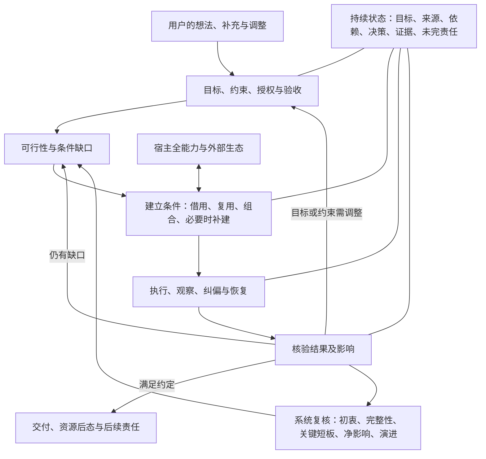
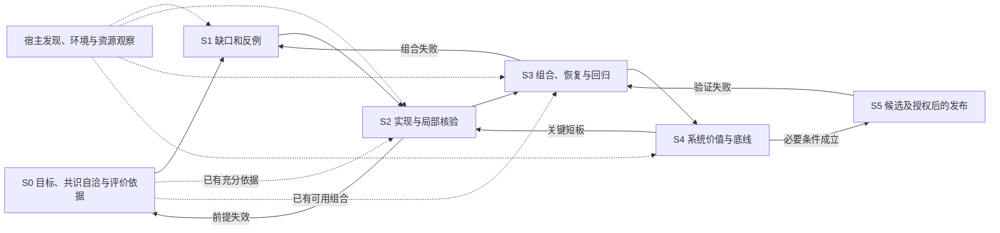

# 3.3 共识节点与当前计划

节点：N33-20260909 · 修订：r39 · 2026-10-07。状态：当前仅推进已选本地执行/控制路线；Cloud不在本版实现、候选、工序和验收清单，成熟后是否适配另议。必要功能/质量及完整验收后发布3.3的条件授权保持。

2026-10-09轻量安装路线已获用户同意：第三方工具和依赖是按任务与宿主变化的条件，不默认全部随Accord分发。复用可靠已有运行时，缺失时由健康宿主执行者在对应权限内准备最小必要条件；版本、来源、更新和恢复责任随实际采用方绑定。现有生命周期Skill复用为官方`onboardingSkill`，源码候选`20261009151947`/25成员/`050e45a6`；不新增Skill、运行时或服务。CLI0.162.0在任务自有一次隔离安装后能解析该入口；被测宿主PATH仅System32，外部观察器仍使用Node，因此只证元数据解析，不代实际setup调用、零Node准备或Hook/MCP采用。原生进程自然exit0/Job0、25缓存成员与候选逐一匹配；原件留存后清理自有临时运行目录。主用户114112安装保持。下一步只补实际引导与必要runtime连接的有效缺口；离线包/SEA不是新发布前置，17scope/13case/F-A不变。

2026-10-10当前采用条件纠偏：用户已正确执行资格化沙箱服务后的更新包，实际仅被常驻0.162.1 managed daemon和updater阻挡，安装尚未开始，原一次许可未消费。窗口关闭不保证这些后台退出，不能循环要求用户关窗口或以品牌名白名单绕过；当前同socket身份/完整loaded0及无恢复候选只证明有界观察。已准备两个精确实例的官方正常控制后接原五步更新，独立stop权限默认未授，保留原“不停后台”安装范围；身份、任务、配置、其他消费者/子进程和共享90秒时钟实时检查，不强杀、删恢复或复跑旧目录。纯检查不代实际关闭/采用，当前仍以原17scope/F-A推进，不新增无限空闲调查、通用控制服务或额外发布前置。详见[当前接续](CONTINUATION.md#已准备的下一次采用)。

2026-10-09 CI纠偏：最新a356/CI37887791818为10成功/1失败，失败仅Windows/Python3.10的source-pump queued用例：收到一次释放回执后最终记录提交unknown。原用例本地0.813秒过；仅延迟最后持久化4300ms即复现同code/stage/终态/单次释放签名。功能夹具不应把磁盘速度当协议断言，现统一20秒source run并由同deadline预留8/6秒给plan/recovery，外层30秒（双交接50秒）；显式4秒短期限反例仍正确失败且不重放，原adoption10ms及普通3秒守卫保持。69项本地会话/连接与独立复审通过；产品运行字节、25成员包、真实案例限额及CI job timeout未变。原CI未保底层持久化耗时，因此只确认并修期限敏感性，不声称已证明平台故障或托管重验通过。

2026-10-09组合观察结果：本次[调用者影响核对](../../product/cases/consumer-impact-v3.3.json)两阶段实际完成（145.077/98.048秒），同一Sol/medium/default任务在私有工具撤回后用只读替代，纳入新增合成调用者并撤回安装建议。原件/配置/190tracked保持、命令与轮次结束已核。原worker把未给定摘要算法错误推成必须提供归档，整案not-admitted；Root另交校正报告并独立复算两侧树摘要，不能追认worker原通过。原checker与helper路径前缀口径不一致，原FAIL保留，派生检查只证定位等价。原case精确定义保6fd67b63和摘要后转历史，不重跑；17scope/13活动case、7声明缺口/5无case保持，数字不是完成率。

2026-10-09关联路径纠偏：730的普通context修复仍漏了交接源/目标和普通owner回复后态。新增五个反例证明原实现会误保最初proposal或清空实际请求；现普通与交接共用接收守卫，先保请求后核变化，各类回复后再核绑定再清pending，失败不重放。AGENTS同步明确复用有效授权、沿受影响调用阶段及过期指引纠偏；不写入案例预算或新增审批。新源码候选`20261009113418`/25成员/`71aea2fe`，主用户现装仍114112/e4c0。这里只证可变借用接口的确定性守卫，不晋完整自主性或组合验收。

2026-10-09前一源码工序（730）：本轮修复一个确定的连续性接口缺口：普通source run等待请求期间借用连接身份/版本/回调变化，原实现仍先回复context请求，随后才失败且丢失该pending请求。现接收前后核绑定，先保全已消费请求，再决定处理；回复后也核绑定再清请求。四个反例先失败后通过，会话/连接65项测试及独立正反复审通过。只证本地协议与SQLite组合，不外推原生冻结连接曾跨连接响应、模型自主性或完整F05/A05。新源码候选`20261009104813`/25成员/`5989b262`，主用户现装仍`20261008114112`/`e4c0`，没有安装或授信变更。前0e1802ef/CI37869819255已success；当前候选托管检查另核。

2026-10-09当前结果：c22/CI37821558646与35b基准的原生比较已交付并独立核验，worker约166秒；实际Sol/medium/default、Goal前后null，两阶段160/96MiB CPU10%、两路并发自然退出及原件保持已证。已撤回“未绑定安装前态”的误判：07ea冻结CONT原已引用114112/e4c0安装报告及实际25成员回读，原package-before条件充分，不能另加每轮新快照格式门。完整600秒必要QA仍未充分证明，整案不晋通过；登记或额外复审时间本身不是执行超时。保原定义/限额/审查，两个结束实例仍作历史，不重做比较。当前验收说明明确既有来源适用性与真实工作/QA时点分开判断；e2e/CI37835688818已success。后续优先其它实际未尽职责，复用健康原生路线和已有局部事实。

2026-10-09后续结果：02复用exact-trusted主仓入口/独立业务目录，已通过真实配置、Goal与入口观察；52.259秒自然退出且配置/主仓不变。实际工具被Windows sandbox ACL刷新故障阻断，未完成业务，原两声明已精确保d8988f98后移入历史，17scope/13case/F-A保持。Root随后在单独健康本地路线交付9日志/7814条维护索引并独立验证，明确不抵原SDK、完整资源/环境或净收益验收。原监督器提前强退和oracle额外时间相等假设按实纠偏，保原件/失败；不继续堆等价SDK试验，不为宿主问题擅改用户ACL或停止共享进程。

2026-10-09当前工序：用户确认后，CI时序索引实例在原生bootstrap被Root调用者的错误回显期待拦住，2.0528秒结束、0业务输入，配置原样、所属进程已按强制收尾闭合。固定0.161源码与独立审查确认cwd是隐含写根，响应不会在显式writableRoots重复它；最小纯修正已验证，原实例不追认或重跑。两条已结束声明保留4fcd63fa精确身份后移出活动必过集合，17scope/13case、7声明缺口/5无case及全部F/A底线保持。下一必要运行复用已审工具/原日志和这个修正，事先绑定新路线与当前权限，不再重复来源调查或制造更多空任务。4fcd63fa的CI37754378598已success。

2026-10-08前态：资源与环境两项曾共享[CI时序索引任务](../../product/cases/ci-timing-index-v3.3.json)，前瞻登记真实160→96MiB所属worker限额、足够并发选择、首批cache保留、完整结果与退出。70项纯检查及独审通过只证明准备，当时15case/5声明缺口/3无case从未等于实际通过；后态和失败处置见上段。原600+20、45+10及Token上界、父职责、既有安装与历史保持。

2026-10-07 r38用户确认本版最终六条执行/控制路径及现选模式；三个普通Chat独立模式、网页聚合与JetBrains/Xcode内置集成本版延期，能力仍未知、非永久排除。三父scope/case共同selectionFinal=true；原17范围/全部F-A/质量/selected subjects/modes责任保持，最终集合不等实际验收。原候选依据保前态/Git，改变条件按当前源重核、不追认旧案。插件参与须入口使用许可、有效启用及必要信任/权限/加载；子代理可选且用户掌控，关闭时足够单代理或保真实核验缺口。公共目录按官方路线准备，Git市场可见不等上架，上架不代入口适配。

2026-10-04 r37纠偏（历史，当前范围已由r38取代）：入口适用性以用户具体任务、可用能力、结果及必要控制为准。研究/论证/内容报告本身可为完整成果，闭环不以电脑effects或另建庞大Agent框架为前提；执行、长程状态、权限、恢复等在任务需要时仍须充分承担。3.3的OpenAI限制是供应商范围，不是其所有入口都支持的声明。现六已选执行/控制入口不变；三Chat mode及web聚合改为task-bound pending候选，9行为6selected/3pending、selectionFinal=false。此为当时未运行定义的前瞻处置，旧auxiliary/inapplicable决定、case身份/失败保在Git；未因截图给准入、未复跑业务、未恢复取消的执行位置或新增scope/case。

2026-10-05必要源接入：补此前无case的宿主能力覆盖正式定义，复用现有准入模块核其选定subject/mode与效果矩阵，缺行、误配或削弱必要谓词拒绝；入口选择未定时，该范围不能被外部自报完成解锁。定义指纹包含适用性来源，来源变化后重绑。当前scope仍17，case由14到15是一个必要声明绑定，不是行为通过；旧14case及已运行条件/失败保持。不新增观察器、服务或业务试验，普通足够工作由Root直接实现，必要源复核使用原生协作。

2026-10-05生命周期源核对：整体宿主生命周期与逐入口生命周期分别承担变更/故障/恢复及入口集合/UI差异，不能互相替代，但可共享同一真实episode原始事实。整体范围目前无正式case，继续保缺口；不为计数造空case。未来整体case须明确绑定适用性来源的subjectEntries/selectedModes，选择未定不得关闭范围，来源变化使绑定失效。复用现有v5选择与定义指纹检查，不增选择器或运行时；这只保护准入，实际采用、partial effects、失效入口外的获准恢复actor及退休/资源后态仍须充分独立观察，不能由结构或旗标代证。

2026-10-05结束实例处置纠偏：词表、概念关系和state-client三个固定SDK实例均已一次执行结束、未准入、许可消费且禁止重放，却仍在“所有当前case必须通过”的活动集合中。复用既有历史处置模式，只移出这三个实例，保存0df固定声明、完整对象/定义摘要、原case文件、600/240/20等限制及失败。活动case由15到12，17必要范围、13职责、全部质量/情境/claim底线、joint及A01–A07/A08关系保持。路由和系统组合仍缺新的充分case，不因移除错误的旧实例必过义务而变成通过；未来绑定实际必要新结果，不重标过去episode、复制旧grant或添加空case。集合数字是当前映射，不是进度或不可变目标。

本文件是当前目标、设计取舍、历史处置和下一步的统一入口。[基线](BASELINE-v3.3.md)提供 F01–F08 的详细结果定义，本计划内的 S0–S5 工序定义依赖和交叉作业，[历史试验记录](PROCEDURE-v3.3.md)仅保留带日期的观察，[验收](ACCEPTANCE-v3.3.md)提供 A01–A08 的判据；它们是按需查询的配套视图，不是四套独立决策。`product/development.json` 是校验所需的机器投影，不以 JSON 形态取得更高权威。新的用户决定和事实先与本节点核对，再更新受影响视图、实现及证据。

日常执行结果写入历史试验记录，接续文件只保留当前事实和未完依赖；需求、取舍、判据或工序依赖实质变化时才修订本计划。当前案例的判据依赖绑定规范和实际实现，不将仅供追溯的记录整份纳入。追加历史不使未受影响证据失效；规范、案例定义、包或条件变化仍按精确依赖重验，来源认证、时效、当前独立复核及候选绑定不放宽。

本节点是当前共识的可修订记录，不冒充代码提交或验收凭证。发布、安装及外部写入各按实际授权。旧 Git 提交、标签和发布结论保留原身份；当前未提交成果先作可恢复保存。2026-09-10用户授权Agent根据实际变更决定提交与推送。2026-09-14经用户纠正并核对[GitHub计费规则](https://docs.github.com/en/billing/concepts/product-billing/github-actions)：本仓库为PUBLIC，当前ubuntu/windows/macos-latest均为标准托管运行器，运行分钟免费，不适用GitHub Free私仓的2000分钟额度。撤回据此节约或推迟远端CI的理由；按变更和验证需要正常使用本地及远端CI，不默认添加skip ci。避免无价值重复运行仍基于反馈速度和实际依赖，不基于这项不存在的分钟限制。大型付费运行器及存储另按实际条件判断，不由本结论新增付费权限。该较早授权仅含开发提交；2026-09-14用户进一步要求“我现在只想尽快实现发布，功能和质量不打折”，据此在完整必要验收和精确候选核对成立后发布3.3.0。对外传播、新账户及其它版本仍分别绑定授权。

2026-09-20校准CI节奏：本地提交与远端推送分开，小改先做受影响检查，相关改动形成完整工作段后再集中推送；不按对话轮次触发全矩阵。完整跨平台验证按集成节点、相关平台变化和最终发布候选安排，必要覆盖及发布门槛保持。正在执行的有效CI不因低价值推送被反复取消，独立本地开发仍可继续；真正改变检查前提的修复按实际需要推送，不设固定等待时长。纯接续/流程记录按相关静态检查处理，不把这一点扩大为跳过Skill、Hook、运行时或候选包变化的必要验证。先改执行节奏，不为此新增调度系统或默认使用skip ci。用户不必理解CI或等待后台工作结束后才交流；普通消息按当前任务解释，不自动取消在途工作。实际暂停、取消或需求变化按意图、影响和权限处理，恢复时先核对服务端真实状态，交付判定仍绑定所需版本及结果。

2026-09-25将上述CI责任落实到原工作流：push与手动验证按不可变提交SHA分组，不因后续提交取消正在执行的另一候选；PR检查仍按PR引用分组，允许新候选替换旧候选。同一SHA重复触发按宿主默认只保留一个等待项，不承诺全部排队。普通聊天不触发推送或取消；必要修正与其它工作可继续，Agent保留运行ID、目标SHA和未完核验责任，并以实际服务端结果判定。未新增调度器，矩阵、测试和发布底线保持。

## 共识自洽审查与评价依据

共识本身也是评价对象。先验证定义、事实前提、目标、约束和关系是否成立，再据此清理历史和实施。源头矛盾不得靠下游执行掩盖；发现实质矛盾时暂停依赖它的动作、保留独立成立的安全工作，修正源头并追溯受影响的结论和产物。这里的“暂停”不把一个局部矛盾扩大成无关工作全部停摆。

自洽审查包括：同一术语是否同义、范围与量词是否一致、价值目标与版本承诺是否混淆、事实是否有依据、必要条件是否可满足、授权是否有来源、职责是否有承接者、依赖是否循环或相互冲突、失败能否被发现和恢复、验收是否能反证错误而非自我认证。反馈回路可以存在，但执行前提不能依赖尚未取得的最终成功，例如发布后的检查不能成为发布前已经完成的条件。

本节点对已讨论命题的本地审查如下。它记录有限审查与解释边界，不宣称形式化证明或独立功能验收。

| 潜在冲突 | 当前解释与处置 | 对照反例或后续核验 |
|---|---|---|
| 通用、供应商中立 vs 3.3 仅 OpenAI | 前者是价值与设计，后者是本版交付范围；通用职责不写成供应商专属假设 | 模型/事件或平台名称被写入通用必要条件时重审；不能把其它宿主未来可适配写成当前已支持 |
| 全能力不漏项 vs 按需、轻量 | 发现与处置全覆盖，执行按实际用途和权限选择；列出未知和没有当前用途的项 | 只看 API 遗漏 UI 是覆盖失败；为了覆盖而启用无用功能是干扰失败 |
| 不穷举需求 vs 可验收 | 不枚举全世界需求；针对明确版本、入口和承诺，维护来源完整性、适用判据与开放反例 | 测试样例命中或固定清单齐全不能证明所有场景可靠；新增发现修订受影响范围 |
| 自主创造条件 vs 用户授权与现实限制 | 技术判断、研究和可代办操作由 Agent 负责；实质目标取舍及不可代办授权由用户决定 | 缺工具就放弃和未经授权安装均失败；受限必须有原因、替代分析和未完责任 |
| 纠偏保障 vs 用户直接操作 | 核对变化事实、实际影响和用户意图；同一动作可能是明确选择或误触，不能靠经验标签判定 | 明确意图被强制改回、含糊而重要的变化未确认、无实质影响却反复打扰，均失败 |
| 协调责任 vs 中央代理 | 关键职责需接通和核验；技术路径按缺口选择，协作层不自动取得更高权限 | 强制所有调用中转、把未观察的调用算作可靠协同，或按组件偏好改变用户选择，均失败 |
| 负边界 vs 积极交付 | 防止无依据推断，同时承担已授权的完整结果 | “没越界但未完成”不通过；“没禁止所以可以”不构成授权 |
| 动态节点 vs 稳定验收 | 变更有版本和依据，撤销受影响证据的当前效力再复验，保留旧记录 | 看到失败后降低判据以通过，或更换对象沿用旧证据，均拒绝 |
| 历史整治 vs 可追溯与有效资产 | 移除当前错误权威、分发和重复负担；原始版本、失败和可恢复成果保留 | 改写旧发布或删除唯一有效机制而无替代验证，均失败 |
| 世界级/生产级志向 vs 3.3 有界收官 | 全维度比较，先守必要底线，再按任务权衡；可选优化进入后续 | 用口号自证成熟或以无限优化拖延完成，均不能通过 |
| 交接、恢复与释放 | 停止冲突写入后保留恢复资源；确认目标安全续做再释放，后续失败先核对已发生效果 | 仅凭回执/子任务启动/摘要完成释放源，或回退时同时恢复两个写者，均拒绝 |

上述显式张力已有可检验的解释；尚未证明运行时能够可靠履行它们。当前缺口仍进入 W01–W08，不能因共识自洽就宣称功能成立。任何新反例都可推翻当前解释或实现。

技术判断不因表达强烈或双方认同而成为事实。源码公开和多端复用降低调研与实现成本，但不证明所有客户端暴露同样的控制、权限和恢复接口；当前[Work官方说明](https://learn.chatgpt.com/docs/enterprise/chatgpt-work-overview)也将共享核心与按执行位置、工具和策略决定的能力区分；关键状态交接可采用简单闭环，也不代表提前触发便保证接管或失败恢复。Plan/Goal的适用性按下文的当前上游规则及具体任务判断，不作“绝对不适合复杂工程”的断言。现有证据尚未证明核心目标根本不可行，也不足以保证任意需求、入口和故障都可实现；按具体缺口、替代路径和实际结果推进。

2026-09-27收尾依赖核对：17个必要claim/scope没有重复；11个有定义、6个无定义是真实定义缺口，不等于六项功能均未实现。当时另有systemic-correction没有活动case、普通CLI交付的活动case未覆盖effective-user-environment；后续更新说明同一交付段已补上前瞻声明，并在48d4dbeb精确候选上完成两轮交付、独立四轴审查及两case的observe/recheck准入。该实例不重放，不扩展为完整范围通过。CLI校验的caseBindingGaps按活动case列明无案例、职责/质量轴/场景未覆盖，以及A08是否缺少单个完整组合case；它只诊断声明缺口，不判断案例充分性、不提供执行证据、不增加通过条件。无observer仍不准入。

2026-09-28区分定义与执行前提：按上述既有A02/A05判据补齐`v33-dynamic-model-routing`与`v33-autonomous-continuity`两个范围的机器投影，范围定义无需等待模型任务。此举只把两项从未定义移入已定义但无案例/无证据，既不缩成一次SDK测试，也不要求更换胜任的主模型；17项分母、原案例与判据保持。其余四项定义缺口与两项实际案例/证据缺口分别保留，不能用定义数量表示功能、工时或发布进度。具体执行仍须前瞻绑定真实成果和当时有效的入口、包、能力、权限、预算及独立核验，不以空案例解决计数。

2026-09-28随后集中补齐其余四项机器范围：入口能力覆盖、系统组合、整体生命周期、净影响评估。必要范围仍为原17项，现均已有定义；原12case保持，六项无case/无证据继续显式阻塞。前者分别承担功能表面与必要使用、同episode全链及纠偏、采用/变化/失败恢复/退出、独立结果与总成本判断，不互相代验，也不取代三个入口父范围或已限定的SDK子范围。此后定义缺口已闭合，执行重点转向具体案例前绑、真实行为和整体验收；不把17/17定义写成功能完成率。

入口处置按当前r38最终选择、r39保持的范围分成两条工作线；既有entrySurfaces与三个父scope继续承担登记，不新增名册或按界面数复制试验：

| 工作线 | 本版范围与待补条件 | 验收边界 |
|---|---|---|
| 执行入口 | CLI/Desktop/VS Code/SDK四行，复用共同机制，补实际采用、输入/权限、恢复和退出差异 | 共同代码不代验各入口；VS Code仍需建立受支持的组件/后端连接，不能照搬桌面插件支持结论 |
| 交互与控制 | 桌面仅local-only Work与Remote，手机仅Remote，复用获准本地主机 | 绑定同一任务、账户/配对、输入/审批、暂停/撤权、断连后效果及结果权限；手机不成为插件执行主机 |

当前9行是6selected/3deferred；各独立Chat模式均deferred，selectionFinal=true，没有待用户再次裁定的pending。延期保留能力unknown和未来再议，不构成本版交付/生命周期任务。选择已定与实际验收未完分开，不能用scope选择或静态代码宣布支持。

2026-09-27至10-04的4/7、6/3 pending数量、当时Remote/Work工程选择及后来取消路线的来源段落保留在[bca52cdb原计划](https://github.com/yiheng8023/YIYUAN-Accord/blob/bca52cdb92c3eb51e061f9ab7fa3d8eca5b22589/docs/operations/PLAN-v3.3.md)，只作历史。当前继续沿已选路线推进；不可达不等于执行停止，不能据此重新派发，也不能让延期项目继续占用关键路径。

2026-09-27更新/恢复说明交付已完成：[两轮工作段](../../product/cases/upgrade-guidance-v3.3.json)在用户批准后执行一次，三份成品按后来Stop反馈同步纠偏。既有准入器接受v33-codex-cli-update-guidance-01与v33-systemic-correction-03；详见[实际记录](PROCEDURE-v3.3.md#更新说明交付与反馈纠偏的实际准入2026-09-27)。独立备份与后置Hook路径的区别、安全更新时机和执行者责任已提炼到两语README；这是Root随后整合，模型原件保持。旧systemic scope的已结束实例条件仍留在7ae3bac5历史身份，新实例保持自己的候选与有效用户环境条件，不归因于Accord单独收益。该段及所属资源责任已闭合；后续沿上述工作线推进未定义范围、实际入口与自主连续性的必要工作，不重复这两轮或制造交接压力。后续用户截图已显示自然Stop完成，原单次失败的具体原因仍未知；完整验收与发布资格仍未成立。

2026-09-27 Work职责组合判断：**Work本地子模式确定复用现有Accord包，不另建执行器。** [插件说明](https://learn.chatgpt.com/docs/plugins)明确Hook适用于包含Work的Codex runtime，但脚本须存在于实际执行环境并经信任；[MCP说明](https://learn.chatgpt.com/docs/extend/mcp)区分同主机配置与网页远程工具。当前安装的桌面26.924.2738.0代码保留Work插件选择、local配置读取及原生thread/start路径，支持该工程选择，不能据静态分支证明当前账号可用或已执行。组合职责由Hook供应输入/恢复指导、Skill协调、同主机stdio状态MCP核对状态、原生线程承担执行/暂停/持久化；现有检查点按真实需要采用。

同日真实Work本地核验已完成：原生历史确认入口指导、UserPromptSubmit和一次状态MCP调用，thread/session/turn相符；实际cwd的输入回执与本轮epoch/turn一致。Root准备的提示词固定了项目目录，而用户新建的是projectless对话，因此原查询针对另一session+cwd键返回missing回执。保留原报告与事后对账的分别来源；这是诊断提示词的路径问题，不归责用户，也不改写为正确cwd的MCP联读成功。下一步将状态读取绑定实际Hook所在cwd，业务文件目录另列，在真正需要的普通Work交付中核验采用、续作和退出；不为覆盖原结果重跑诊断。MCP缺元数据/根身份冲突时的守卫，以及上下文读取对Hook转录和CODEX_HOME/sessions的限制保持。原查询不构成状态处理缺陷；后续只补足可发现性：输入回执提示给出JSON编码的实际绑定cwd，状态工具说明指向该定位并明确checkpoint文件也以此为基准，不自动改域或新增独立业务目录参数。

2026-09-29模式处置对齐（历史数量，非当前范围）：此前两条已定开发路线现在进入三个父scope/case的正式限定集合：`chatgpt-desktop`选择Work Local及限定Remote，`chatgpt-mobile`仅选Remote控制已选本地主机任务。原四个Codex入口保持，共六个ID具有已选开发路线、五个聚合行待判。这是开发责任对齐，不是新增两个完整支持入口，也不增加功能完成率。

混合入口只声明本版实际范围：桌面Chat/Work Local/Remote、手机Chat/Remote、网页Chat；完整模式由机器投影modeCatalog给出。普通Chat独立用途已按r38本版deferred、能力unknown；不能凭界面名判永久不适用或凭选择器晋全支持；已选Work Local/Remote逐主机和交互边界验收，共有核心不代验Chat采用。校验器不得强迫已取消路线继续留在清单，也不得省略当前声明模式或削弱其判据。

现有准入器核入口及当前modeCatalog全部模式：三个父范围共享完整处置，交付/生命周期只覆盖已选模式且保留全部职责。宿主能力覆盖case另引用同一已选集合与模式，不要求把它加入三父范围的共同声明组。任一仍在范围内的入口/模式pending或selectionFinal=false均阻止这些完整范围准入。当前17必要范围和A01–A08质量底线保持，实时case定义见机器投影；历史无模式的全待判声明仅可读取，不能用于完成当前准入。声明结构、范围来源和真实效果分别复核，案例数量不作为功能完成率。

Work Local只指协调与工具执行均由已选本地主机承担；Remote复用对应主机。实际主机或入口变化时重新核对采用、状态、权限与退出，历史和模式不自动转移，不在当前对话中热切执行者。

2026-10-03当时的新环境界面与准备观察已结束；其原条件和结果保留在上述bca52cdb历史计划及接续证据中。该执行位置后来已由用户取消，不再保留当前准备、适配或等待开放的工序；未来是否重选另议。

2026-10-03元指导版本决定已明确：原文默认纳入3.3，由单一包内reference承载、现有入口加载及桥接具体任务职责；不是新增独立指导服务。保持原文字节、用户文件管理权与宿主优先级，去重不能删除实际保护。工序沿F01/F02/F04/F05/F06/F08及相应既有A项：先源/包/读取失败与子代理状态隔离，再核启用信任后的启动、普通输入、压缩恢复/重连及实际子代理全文可用，最后核结果、干扰、停用和退出。4000的正数每handler载荷门只是当前配置，不作无截断或全宿主保证；新安装/Hook信任及Cloud仍各自需对应权限，未消费旧单次许可，不改17scope或降低F/A。

[项目说明](https://learn.chatgpt.com/docs/projects)还明确ChatGPT项目指令适用于项目内聊天，但这是项目作用域的指导通道，不等于已安装Accord的入口、全部非项目聊天或可靠的状态/效果恢复。不能借此要求用户重写AGENTS.md，或用静态指令替代应由宿主承担的确定性保护。实际账号的入口、权限和协调器采用条件分别核实；当前只读界面观察不能扩大为全账号不可用，也不授权创建/发布环境或修改项目指令。

历史IDE来源澄清保留在bca52cdb原计划：当时的会话/恢复资料不支持“没有历史或回退”的笼统结论，也不能证明完整状态继承与效果撤销。当前两项内置IDE均按r38本版deferred、能力unknown，没有本版核验待办；未来是否重选另议。外部执行者按真实任务需要使用IDE工具，不等于适配内置Agent。

2026-09-30按用户关于DevDay变化的提醒核对[十项官方来源](../../research/reviews/2026-09-30-devday-accord-impact.md)。Dots的notes、暂停/唤醒及委派、MCP Events的异步订阅、Plugin Extensions的交互通道和Agents API的托管状态提供新的原生比较路线；它们的账号条件、不同停止语义、漏失/重复事件、云协调Hook限制及实际效果仍分别验证。先比较能否承担既有职责，不因新品可见新增入口ID、常驻服务、订阅、付费套餐或默认长程Goal，也不以新闻代验当前SDK/CLI链。CLI0.159的opt-in输入交错和启动变化按真实版本/开关核受影响部分，不强制全量重验或自动变更用户模型。当前Root本机新包已实际采用；目录自然退出失败和重启闪窗分别保留，完整验收、范围和发布条件不变。

## 全维度动态评价框架

评价就是对现有 A01–A08 验收条件作具体量化，不在验收外新增一套评分体系。共识/需求是否自洽、实现是否符合要求、真实用途是否满足，分别核对；同一组判据也用于当前开发、历史重审和 Accord 的实际应用。

每个指标只绑定必要信息：对象及版本、分母/计算方法、通过阈值、观察证据和失效条件。每个案例执行前确定重复次数 n、超时 T、资源/费用预算 B 和允许的恢复条件；未绑定记为缺口。不得看过结果后下调要求。时限、费用或上下文阈值按具体任务给出数字，不编造适用于所有任务的统一数值。

| 现有验收 | 可计算指标 | 本版必要通过条件 |
|---|---|---|
| A01 需求与授权 | 已正确承接的有效意图/有效意图总数；遗漏、误授权、未经同意改变目标次数；必要确认遗漏、不必要确认次数 | 覆盖 100%；其余计数均 0。明确取消或变更的意图按当前授权更新分母并保留依据；确认必要性按案例事先绑定的意图、影响与授权条件判断 |
| A02 宿主能力 | 有来源且有处置的功能/已绑定版本与入口发现的功能总数；官方/实际界面差集中的未解释项 | 处置覆盖 100%；未解释项 0。包括按钮、设置、命令及 UI 独有项；发现未完成时分母未知，不能算 100% |
| A03 推进与恢复 | 通过的普通推进/可恢复失败案例数÷预定必要案例数；不必要催促和人工救场次数；恢复耗时 | 案例通过 100%；催促/救场 0；恢复耗时不超预定 T。必要用户决定单独记录 |
| A04 历史及全程纠偏 | 已修正并复验对象/受影响对象总数；漏改、误改数量 | 受影响对象覆盖 100%；漏改/误改 0；未影响的有效结果保留 |
| A05 继承与连续性 | 关键状态已核对继承数/所需数；接管验证通过数/必要接管案例数；提前释放、冲突写者、丢失未完责任数 | 两项覆盖 100%；后三项 0；继承损失与恢复成本符合各案例预定条件，未知不算通过 |
| A06 环境与生命周期 | 已通过的适用安装/加载/变化/更新失败恢复/退出案例÷必要案例；必要且可观测变化的发现率；无关配置损坏、未核实替换和擅自恢复用户选择数 | 案例通过与必要可观测变化发现均 100%；后三项 0。不可观测项保留为限制或待补条件，不能删除它提高覆盖；不适用须有来源和独立理由 |
| A07 成品与资源后态 | 成品满足的必要条件/必要条件总数；未处置任务资源、原件损坏、无归属变更数；峰值和退出后占用 | 满足率 100%；后三项 0；CPU/GPU/内存/存储/进程等达到预定资源预算及退出条件 |
| A08 系统与净影响 | A01–A07 完成数/7；完整组合案例通过率；未解决严重退化数；成功率、返工、时延、费用和维护成本 | 必要前提 7/7；组合案例 100%；严重退化 0；按预定任务预算完成充分净影响评估，不用均分抵消底线 |

100% 和 0 指绑定样本、对象与条件内的验收，不推断无限场景无故障。全维度由原有八个质量轴交叉检查这些指标：授权/安全、功能完整、普通入口、恢复/生命周期、变化适应、证据可靠、用户负担、维护/资源；新增盲区回到受影响的 A 项修订。非线性调度的收益与失效也按相同指标核验，不能为了并行增加冲突或跳过必要前提。

正式验收覆盖以当前 `python -B -m yiyuan_accord verify --json` 的 `evidenceAdmission.progress` 及其缺口字段为准，当前工作状态见[接续页](CONTINUATION.md)。本计划不再复制一份易漂移的实时计数。2026-09-09的3/17已定义、14/17未绑定等数字是历史快照，保留于该节点的Git版本，不作为当前起点。

验收覆盖分 = 已验证必要范围数 / 必要范围总数 × 100。它衡量正式证据覆盖，不代表代码完成率、综合质量或工时百分比。分母变化须有范围修订依据，不能删掉困难项提高分数；A项和关键阻塞逐条展示，高分不抵消必要失败。未验证既不记已失败，也不记已通过。按实际缺口补足案例或证据，保留原始失败及未完责任。

2026-09-28用户明确本次进度只计算到3.3正式发布。核对发布对象、精确包和公开链接属于发布动作的完成证据；之后的宿主安装、传播、市场审核和治理不进入分母。工程进度按现有W01–W08的已交付结果、剩余断点和关键路径报告，不用定义数、测试数、局部CI通过率或缺少稳定权重的百分比替代。3.4适配候选的调整不改变当前17项必要范围及A01–A08底线。

## 设计初衷与版本边界

Accord 的产品定位是面向人与 AI 持续协作的协调与可靠性保障层。职责贯穿用户意图、Agent/宿主、外围能力与最终结果；插件是具体宿主中的交付形式。产品问题、系统职责和实现载体分别考虑，不把逻辑上的“介于之间”预设成技术上的统一中转。关键判断、状态变化与结果反馈须有可验证连接；允许健康原生直连，按实际缺口决定是否补中转、拦截或持久机制，避免无依据增加耦合、成本和单点故障。协调责任不赋予高于用户或宿主的权限，也不等于已取得全域观察或控制能力。

Accord 面向人与 AI 的长期协作，属于更广泛的人机协作愿景。默认用户只有自然语言想法，不懂可行性、技术操作、资料检索、配置、模型调度、上下文或资源管理，也不负责提醒继续、fork、接管和救场。Agent 在授权范围内澄清目标、判断可行性、主动创造必要条件、组织能力、执行、纠偏、恢复并核验结果；必要的本人动作和目标取舍以普通语言说明。可建立的条件缺口不是目标不可行的证明，不能让用户自己阅读文档或协调工具代替交付。

默认非技术输入是必须能服务的条件，不把用户限制为新手；熟练用户仍可直接操作、调用组件或调整路线。按已表达意图、真实影响和授权判断，不按“新手/高手”标签赋予或取消控制权。

项目开源，不以盈利为目标，以工业/商业生产级交付标准建设，追求平权、普惠与用户自主。中立首先是价值和治理独立：不绑定供应商，不以资本、赞助或生态利益扭曲评价或牺牲用户利益。商业能力可以按实际价值借用；选择应考虑可获得性、质量、总成本、隐私、可替换性和退出条件。世界级是全维度持续对标的志向，具体成熟度由证据确定。

**3.3 只交付 OpenAI 范围的适配：ChatGPT 与 Codex 的适用入口分别验收；Claude 不纳入 3.3 分发、安装入口或功能声明。2026-09-28较早取消Claude后续适配，现按最新决定仅重新列为3.4可能候选，并加入Pi、DeepSeek Harness、Z.ai ZCode，随后补充Google Antigravity；其它后续计划保持。** 产品名称统一为 YIYUAN Accord；阶段性实现不改变通用设计和供应商独立。历史包与证据留在原版本，不能因更改版本号而成为 3.3 功能。当前源码中保留的历史验证代码、记录和来源引用只服务追溯，不构成当前支持承诺。

AI协作入口承担所绑定任务的交付责任。入口先按任务必要能力、结果及控制经过下述适用性判断，再确定范围与承诺；普通Chat的研究/论证/内容等独立用途按r38本版deferred、能力unknown，不由界面名判定永久只有辅助。未上架不能推断不能调用，品牌相同不能推断能力相同。3.3 不自动缩成 CLI，也不承诺所有尚未验证的 OpenAI 入口都可用。

## 入口适用性与版本承诺

### 本地入口与通用适用性

按用户确认的层次组织适配，避免把不同维度和品牌平铺成独立工程：

| 维度 | 类别与作用 |
|---|---|
| 产品或工作形态 | Chat、Work、Codex；按实际承担的职责判断 |
| 执行位置 | 本地、远程主机、云端；绑定执行者、数据与权限 |
| 接入方式 | 网页、桌面客户端、IDE、CLI、API/事件触发 |
| 运行平台 | Windows、Linux、macOS；分别核对路径、进程及资源机制 |

VS Code兼容编辑器优先作为同一扩展适配族，Xcode、JetBrains等作为IDE类别下的集成实例记录。品牌不自动增加一套实现或独立业务试验；共同机制与证据复用，只有影响Accord职责的权限、组件载入、事件或恢复差异才补接和验证。沿用原发现ID追溯记录，不把重新分组当作已证明等价或自动减少必要功能；最终支持集合与其验收绑定仍须一致。

2026-09-11用户确认：适配由真实交付价值与必要职责的全链路可行性决定，不以界面数量、产品名称或当前组件支持情况代替判断。先根据可行性和预期净价值确定开发范围，再通过真实执行确定支持声明；不要求先完成验收才能开始实现。网页、桌面、移动是交互位置，本地或云端是执行位置，均不能单独证明或否定Agent能力。模式、实际执行者、权限、数据与状态边界必须分开识别。

按现有入口盘点逐项给出纳入开发、辅助用途、待判、后置或不适用的处置、依据及未完依赖，不另建一套登记系统。判断包括真实用途与用户收益、可用或能合理建立的执行条件、完整必要职责及失败恢复的可行路线、用户负担与全生命周期成本。普通Chat仅有对话或插件选择时，不承诺独立全链路适配；若承担有价值的需求承接或向实际执行者转交，评价该组合的连续性与结果，不能把转交说成Chat自行完成。未决的实际能力保持unknown；r38已决定本版延期的入口不再列作待判。无法操作当前界面或暂缺账户不证明产品永久不适用。可补足的条件由Agent在已有授权内主动建立，真实新增权限、数据或费用仍按边界处置；后置及排除保留理由和原始缺口，不改写历史失败。

用户9月15日强调没有本地Mac不妨碍macOS/Xcode适配。继续利用官方配置/协议、跨平台实现、现有macOS CI及适合的远程资源完成可执行工作；只有确需具体宿主交互的未知才保留相应验证边界，不据此搁置整体适配或要求用户购买设备。macOS上的CLI机制与Xcode内集成分别归因，平台CI成功不冒充后者，缺少后者证据也不抹去前者的进展。

用户进一步明确当前没有Xcode/JetBrains，不购买Mac或JetBrains来满足本项目验证。按已有VS Code、CLI、桌面客户端及标准托管Linux/macOS CI推进共同机制；具体集成优先查官方资料、源码和既有可靠证据。仅有真实关键差异且替代证据不足时保留该实例的未验证边界，不据此要求采购、反复催用户安装或阻塞条件已具备的主线。未安装不等于不兼容，未验也不等于已支持；新增账户、付费远程资源或安装仍需其实际授权。

全链路指目标与授权、执行与纠偏、连续性与恢复、结果核验与交付、资源及未完责任均由可靠的承担者按需接通。Hook、Skill、MCP、原生状态/调度、Agent判断或其它合理组合都是手段。缺少Hook只限制依赖它的当前路线；应先映射缺失职责并比较替代方式，不能直接排除整个入口。替代方案须达到实际承诺所需的可靠性，并验证适时参与、行动反馈、恢复和收尾；需要确定性执行的保护不能仅靠提示出现来证明，也不预先把所有职责规定为拦截。共有执行基础优先复用，按实际差异补接与验收，不为多个界面重复建设适配器。

当前Codex CLI、Desktop、VS Code及已绑定App Server职责继续；local-only Work和Remote限于已选本地主机路径。已选入口的完整功能、可编辑/可使用设置、交互、权限、普通交付、连续性、恢复与退出仍需验收；JetBrains/Xcode内置集成及普通Chat独立用途已按r38本版延期，不再作为当前工序，不能以无电脑effects否定研究/内容成果的闭环。

[JetBrains当前官方说明](https://www.jetbrains.com/help/ai-assistant/codex-agent.html)明确支持Skill、AGENTS.md和经设置传入的MCP，以及自己的权限/模式与上下文显示；这提供了复用或组合的候选路线，尚未证明Accord Hook参与。OpenAI的[IDE说明](https://learn.chatgpt.com/docs/codex/ide)区分VS Code兼容扩展与JetBrains/Xcode自有集成，不能跨集成直接借用证据。此前通用插件页与本机VS Code有限参与观察的分歧保留为历史记录；当前按2026-09-28补核分别处理官方支持边界、历史参与和实际加载未知；按实际构建和功能区分处理，不回退为统一排除。上述来源复核不是完整支持声明或新增安装授权。

2026-09-15的外部触发及内置IDE候选来源保留于bca52cdb历史计划，不构成当前任务。移动Remote的已选路线仍复用连接主机的任务、文件、插件与权限；本轮官方回读及用户界面观察见下文，同一任务的远端输入/审批/断连差异仍待验，不能宣称手机本地执行或加载。

验收沿用A01–A08：A02核当前范围处置、已选入口及依据，A01/A03/A06核实际交付和生命周期，A08核完整组合与净影响。适用性覆盖当前9个OpenAI盘点行（6selected、3deferred：两内置IDE及网页Chat）；后两父范围仍对应同一六个已选集合。三混合入口以当前modeCatalog完整声明，各独立Chatmode均deferred；selectionFinal=true、17范围和全部质量底线保持，必要case按实际缺口补绑定。载体entry与被验subjectEntries不得混同，开发选择不计行为通过。

2026-09-27曾将IDE内置Agent与外部执行者调用IDE工具分开判断；以下保留复用分析，当前处置已按r38更新，不能把组件发现当整包接通：

2026-09-28补核VS Code：现行[官方插件说明](https://learn.chatgpt.com/docs/plugins)明确IDE扩展不属于插件受支持入口；历史发布说明和两次原生参与观察保留各自日期/版本，不能覆盖当前支持边界。本机26.917.62051扩展的普通app-server启动、initialize及请求转发未见全局plugins/hooks关闭，查到的关闭项只用于临时标题/描述生成；这仍不证明后端加载。附带0.155.0-alpha.16.3也不能代替实际后端身份，因为扩展允许CLI路径覆盖和WSL执行。cx-vscode继续作为开发目标，入口、Hook/MCP和安装路径须按实际构建补证，不按CLI插件等效宣称支持；限定只读核对的指定v2随后已由原生记录确认：27100450入口在首个工具前注入，一次状态MCP调用身份匹配；输入回执仍缺失并处于恢复隔离，未检验自主恢复或完整接入。没有因此启用、安装或调整用户配置，详情见接续。

| 路线 | 复用与职责 | 当前决定及最小未完条件 |
|---|---|---|
| JetBrains内置Codex | [Skill导入](https://www.jetbrains.com/help/ai-assistant/agent-skills.html)和[Agents的MCP传入](https://www.jetbrains.com/help/ai-assistant/codex-agent.html)提供组件通道；[聊天Project rules](https://www.jetbrains.com/help/ai-assistant/configure-agent-behavior.html)不替代所选Codex的指导 | 本版deferred、能力unknown，无当前适配/验收待办；若未来重新选择，仍需入口/输入、身份与恢复对应，不以导入技能推定Hook已部署 |
| Xcode内置Codex | [专用配置与组件导入](https://developer.apple.com/documentation/xcode/extending-and-customizing-agents/)作用于Xcode启动的Agent | 本版deferred、能力unknown；未来若重新选择再核构建/事件、MCP身份与恢复，不借CLI或macOS CI冒入口采用 |
| 外部Codex使用IDE工具 | [JetBrains IDE MCP](https://www.jetbrains.com/help/idea/mcp-server.html)与[Apple mcpbridge](https://developer.apple.com/documentation/xcode/giving-external-agents-access-to-xcode/)均提供官方连接路线 | 保留按真实任务需要复用的组合可能；不产生本版内置入口适配任务。若确需IDE工具，另核连接、目标、效果和退出，不能替代两内置入口的deferred处置 |

以下是历史组件复用分析，不是本版内置IDE待办；它不新增IDE控制器、身份合成或Hook转换层。内置入口缺失的职责可由充分原生机制承担，但须有明确对应；外部组合不绕过内置的不确定性，也不要求先完成整项验收才能开发。IDE MCP的启动cwd与业务项目分别绑定；启用或自动配置会启动服务、改变连接或客户端设置，需具体授权和恢复责任，不能用当前来源审查代替。项目工具暴露和执行确认保留用户选择；停止客户端或回滚文件不自动撤销IDE内已发生的全部效果。当时只沿官方契约和既有资料核对，没有要求用户采购或为取证安装；是否重新选择这些内置入口另议。该段保留2026-09-27工程路线核对的历史观察，当时为4selected/7pending；当前集合以r38最终决定及r39保持的9行（6selected/3deferred）、已选模式与selectionFinal=true为准，不能沿用旧分母。父范围和必要质量仍分别验收。

2026-10-09只读回核官方现页：[Plugins](https://learn.chatgpt.com/docs/plugins)仍明确IDE扩展不支持插件；[Remote connections](https://learn.chatgpt.com/docs/remote-connections)说明复用连接主机的项目、状态、权限和插件，实际配对/可用性仍需核；[插件打包](https://developers.openai.com/plugins/build/plugins)仍支持现有`.codex-plugin/plugin.json`兼容格式。因此当前没有强制迁移manifest格式的任务，VS Code也不能借桌面插件可用性直接过关。本轮未操作IDE/手机、启用连接或调整安装；六条选择和行为unknown保持。

同日后续用户已补充Android手机截图并确认Remote位于Codex内：页面显示带绿色指示的已列出主机及YIYUAN-Accord项目。入口发现已闭，不再记录为等待用户答复或入口消失。官方现页也说明从Codex进入连接电脑、旧界面可能仍称Remote；其改名说明明确举iOS，本机Android位置以用户截图为据。`remote`仍表示已选的本地主机控制路线，不锁定菜单名称，不因界面改名修改机器模式ID或扩大范围。主机/项目列表可见不等于同一任务的输入、审批、暂停/撤权、断连后态和结果回传已验；后续在必要实际交付中补证，不为菜单核对重新配对、启用连接或创建Cloud环境。

随后用户从手机发出“从手机继续。”；原生MCP及Hook输入共同确认原Root线程01a0d6a8-d302-7081-ab25-b1b4281dd924、新turn01a120a0-ab52-7173-a31e-78f08015197c及epoch359f1988-f199-408f-9d1f-cce040f3452a，完整6字符输入、无replay/恢复隔离。实际shell读取确认原Windows主机、原仓库main/a987fb45；没有迁移执行者、创建新会话或改连接/配置。手机来源据用户操作说明，原生元数据本身不含设备类型；该有限输入/本地执行观察不替代手机结果显示、审批、暂停/撤权或断连后态验收。私有accord-mobile-remote-20261009-01保原始回执和OBSERVATION；不增加事后通过case或改变17范围/13case及F-A。

## 跨项目与执行位置的连续性

2026-09-21用户两张截图直接显示同一批处理对话从“最近”移到Playground项目下，确认该客户端的手动归属调整入口。后续只读接口对同一task返回projectId=null、原批处理cwd和notLoaded；它与截图之间的具体操作序列未观测，不推断移动失败或已经回退。侧栏归属、对话历史、cwd/仓库、权限及实际进程分别核对；项目移动可作为保留原对话的接续候选，但不据位置变化宣称上下文减负或代码/执行状态迁移。当前调用工具未暴露任意项目移动接口，不以改本地配置或数据库代替受支持操作。原图与限定元数据保存在私有accord-project-assignment-observation-20260921-01；本观察不改变原批处理结果判定，也不移动或重新运行该任务。

当前F05/A05以获准目标、有效状态与责任连续性为核心，按已选本地路径核同项目换载体、同仓库跨主机和跨项目职责承接。当前范围之外的执行位置不是本版验收对象或后续自动重查任务；历史不同方向的观察仅保留原身份，单一本地案例不代验全部路径。

保留当前检出的默认约束用于防止无依据迁移，不应成为已经授权且目标明确的跨项目/环境交接禁令。跨越边界时核对目标/子目标关系、源和目标归属、可转交的最小状态及有效成果、路径/版本/未提交变更的映射、目标端实际能力和数据/权限范围。源项目的指令与授权不会自动成为目标项目的权限；只传递适用且获准的数据和责任。目标接收、实际可续做、源释放、后续失败恢复与返回后的成果核对仍分别取证。不同项目可能各自继续运行，只对实际转交的责任和共享可变成果排除冲突写者，不要求全局只能有一个Agent。

优先复用适用的官方或可靠组合。当前[主机间移交文档](https://learn.chatgpt.com/docs/remote-connections)要求目标主机保存匹配项目并传输聊天/Git状态；它不证明任意跨项目语义继承。当前任务工具不能自我移交，需要适用且获准的其它调用者或路径；UI和命令按实际版本/账号核，不从单个工具缺失推断整体不可行。

此修订细化既有W01/W02/W05/W06与A02/A05/A06/A08，不增加已实现或通过计数，不授权新账户连接、数据上传、外部写入或直接迁移本开发任务。下一按实际需要比较可行路径并补代表性来源/权限不匹配、部分状态无法搬运、目标失败和回接验证；已完成的同目录基础链保留其有限价值，不重跑充当跨边界证据。当前指导已将检出保留限定为未获准迁移时的默认，要求重新绑定目标权限、路径及状态，并限定共享效果的写者；具体跨边界实现没有实际执行与后态前保持未验证。

## 稳定关系与动态方法

本节系统图与[工序依赖图](#工序与依赖)持续维护；面向用户和开发者的概要视图见[中文 README](../../README.zh-CN.md#如何工作)与[英文 README](../../README.md#how-it-works)。图示沿用本计划的设计依据，相关职责、关系或依赖变化时按[贡献指南](../../CONTRIBUTING.md#current-development)同步校准受影响视图；验收状态仍以所链接的证据为准。

起点—过程—结果是可嵌套、并行、反馈的关系，不规定三个物理模块或三个 Skill。非线性工序同时适用于 Accord 的开发、通用设计及普通用户实际任务；工作按依赖和条件组织，允许交叉、并行、回退和重排。简单任务可以线性完成，授权、共享状态、不可逆动作及交接释放的必要局部顺序仍须遵守。语义判断解释输入与变化；事件驱动只重审受影响判断；负边界限定缺乏成立条件的推断、授权、动作和完成声明。少数稳定约束驱动可变路线。局部确定性操作可标准化，全程不套固定 SOP。

边界内仍有完成目标的积极责任。未禁止不等于已授权，没有越界不等于完成。一次消息中的同意、侧问、纠正、暂停或补充分别解释；仅有侧问不能抹掉此前同意和未完责任，真实暂停则保留工作并遵守新边界。

```mermaid
flowchart TD
    U[用户的想法、补充与调整] --> T[目标、约束、授权与验收]
    T --> F[可行性与条件缺口]
    F --> C[建立条件：借用、复用、组合、必要时补建]
    H[宿主全能力与外部生态] <--> C
    C --> E[执行、观察、纠偏与恢复]
    E --> V[核验结果及影响]
    V -->|仍有缺口| F
    V -->|目标或约束需调整| T
    V -->|满足约定| R[交付、资源后态与后续责任]
    S[持续状态：目标、来源、依赖、决策、证据、未完责任] --- T
    S --- C
    S --- E
    S --- V
    V --> Q[系统复核：初衷、完整性、关键短板、净影响、演进]
    Q --> F
```

闭环必须有明确、可核验的状态及转换规则；需要跨掉线、进程退出或重启恢复的责任还须有足够的持久依据。持续状态首先是一组必须继承的事实和关系，可以由宿主持久任务、执行回执与Accord检查点共同承担；是否另建状态机模块、数据库、图或常驻服务由真实缺口与生命周期成本决定。状态机描述哪些变化合法及其条件，并不要求所有需求走同一SOP；禁止用静态指导、单个running/done标签或模型的完成自述冒充当前事实。

恢复至少要核对当前目标和验收版本、有效权限与暂停、已完成成果和依据、未决责任，以及相关动作的派发/效果/回执和当前写入归属。掉线只说明连接状态，不能推断远端操作停止或未发生；命令已生效而回执丢失时，先保留“结果未知”，用实际目标后态、可查询操作身份或幂等机制核实，再决定继续、补偿或请求必要判断。不得把无回执直接转换为失败并盲目重放，也不得用旧running或done直接恢复副作用、完成声明或源释放。宿主重连/启动或另一获准恢复者须实际唤起核对；持久文件本身不执行恢复，失效组件不能成为唯一恢复者。

原生能力是低负担起点；存在重要缺口或可信净收益机会时，比较成熟外部资源及组合方式。插件、App、Skill、MCP、Hook、SDK、工具与自身实现均按需取舍。生态矩阵管理是核心职责，覆盖能力之间的替代、组合、依赖、冲突、归属和生命周期；矩阵按当前决策需要形成关系视图，不要求常驻全量目录或集中代理。生态介入可能影响语义、共享状态、产物和释放判断；发现错误需回溯受影响依赖、修正或撤销结果并复验，停用组件本身不消除既有影响。

沿用 W02/W06/W07/W08 和 A06–A08 管理生态负担：分开核对安装/缓存、当前任务可见及上下文暴露、授权/连接、运行进程与资源占用。选择足以满足需要的作用域和存续时间；发现或安装不自动意味着长期全局启用。按需求结束、依赖变化、失败或成本变化调整暴露、停用、复用或退役，核验实际后态；保留用户明确选择和其它任务仍需的共享能力，接管或恢复尚未完成时不提前释放必要资源。已进入上下文的内容不能假定随停用或卸载立即消失；按宿主支持验证刷新、缩小暴露或必要接续的实际效果。负担以可测上下文、时延、资源和维护成本判断，不能只按安装数量，也不要求全部能力每轮加载或调用。

动态适应面向实际遇到的环境，而非只支持预设的“初始环境”。自定义、组件组合与未知变化均需发现并按当前目标处理。Accord 应驱动宿主自举：从已有且获准的可执行能力出发，研究并建立缺失条件，接通必要组件、状态与执行/恢复路径，逐步验证能否兑现结果。可建立的条件缺口不得直接归为“不支持”；不能把前置条件与最终能力相互依赖，启动后应有实际执行者；失败后应保有经验证的可恢复状态、责任归属及唤醒或接续路径，不要求旧源进程常驻。确实无法补足的权限、物理能力或资源限制须有依据、替代分析和未完责任，不许越权或以无限尝试冒充适应。自举是形成所需工作条件，不默认修改模型、训练或新建独立智能系统。

开发隔离用于定位因果和检验机制，不是面向用户的使用前提，也不证明“初始”或“无干扰”。功能切片必须回到代表性真实组合与变化条件验证；以目标是否可行、条件能否建立、行为及恢复是否可靠评价适应性，不以默认设置或已知配置清单划定产品能力上限。无法穷尽环境组合不免除对新条件的主动研究和纠偏责任。

强开发环境可以提高研发效率，但也可能掩盖缺口、形成未声明依赖或使效果归因失真。验收区分声明且实际可获得的宿主必要条件与开发辅助；在可比较条件下观察原生宿主、精确候选、去除相关额外帮助、帮助失效及环境变化后的结果。合法依赖无须全部剥离，但必须说明由谁获得、接通、维护和恢复；产品声称可自举的能力应由实际交付路径建立，不能靠作者预先配置或救场。未能控制的差异限制因果结论，不用环境提供的成功冒充 Accord 增益。开发期保持强环境、验收有界隔离并回到真实组合，两者可以并行。

上下文扩容属于需显式记录的开发条件，不成为交付的隐含前提。按当前宿主、账号、入口和模型发现默认/自定义窗口及压缩设置，分别核对实际生效；在测试进程中验证相关默认条件，保留用户的开发配置。相同预加载量下，扩大窗口会降低其占比；若宿主据容量增加预载或历史保留，绝对负担仍可能上升，须实测而非推定。记录可得的初始指令/工具暴露、实际输入及缓存、占用、压缩、结果、返工和延迟；不可得费用保持未知，不直接移植API计费。默认条件下遗漏必要职责、过量常驻或无法恢复必须处理，不能依赖扩容掩盖；更大窗口、更晚压缩和更少压缩次数均不自动证明净收益。对比范围按实际风险绑定，默认上下文预算也不等于整个环境恢复为出厂状态。

模型及子代理选择由 Agent 动态发现当前账号与实际调度接口支持，结合用户限制、任务质量及完整成本决定；检查实际执行，不写死模型名、版本、套餐或档位梯子。不可用、已退役或被用户排除的型号不保留为调度后备，不为单个退出候选保留专用路径；产品不得依赖某个付费档专属选项。具体分工和是否并行受当前授权及宿主能力约束。

用户主动选定模型不证明其了解任务适配性，也不意味着发生误操作。目标及必要条件明确后检查当前配置的适配性，覆盖初始选择和过程中的切换；不必等失败才发现已知能力缺口，也不逐轮重复选型。可以胜任时继续，存在有据的不匹配时说明对结果的具体影响并提出可行方案。已有调度授权内可自主调整；改变用户明确固定的选择或新增费用、数据与信任边界时，围绕质量、速度、成本等实际取舍做必要确认，不让用户研究型号。确认期间保留未完责任，仅暂停依赖项并继续独立工作；用户明确坚持的选择仍须尊重，不降低原验收或虚构能力。

切换成本包含当前宿主实际相关的缓存失效与预热、上下文重处理、初始化、交接和复核开销，结合剩余工作量与复用机会判断是否值得切换。满足质量要求的现有配置保持稳定；存在必要能力缺口或有据的净收益时才调整，不以缓存收益压过正确性和授权。模型切换、推理调整和工具/上下文变化可能影响不同缓存，不能假定必然全部重建或跨模型共享；信号不可得时标明未知，不声称节省。[OpenAI缓存文档](https://developers.openai.com/api/docs/guides/prompt-caching)提供API层的机制参考，具体Codex入口的支持、命中和计费仍须实测，不直接移植API能力声明。

用户2026-09-20再次明确：自动化须计入误判与副作用。用户主动选定的模型和推理强度默认保留；调整须有涵盖该对象的调度授权，子代理选型授权不能推成主模型变更授权，父任务变化也不能当作已运行子代理同步变化。切换前后分别核对有效设置、历史可用性、当前上下文与工具兼容、权限及未完效果；历史仍在不等于缓存命中或理解无损。相同条件下反复切换须有新的实质依据。固定[Codex 0.155.1源码](https://github.com/openai/codex/blob/be2951ea34f0d295ed0becf97079f92fa5f6950e/codex-rs/core/src/session/reasoning_effort.rs)已有受功能、模型及后端条件约束的缓存前缀保留机制；[运行轮设置更新](https://github.com/openai/codex/blob/be2951ea34f0d295ed0becf97079f92fa5f6950e/codex-rs/core/src/session/step_activation.rs)也有明确作用域与兼容约束。源码能力不证明当前GUI已启用或某次切换获得缓存收益；无需为此强制真实任务换型。

交接以继承完成为判据：源保留恢复能力并停止冲突写入，目标核对目标、来源、状态和未完责任，实际证明安全续做后才释放源；回执不等于接管。根据真实容量、任务需求、压缩和损失信号动态决定，不伪造效率区间或固定阈值。按实际效果选择有摘要压缩、同任务上下文换窗或必要的新任务接续，不固定一种物理载体。文件保留不证明目标与纠正仍在模型上下文；可能省略历史前保存可恢复的目标、授权、暂停、未决事项及效果，恢复后按当前来源核验，再继续实质动作并释放恢复副本。复制历史的 fork 用于分支；开发对话保留，归档另需授权。原生工具、设置、模型/账号资格和实际行为分别发现，实验接口存在不等于默认启用或已获授权，不把它列为产品的隐含前提。

Plan与Goal是可选上游控制，不能成为Accord完成全链路、连续性与交付闭环的前置条件。用户未明确选择或请求时不自动开启；普通“继续”“做到完成”不构成开启模式授权，任务计划记录与Plan模式分开。用户主动选择后兼容当前实际版本约束，保留最新目标、暂停、权限、预算与未完责任；不自动取消选择，也不通过其他执行者绕过模式限制。实际完成目标后正常结束该Goal不等于擅自关闭功能或启用新Goal。

用户已开启Goal时，上下文交接阈值只触发受控收尾与载体判断，不等于目标已完成或Goal预算已用尽。同任务换窗或宿主继承成功时优先沿用原Goal；新载体先回读目标、状态和用量，仅在原明确选择覆盖同一接续、授权仍有效且宿主允许时恢复该选择，不为连续性无条件新建Goal。保留原预算及已用/剩余量、暂停或限额原因；交接不能重置额度、解除真实暂停、把未完Goal标成complete或形成源目标重复自动推进。只有存在实际未完成动作和安全需要才中断在途操作，先保护效果与恢复来源、核对目标接管，再释放已转交责任；具体工具限制与未验行为保持可见。[官方接口](https://learn.chatgpt.com/docs/app-server)区分持久目标的更新与新目标引起的用量重置，不能以历史文本或fork成功代替实际状态回读。

2026-09-14核对[Tibo征求意见帖](https://x.com/thsottiaux/status/2099393115241300166)及[VB回复](https://x.com/reach_vb/status/2099397110164488259)：存在移除建议和相反使用反馈，不是官方下线通知。当前0.154.0的[Plan模板](https://github.com/openai/codex/blob/rust-v0.154.0/codex-rs/collaboration-mode-templates/templates/plan.md)确有三阶段、决策完备及非修改性约束；[Goal续作模板](https://github.com/openai/codex/blob/rust-v0.154.0/codex-rs/ext/goal/templates/goals/continuation.md)则明确依当前证据推进并可替换旧工作。不能把二者笼统判为同一固定流程，也不据讨论删除能力。官方更新后再复核受影响适配。

### 可靠入口与Skill分层

用户9月15日确认：必要协作职责须在需要时可靠进入执行、获得反馈，并在变化或续接后保持有效；不以模型必然隐式选择Skill为前提。Skill、Hook及其它宿主机制是承载方式，按具体入口核对可用性、信任、实际载入与执行；缺少某一方式时寻找足够的替代连接，不直接排除入口，也不把尚未接通说成已覆盖。[官方Skill机制](https://learn.chatgpt.com/docs/build-skills)允许按描述隐式选择，并不保证每次调用；已加载且仍适用的指导可以复用。

上游指在依赖动作前生效的整体协作指导：当前目标与授权、可行性和条件、能力协调、执行反馈与纠偏、连续性、核验及资源收尾。它不限定为某个Skill或文件数量，局部Hook成功不能代替这个整体前提。宿主可按情境自动选择并承接相应职责，Skill与Hook可协作；健康原生路径、共享状态和成熟外围能力应复用，不要求全部由Accord自建。简单需求可直接完成必要闭环，详细流程按实际需要展开。

3.2.1输入Hook主要提示Agent读取Skill，首次漏读或丢失后未恢复且无等效承接会形成职责缺口；当前3.3由受支持、启用且受信任的SessionStart与SubagentStart提供完整元指导和协调职责；UserPromptSubmit保存输入并补充简短状态协调提示，不再逐条重复全文。详细指导按需读取，缺失或变化的指导须在依赖动作前通过获准入口恢复，尊重用户停用；回执不证明指导已加载或仍适用。这减少了首载依赖，但注入不等于遵循；已绑定条件由状态检查与退休守卫核验，不能自动发现全部未声明义务。首次未读、已有有效指导可复用、压缩后丢失三种状态分别判断；调用次数或Hook成功次数不作为完整性判据。

用户确认拆分后，当前实现为一个简短协调入口与四个独立可发现的专用Skill：能力协作、连续性/恢复、成果验证、插件生命周期。Hook直接送达同一份入口正文及可用路径，专用Skill单独调用时可回读缺失的简短入口；已有有效指导可复用。SessionStart的规范与状态证据分别由既有两条匹配Hook提供，保留状态快照容量；普通输入仍接入当前回执。指针在未读细节时说明触发条件，必要细节在依赖动作前取得；缺失时保留已知底线、暂停与未完责任，解决依赖或明确限制。完整包校验包括各Skill身份、链接和字节，原生发现核对完整清单；这些检查不证明模型全部贯彻或行为零错误。数量仍按实际职责与证据调整。

组件按语义、事件、当前状态及反馈动态协作，可直接完成、交叉组合或返回前序重判；调用清单不是固定顺序。单段依赖可用有向无环图表达，整体恢复/纠偏允许有条件回路，须有进展、停止与恢复边界，不用另建图引擎代替实际连接。适应范围包括当前协作中的用户、宿主、后来加入的组件与共享资源；不因变化并非Accord发起就忽略影响，也不因此取得无关对象的所有权或处置权。

组件应具备参与临时组合所需的可发现接口、输入输出、依赖、权限、状态反馈与退出/恢复条件，由Accord和宿主按任务组织，不要求每个组件自带装配器。组合可按反馈调整和拆解，结束后解除任务关联、回收所属资源，保留用户原有组件和未完恢复责任；新安装、启用和访问仍需实际授权。外围组件按已开放接口判断可组合性，不宣称任意组件均能无条件互通。

职责以当前共识与验收为准，分发说明、Skill、参考和Hook不得成为互相漂移的规则源；重叠部分校准语义，避免用增加文本、强制常驻或再造路由框架掩盖断点。内容分层改变包和读取路径，需核对实际可达性及受影响行为，不能仅凭字节减少宣称可靠性或费用改善。

用户进一步明确原设计：以AGENTS.md持续提供上游驱动，意图契约承担每次输入的理解与边界，意图、能力、收尾三个自研Skill按情境协同；允许直接处理、组合和返回前序重判，不能把职责先后误解为固定SOP。Accord须在不要求用户新增、修改或替换其AGENTS.md的条件下提供等效的整体入口，组件可由Skill、Hook、脚本、运行时与宿主能力组合，数量不预锁为一个或三个。每次输入都需解释其与当前目标、权限、暂停及未完责任的关系；具体深度、详细载入、能力组合及纠偏由实际条件决定，不要求每次重读全部正文或重跑全套步骤。

源码核对保留一个事实区别：codex-user-config的历史b13edc3中，AGENTS.md 632–645将完整intent-contract等Skill列为按需增强，675–695明确简单任务原生直达、多能力组合和事件驱动重选；不能据此断言每个历史版本都曾强制完整Skill逐轮加载，也不能否定作者要求的可靠上游职责。当前Skill与Hook核心指导的共同语义应统一维护，Hook/宿主承担可靠送达、状态保护和反馈，必要细节在依赖动作前取得；具体文件与模块组织仍按可行性、重复和依赖核对，不凭“几乎所有需求”宣称已验覆盖。用户目标与授权始终高于包内指导。

[官方Hook机制](https://learn.chatgpt.com/zh-Hans/docs/hooks#sessionstart)支持SessionStart/UserPromptSubmit提供开发者上下文，压缩后的SessionStart可在下一模型请求前补充指导；这是插件自身承接上游的可用连接，无需修改用户AGENTS.md。当前已有相关入口实现，接下来的缺口是共同规范一致性、实际采用及失效恢复；不能只写一次“请读Skill”便认为责任已交出。宿主、运行依赖、信任与输出容量须按实际入口核实，组件失效不能悄悄降成只有局部Hook的工作状态。

上下文感知与连续性判断是独立职责，不能等详细Skill偶然选中才开始；独立不要求常驻进程或另建Skill。除新输入外，按宿主实际信号在长工作段/大读取前及工具输出、压缩、换模、恢复等实质变化后更新判断，预留接管与失败恢复空间；只检查每条用户消息不足以覆盖单轮增长。复用原生感知、压缩及续接，补实际缺少的反馈和执行连接。当前独立读取模块存在不等于采样、评估和交接已自主连通；本轮启动指导与状态存储解耦仅修复一处上游依赖，Node缺失、Hook未信任和自动交接仍须分别解决及验收。

### 自举的能力维度与证据

以下八项是交叉作用的能力维度，不对应八个组件、线性工序或额外评分体系；用于开发、实际协作和后续维护，按原 A01–A08 的适用结果取证。发生工程自举须证明：从已有且获准的条件出发，系统实际建立缺失的工作条件，使原先受阻的后续任务能够完成；列出能力、保存经验或由作者代建条件不能代验。

用户9月15日确认进一步校准：八项不处于同一层级，也不构成完备性证明。自知偏观测，自洽是跨项质量约束，自治组织受控执行，自学/自纠/自愈承担改进和恢复，自证提供证据，自进化是这些能力协同形成的较长期效果。评价对象是Accord、宿主、工具和反馈形成的实际系统；改进规则/工具/组合与更新基础模型参数分层陈述，不要求Accord独占全部实现。

| 维度 | 工程含义及可反证条件 | 对应既有验收 |
|---|---|---|
| 自知 | 观测状态、能力、边界、依赖和风险，区分已知、假设与未知；自述或清单不等于实际可用 | A02/A06 |
| 自洽 | 理念、目标、规则、结构、行动和结果逻辑一致，同时符合外部事实与用户目标；内部一致不证明判断正确 | A01/A04/A08 |
| 自治 | 在授权和边界内自主推进、调度与维持秩序，也能接受干预、暂停和交还控制 | A01/A03/A05/A07 |
| 自学 | 从反馈形成可检验假设，经验证后在后续任务复用；保存记录不等于形成能力，不默认修改模型权重 | A04/A06/A08 |
| 自纠 | 识别偏差、追溯受影响依赖并修正结果与成因，以后续案例检查同类问题复发 | A04/A08 |
| 自愈 | 异常后恢复必要服务、状态与未完责任，必要时降级；不盲目返回可能有错的原状态 | A03/A05/A06/A07 |
| 自证 | 指举证与可验证性：提供可复核、可反驳的事实，保留失败与未知；候选不能同时垄断改进、评分和成功认定，不能改标准迎合结果 | A01–A08 的证据要求 |
| 自进化 | 在授权范围内，通过可检验、可继承、可回退的变化改善实际协作能力；追踪退化和成本，保留后续改进与恢复能力。单次变化或任务得分增长不自动证明递归改进及长期收益 | A04/A06/A08 |

认知/元认知层面的自我监测、反思与调整，要与工程上的状态、执行、反馈和恢复形成闭环。“意识自举”若指主观体验，则保留为研究问题，不作工程自举的必要条件或 3.3 承诺。八项不是全面能力已实现的声明，长期复利也不能由单次改进证明。语义理解与结构化校验互补：转换时保留原始依据及不确定性，执行反馈同时纠正解释和状态；不因使用生成式或符号方法便宣称可靠。

裸宿主条件指具有已声明最小运行能力、没有预装额外生态的宿主，不假定没有操作系统、模型或必要权限。安装Accord后应能驱动宿主发现外围能力，并在授权内建立适用条件；加入其它能力后按替代、互补、协作、冲突及生命周期处理，验证组合结果和实际负担。Accord作为宿主与外围能力间的协作中间层，不取得更高主权，也不强制中转所有调用；作者预先装好的工具、已批准的信任或人工补接不能冒充产品自举。整体入口本身依赖未建立条件时，先明确可用启动者与补接路径，不能要求失效Hook自行补齐自己的全部前提。

完整性还要核对五个实际连接，落实到既有职责而不新增五套组件或指标：

| 必要连接 | 核对内容 | 既有验收 |
|---|---|---|
| 建立条件与自配置 | 取得、配置、连接或构建缺失能力，使后续任务实际完成；保留用户控制及数据/资源边界 | A02/A03/A06 |
| 候选与试验 | 根据问题产生变化、比较替代方案，以有判断价值的试验区分偶然成功和可复用改进 | A04/A08 |
| 评价与标准保护 | 发现退化、过拟合和评分投机；标准可在有依据、有权限及独立复核下纠正，不能由同一候选单方改标准给自己放行 | A01/A04/A08 |
| 继承与更新落地 | 有效改进在后续任务中生效，保留版本来源、未完责任及回退路径 | A04/A05/A06/A07 |
| 资源与停止判断 | 按有效反馈及全生命周期成本决定继续、换路、采用或停止；不为自进化无界扩张或重复无收益试验 | A06/A07/A08 |

自举从可用的最小改进基础开始，或在已有授权内借宿主、工具和外部反馈建立它；不要求启动前已经具备完整自进化能力。自进化能力本身也接受检验：后继系统是否保留并改善识别问题、产生/验证下一改进的能力，同时维持已有职责、可纠正性和恢复能力。声称递归改进时，须在绑定任务、预算和来源条件下另验改进机制本身，不能仅用新版本得分更高代证。

研究校准：[STOP](https://arxiv.org/abs/2310.02304)展示种子改进程序修改自身后的有界效果；[Darwin Gödel Machine](https://arxiv.org/html/2505.22954v1)展示冻结基础模型下的Agent代码改进及版本探索，保留泛化、成本和持续增长限制；[AlphaEvolve](https://deepmind.google/blog/alphaevolve-a-gemini-powered-coding-agent-for-designing-advanced-algorithms/)展示由自动评估支持的算法演化。这些是有限系统改进的依据，不能说完全没有递归改进证据，也不能外推为通用、长期可靠的成熟递归进化。[Anthropic公开分析](https://www.anthropic.com/institute/recursive-self-improvement)仍将完全自主开发后继系统列为未达到阶段。研究中递归的层级与外部支撑分别说明，不把基础模型不变等同于系统不能改进。

[IBM自治计算研究](https://research.ibm.com/publications/an-architectural-approach-to-autonomic-computing)的自配置、自优化、自愈、自保护可交叉检查覆盖；[OEO研究](https://www.microsoft.com/en-us/research/publication/rethinking-self-evolving-agents-do-we-still-need-prescribed-optimization-pipelines/)在保持目标、权限、预算、数据与评价边界时允许动态组织改进，且报告不同优化器能力下结论不同。参考用于发现和解决本项目缺口，不照搬框架、固定模型档位或制造新的试验义务。

自进化是远期能力方向，最终服务用户目标和长期价值。3.3落实授权内可验证、可继承、可回退的有限系统改进；强递归自我改进不成为隐含发布前置，也不能据其尚未解决降低现有功能、质量和自举验收。开发代理替产品完成的改进保留开发身份，普通交付包实际促成并验证的效果才可用于相应产品主张。

模型能力、账号资格、当前派发接口支持、客户端显示/启用开关与本次有效选择分开核对。2026-09-23用户说明并展示本机手动开放Max/Ultra；这只证明该环境的自定义可见项，不证明默认用户可见、任一入口可调用或已选择该强度。不得为了扩充候选而擅自打开隐藏/选择加入的档位，也不得把API、界面滑块或父代理选项视为子代理接口的等价能力。新模型或版本变化触发有界重评；质量底线、实际结果及复核/返工/缓存等总成本决定分工，不固化强主模型加轻子模型的梯子，主代理把关不替代结果证据。

## 宿主全能力覆盖责任

### 用户操作与环境变化

2026-10-09默认宿主前提核对：现包adapter早已声明`host-path-node`，Hook/MCP实际以裸`node`启动；两语README现明确实际宿主启动环境的可发现/可执行要求，复用已有运行时且补装需对应权限。运行代码只依赖Node内建及包内模块；普通入口不依赖Python或额外第三方Skill/MCP，可选SDK recorder才惰性要求`node:sqlite.DatabaseSync`。CI Node24不是最低版本证明。`host-check`只核静态契约，既有普通入口观察器会绑定绝对Node路径并调整测试PATH，其有限证据不能代验原包在普通宿主中的裸命令解析。下一默认环境验证应保实际启动来源/有效暴露及原始失败，不重跑旧案例或清空用户配置；不为“无第三方扩展”虚构零运行时前提，也不把开发者增强环境当默认环境。原17范围/13case、R2和F-A保持未完，本次修正文案不是新行为准入。

同日复用10月7日的原生正向控制，纠正只记“38共享Skill仍暴露”而漏掉随后已全部进程级禁用的接续遗漏。发现CLI实际升级为0.162.0/dce685d5后，仅新建一次无认证、零模型元数据进程：沿既有精确路径selector，四个原生请求核initialize/config-read/skills-list/hooks-list，38 user Skill均disabled、5 system启用，发现无错误，配置来自sessionFlags及空user/system层。MCP/plugin配置为空，不冒实际安装或连接清单；raw另有remoteControl disabled通知，reader未填充的events数组不代表无通知。55保护源无变化，原生自然exit0/Job0，65运行文件逐字节留证后移除4个任务自有目录；原件见私有accord-minimal-profile-current-20261009-01。至此当前版本的进程级发现控制已证，不再重复该调查；剩余是实际Accord包采用及普通任务后果，不能把禁用写成卸载或将零模型检查写成R2通过。已认证隔离安装区仍是162254，较当前源码差adapter/manifest/session/checkpoint四文件，原0.161绑定和旧单次许可不能直接套用新执行。

安装条件的实际维护交付：[Node兼容性评估](../../research/reviews/2026-10-09-node-runtime-compatibility.md)对照当前源码和官方Node/SQLite来源，区分API引入年代、受测版本和推荐范围。Root另用已有bundled Node24.19.0完成17项Hook/state/MCP/recorder有限回归，29保护文件保持；结合已有24.21.0及CI24来源，双语README采用维护中的Node24为当前受测推荐，不宣称最低版本或所有24.x通过。没有下载、更换运行时或修改主用户配置。本次使用健康原生背景调研和Root本地核验，不冒前述隔离进程中的真实模型/Accord采用；没有事后补通过case，R2仍缺默认环境交付等原条件。其它Node版本仅在有实际需要时扩展核验，不为版本矩阵制造新任务。

用户随后补充宿主支持版本条件：运行时推荐须与实际宿主入口/后端、事件和协议、OS/架构、有效权限及包身份联合核验。共用解释器时满足双方要求；独立进程按启动与通信条件对应，不强求宿主内部Node与插件Node同版本。当前npm CLI启动器的Node16+、官方TypeScript SDK的Node18+与Accord的实际API/SQLite要求属于不同对象，不互相代验。该澄清已进入评估、双语README和发布清单；不替换宿主内置组件，不新增全版本笛卡尔积测试或改变六条入口/F-A范围。

按钮、计划/目标模式、显式 Skill/MCP/插件/App 调用、设置及自定义配置变化，都是需要按影响解释的输入。分别核对操作事实、实际生效状态及影响、用户意图；配置文件变化不等于当前轮已采用，显式调用组件不自动批准其全部追加目标和副作用。Accord 自身、开发助手及观察器引起的变化也必须纳入，不能把自研组件排除在影响检查之外。

无实质影响时继续；意图明确且符合授权时尊重操作并调整相关工序；明确暂停、取消或有效宿主约束立即遵守。意图不明且会实质影响目标、执行方式、权限、费用或已有成果时，保留状态、暂停依赖该判断的动作，用普通语言说明后果并确认预期结果，独立安全工作仍可继续。确认记录绑定决定及适用条件，条件未实质变化时不反复询问；沉默或超时不是同意。不能擅自改回用户设置，也不能以继续旧计划为由绕过新生效的宿主约束。

确认不是终点：核对生效状态，定位受影响决定、产物与证据，执行必要修复，复验并更新计划和未完责任。即使用户有意改变了路线，之前已经发生的效果仍须协调。不可观测项记未知；下一动作依赖它时补查受支持来源或保留真实限制，不声称全面自动检测。

变化处理贯穿全程，不限于自动交接。按影响与时机组合验证：执行前变更、在途操作期间介入、旧结果或回执晚到、恢复后再次变更。旧决定不得覆盖新选择，暂停或撤权不能被迟到成功解除，用户手改的成果不能沿用旧检查结论；已发生效果须核对，不能仅取消后续动作便视为撤销。使用当前来源及宿主可得的任务/轮次关联判断有效性，未知不冒充已核实；根据实质风险选择代表组合，不把穷举所有操作变成推进前置。

按 A01/A03/A04/A06/A08 的既有判据验证意图保真、变化发现、必要确认、低打扰及纠偏后续，不另设确认工作流或评分系统。代表案例需区分同一操作下的明确选择、误触、意图未明及无实质影响，并覆盖控制器未提示 Agent 存在变化时的实际发现；脚本安排变化和手动查询只证明有界接口可用。

### 发现范围与证据

用户要求所有可编辑、配置和利用的宿主功能均不得漏项，**包括按钮、菜单、设置、快捷键和仅存在于 UI 的功能**。覆盖责任不以当前工具列表、CLI 帮助或已安装插件为边界；也不意味着全部启用或遍历点击。逐项发现，按需激活，记录理由和后续影响。纯外观、宠物等也要归类，当前无业务作用可以保持未启用，不能从发现范围静默删除。

每项发现绑定：宿主/入口、版本与日期、来源及原生标识、所属配置层和账号条件、文档存在/当前可见/可调用/实际执行/效果证据、相关职责与副作用、必要授权、回退或退出方式、已用/待用/无当前用途/受限/未知的处置。别名归并到同一能力但保留入口差异。机器可导出的清单自动对账；UI 独有项用实际可用的受支持观察核对。官方索引与实际界面的差集均需解释，证据不足不能宣称“零漏项”。

安装前将候选的规范身份/来源、适用版本、执行位置及安装作用域与当前盘点对照，再确认当前任务确实可用。已有健康匹配则复用；停用、失联、版本不兼容、损坏、异环境部署和真正缺失分别处理，库存未知不作缺失，副作用前按相关变化复核。宿主承担已有盘点和安装接口，不另建重复扫描器；查重与最小必要变更在能力协作/生命周期Skill中接通。已有方案充分时仍可为明确净收益做有界比较，收益不足则保持合适方案，不以寻找理论最优拖延交付。实现指导存在不代验避免重复安装的真实行为。

### 第三方Skill的发现与调用边界

第三方Skill协调并入W02/W06/W08和A02/A06/A08：由Agent在用户委托范围内判断何时选用何种能力，非技术用户无需记住名称或调用时机。复用宿主及原管理器的盘点，区分安装、启用、可发现、原生隐式匹配、主动选定和实际执行。作者默认关闭隐式调用不等于用户永久不能授权协调；保留原源文件与管理权，在真实委托涵盖选择、宿主支持显式调用且目标任务控制权成立时，可以由协调层代选并通过该原生路径加载。记录原需求、委托范围及协调者选择，不冒充用户亲自点名，也不把构造输入当授权证明。停用、明确排除及新的权限/数据/费用边界继续有效；已有明确委托不要求每次重新确认。没有可用路径时选择合适替代或说明具体缺口，不偷偷读取/复制以规避有效限制，不先建通用路由器或批量改第三方源文件。调用前判断流程的适用性与介入程度，之后核验实际结果、暂停和退出后态。

2026-09-23核对[官方显式调用接口](https://learn.chatgpt.com/docs/app-server#start-a-turn-invoke-a-skill)与固定[0.156.0选择源码](https://github.com/openai/codex/blob/fe74a774532af67b5a4a3dec03ce9469e17f89af/codex-rs/skills/src/selection.rs)：已启用且关闭隐式匹配的Skill仍有原生显式加载路径；停用项被选择器拒绝。原生逐Skill配置仅支持名称/路径和enabled，没有隐式策略覆盖字段。隔离固定响应观察证实普通输入未载入测试Skill正文、显式输入载入且原文件保持；不证明协调者的语义选择、委托来源、当前Desktop/CLI自注入接口或普通用户全链。SDK可控入口、当前任务可用接口与其它入口分别核对，不因官方接口存在便承诺全端自动调用。

落实顺序：并入正在收尾的交接验证工作段及后续既有工序；相关缺口先纳入能力协调指导和既有动态路由/生命周期案例的判据，在合适的普通任务中复用验证，不为每个Skill或每种档位另建一轮实验。静态盘点与此次文档对齐不提升完成计数。

| 发现面 | 必须覆盖的类别 | 发现与当前证据边界 |
|---|---|---|
| 交互与任务 | Chat/Work/Codex 模式、输入附件/语音、侧问与队列、编辑/重试/停止、计划/目标、任务搜索/新建/分支/恢复/交接/分享/归档、项目/目录/工作树、面板/终端/审查 | 当前可调用工具和 CLI 帮助仅证明接口暴露；新建、归档、分享等仍需各自授权。UI 当前值未盘点完成 |
| 持续执行与资源 | 上下文/压缩/记忆、并发/子代理、后台运行/唤醒、自动化/通知、防休眠、连接与进程、占用/限额/退出恢复 | 不以终止一轮代替完成或资源释放；宿主结束事件缺失需有相应恢复处置 |
| 设置与偏好 | 通用设置、跟进消息行为、快捷键、外观/字体、个性指令、提示建议、记忆、归档列表、浏览器、计算机使用、宠物/玩具、无障碍/语言 | 官方设置和命令目录已读；本机全部面板及账号专属项尚未逐项验证。无关偏好保持用户所有权 |
| 模型与环境 | 模型/推理/路由、账号能力与用量、项目/用户/管理员配置、特性开关、身份与权限、沙箱/网络、代理、远程/云端/WSL、本地运行环境 | CLI 0.153.4 的帮助已核；实际账号、入口和受管理约束须在相关决策处刷新，不输出凭据 |
| 扩展与领域能力 | Skill/插件/Hook、Apps/MCP/连接器、SDK/API、浏览器/计算机、搜索/文件/媒体/可视化、代码/文档/专业工具、外部成熟资源 | 上架、安装、发现、授权、调用和产生效果分别核对；按需引入、恢复、卸载和核验后态 |
| 管理与更新 | 安装/更新/回滚/卸载、配置迁移、发布渠道、管理员政策、隐私/数据控制、审计与诊断、实验项和废弃项 | 历史版本及来源留痕；支持状态改变时重审受影响能力和验收，不越过用户或管理员边界 |

发现来源，核对日期 2026-09-09：[官方能力索引](https://learn.chatgpt.com/docs/features)、[应用设置](https://learn.chatgpt.com/docs/reference/settings)、[应用命令](https://learn.chatgpt.com/docs/reference/commands)、[配置参考](https://learn.chatgpt.com/docs/config-file/config-reference)、[IDE 设置](https://learn.chatgpt.com/docs/developer-settings?surface=ide)、[App Server](https://developers.openai.com/codex/app-server)。官方完整手册与本机 CLI 帮助、会话实际工具清单交叉核对，当前仅完成发现入口与分类；详细配置键、全部 UI 控件和跨入口实际效果仍属 W02 未完工作。比如官方设置包含跟进消息的 steer/queue 和运行时防休眠，两者都可能影响连续协作；本轮没有改变其本机值。

## 历史处置与当前缺口

2026-09-28用户授权按实际负面影响和债务清理旧包、数据与链路。当前工作树退役无当前调用者的Claude观察器及其22项专属测试（scripts/observe_claude_entry.py、scripts/observe-claude-entry.ps1、tests/product/test_claude_entry.py，共75,724字节），停止把已退出宿主的执行链带入当前CI；原件可由a02bf37b3f77c405a1aebc1c6c6183114786ca4b的同名路径恢复，带日期历史观察不改写。已无Claude分发包或旧占位目录；正在使用的Codex缓存、有效证据和必要恢复材料保留。其它历史核心/Golden Tasks仍有实际验证消费者，不能连带删除。后续清理继续以当前引用、写者与恢复需求为依据，不把唯一证据当缓存，也不让失效执行链长期占用当前工序。

本节点同时约束历史成果的当前使用。按来源、原假设、当前适用性、依赖/副作用、处置和复验要求逐项判断；只处理会影响当前目标的历史，不把穷尽所有旧记录变成推进前置。错误结论撤销当前效力，原始失败和发布记录保留。保留原作用与来源后，可清掉重复说明、废弃入口和失效实现。

责任始于实际承接的任务与相应授权。安装、启用或热更新Accord不表示接管用户在其介入前的全部历史、其它任务或债务；热更新首先是Accord自身插件的版本切换及已承接任务的连续性。用户交付的既有任务、材料和当前目标确需沿用的旧结果，按其实际授权与依赖核验适用性；保护其它既有成果免受本次动作损害，不等于承担它们全部历史责任。本项目已承接的开发历史和有效交接责任不因此丢弃，也不通过该边界逃避自身造成或承接的问题。

保留不是永久冻结。用户当前选择保留云端环境与IDE验证对话，同时要求它们及其它临时过程产物、历史遗留和债务在没有复用价值时适时清理。每项保留应有实际用途、依赖或必要证据/恢复价值，并在用途完成、依赖解除或条件变化时复核；不能以“以后可能有用”无限期累积，也不能把所有重复副本重新命名为证据来免除退役。清理同时检查当前切片、上下游调用者、共享资源、其它任务及整版目标的影响，先保住仍需结果和最小必要追溯，再移除无用副本、失效机制或偿还已确认债务。当前保留决定未撤回时不立即删除其对象；无归属数据、仍有效成果、唯一必要证据及不可变发布身份不因这项原则获得删除授权。具体不可逆操作仍按其实际范围和用户授权执行。

| 资产或冲突 | 节点处置 | 验证与未完项 |
|---|---|---|
| 3.2.1 与更早的发布、证据、反例 | 保留不可变 Git 身份；当前开发不继承旧 PASS | `previousDevelopmentSnapshot` 绑定历史；改变后的功能和实际入口重新验收 |
| 原三 Skill | 继承稳定上游、语义/事件/负边界、意图—过程—结果和动态闭环；组件数由实际职责与效果决定，不预设必须一个或三个，也不整段复刻旧提示词 | 作者保留的 codex-user-config 仓库中 intent-contract 61–75/165–175/203–208、capability-router 354–369、closure-contract 198–217及历史b13edc3的AGENTS.md已回读。规则存在不证明实际生效；当前断点须按发现、参与、状态、执行、后态定位 |
| Matt/Bob 与其它方法资产 | 按原理、适用条件和反例取舍，拒绝因名气或安装状态授予流程权威 | 复用已有可靠研究；需要原谈话逐字判断时再核源，不把历史摘要当原文 |
| r6 以前“两个 3.3 开发包、Claude 仅改名” | 退出当前交付；专属包及安装清单已移出当前工作树，后续适配计划已于2026-09-28取消 | 3.3 开发定义、CI 和当前包检查只绑定 OpenAI；历史源码仍由精确版本读取 |
| r26历史对齐与清理 | 活动视图统一当前入口组合和可恢复状态要求；旧版本、失败及观察原件保留，详细接续前态由754a89f追溯 | 已清理两次结束试验的重复工作区和空旧Claude本地占位；163个历史证据根仅做顶层分类，剩余可能工作区及唯一证据需按用途/依赖逐项核实，不宣称历史清理全部完成 |
| 多份文档中的重复决策和旧下一步 | 当前决策汇入本节点；其余视图按需引用，旧工序记录显式为历史 | 导航与 F/W/S/A 映射核对；不以文档同步代替行为修复 |
| 普通输入、在途纠正、检查点、上下文评估、受控接管、A08 准入修复 | 保留有效实现、有限观察和反例 | 尚不能证明完整普通入口、自主择时、失败接管、全环境恢复或价值；不得升级为已完成 |
| Claude 历史验证及旧参考核心耦合 | 保留历史验证用途；剥离当前分发，旧接口不得宣称当前适配 | 引用残留不作支持承诺；后续按相关功能变更继续减去无效耦合，保留有用反例 |

2026-09-14回溯修正已落实到当前使用边界：前身真实自主交接链已定位，撤回“成功链路仍待定位”；源码将`last.totalTokens`用作最近响应边界的活动上下文基值，撤回把它与累计`total.totalTokens`一并排除的判断；持久恢复可承担源恢复职责，撤回失败后必须有旧进程存活的限制。当前实现与旧测试一并修正，原始失败及局部证据的身份不变。详见[回溯更正](PROCEDURE-v3.3.md#既有交接判断的回溯更正2026-09-14)。

当前准入依赖按用途收准：原始观察摘要和失败记录保持不变；案例、作用域、具体运行条件、质量底线、精确包及实际执行的观察代码继续绑定。计划/验收文档仍是当前候选独立评审的必要来源，进度叙述和非执行测试不再因全文改动就强制重跑宿主。实质规范变化须同步到受影响案例/职责/质量判据并阻断旧证据复用；当前独立评审与条件复核不能省略。同一次预先绑定的连贯场景可形成多个独立核验记录，不重复执行相同业务，也不直接复制expected作为事实。

2026-09-25完成两项结束实例的当前适用性处置：失败的发布准备02与普通CLI代码审查01从活动cases转入developmentObservations中的历史引用，完整旧定义以d6c27f6b的Git对象定位，原执行身份、预算、原件和失败保持。原普通CLI01暂留，默认环境、恢复及其当前适用性仍须判断。所有17项必要scope及F/A判据、职责、质量、场景和条件不变；没有新实例时保留未完覆盖，空案例范围及缺场景不能通过。先有新正例才能停止把旧执行列为活动实例不是既定前提；需要的是下一真实任务在执行前完成适用条件绑定，不是为了填补清单制造工作或把全部历史失败永久叠加为发布门槛。

## 持续校准与收官判据

持续自查设计初衷、未实现/不可靠/未验证/可优化项、全局依赖和故障传播、关键短板、用户负担、净影响与演进成本。负面边界和必要质量底线不能用均分或局部优势抵消；不要求所有可选功能同样完善。自评提出假设，真实结果、反例和必要独立复核支撑判断。

持续校准不能只看局部：同时核对本次结果、关联职责及共享状态、全局关键依赖和总体目标是否仍一致。检查深度按实际影响调整，不把每一步都变成全量扫描。用户的认可或重复表述结合上下文理解；已有决定保持有效，有实质修订就协调，事实前提仍可质疑和纠正。局部完成不能抹掉整体未完责任，也不能借整体要求无限重开无变化且已充分验证的结果。

新用户决定、基线/计划/验收的实质修订、失败、证据反转、阶段变化、能力或环境漂移触发适量重审：发现偏差 → 确定影响 → 修改最早受影响环节 → 复验 → 更新事实和未完责任。影响分析同时回溯既有实现、安装/分发、产物和证据的当前适用性，沿上下游及共享依赖检查整体结果，再调整在途与后续工作；不能只让新规则向后生效，也不能以单文件同步代替关联纠正。同一纠正反复出现时查闭环断点，不能只添加提醒。简单步骤保持轻量，不每轮全量盘点。

这也是Accord在所有任务中的产品职责，适用于每项拟执行或已观察到的变更。由宿主进行语义和依赖影响判断，Accord通过普通入口、Skill和恢复指导持续承接，并复用宿主任务状态或已有checkpoint.unresolved保存重大未决影响，接入现有完成检查。所有变更均需判断影响范围，检查深度按风险调整；不把全局影响等同于穷尽扫描，不以发现依赖取得其它任务或资源的新权限，也不把已声明缺口的状态保护当作自动发现全部影响的证明。

节点修订记录变化依据、受影响目标/关系/实现/证据和仍未解决项；旧证据保留其版本，对受影响结论撤销当前效力再验证。方法可随事实调整，改变用户目标、必要覆盖或新副作用需相应用户决定；不得改验收迎合已有实现。下一修订继续使用本入口，Git 提交和精确证据记录其实际身份。

3.3 收官要求 F01–F08 必要结果与 A01–A08 适用底线均有实际证据；普通输入下正常完成、重要失败可恢复、真实阻塞能说明且未完责任可继承；组合案例贯通共享状态与资源后态，不能拼接独立演示。经过充分净影响评估，无未解决的严重退化；候选、托管/独立核验、发布授权和发布后态分别成立。持续优化不等于无限延长本版，也不能省略必要功能。

## 本版有限收官清单

2026-10-07分发节奏最新裁定：本地/Git市场优先，先完成3.3选定范围的必要功能/质量/实际验收，再按既有条件发布精确源码与包。公共目录是可选待评估渠道，可保研究和必要准备，发布后依发现价值、兼容性、用户负担、数据/权限及总维护成本再决定是否投放，没有固定提交承诺；其审核不阻本版发布。在线MCP与Sites也仅为后续必要托管功能候选，不能为收录强迁本机权威状态、部署或上传用户数据。必要且有净价值的改造可安排维护小版本，未定必到3.4。当前官方路线及差距见[研究核验](../../research/reviews/2026-10-07-public-plugin-directory-route.md)，不新增上架、账号或网络服务权限。

2026-10-06用户先同意运行控制纠偏，随后明确Stop自动续轮原本只是临时开发手段，不应产品化。当前撤回该功能并保有限收官清单。以下R1–R4是本版剩余交付，不是新的功能分母或四次固定模型任务。17必要范围及A01–A08/质量底线保持；根据实际依赖合并必要验证，已充分且未变的证据直接复用。发布后的传播、维护版本及宿主候选决定继续后置。

| 工作包 | 当前缺口与实际产出 | 退出条件 |
|---|---|---|
| R1 普通运行控制及采用 | 已闭：产品Stop注册、自动dispatch和预算撤回；123921精确新包已本机采用，旧状态兼容及原线程加载已核 | 保未完不阻止正常结束一轮；历史证据保留，无当前Stop调整/预算/安装待办。此结论不代R2–R4或全部入口行为验收 |
| R2 能力协调及连续性余项 | 复用已证隐式采用、受托explicit选择、模型分工、C02实用接管及独立原生恢复；只补会影响结果的策略/用户变化、普通择时及必要继承修复 | 当前权能/源政策/目标控制和变化后的结果、未完与退出有充分证据；健康场景正确不介入也可成立 |
| R3 入口及系统组合验收 | 对现有已承诺入口和实际必要的完整任务前绑组合，覆盖剩余环境/资源、纠偏和净影响；R2可并入这一工作包 | A01–A08必要职责/质量/情境按当前合同验收，入口与候选真实采用有据；不同episode不拼接，pending不冒支持 |
| R4 精确候选及发布 | 收齐前述判定、独立和托管检查，更新准确说明并执行已条件授权的3.3.0发布 | 精确源码/包/目标通过、实际发布后态及所属残留核实；未通过项明确阻塞 |

普通输入先选有限有用工作包及退出条件；Agent在正常轮次中负责执行与验证，必要时保未完、恢复或交接。闭环不等于自动增加回合，产品不注册Stop续轮、不暗设2次/30分钟参数，也不自动启Goal。临时开发自动续轮及后来的预算补救保历史身份并退休；用户明确选择的宿主长程控制、原生恢复和任务内部继续仍按实际目标/权限使用。

新发现仅在影响本版承诺、严重退化或必要质量底线时进入这张清单，并说明它替换/影响哪一项；研究性泛化、无价值重复和可选优化进入后续。范围/判据变更保原身份与理由，不靠失败放宽要求。每项报告阻塞、可复用事实、下一动作及可核退出条件，不能用case/测试数量换算完成率；需要新增实际执行时先有完整最小方案，而不连续堆准备段。

## 工序与依赖

工序属于计划，按依赖而非编号调度。S0–S5 是工作类别；各 W 项可处于不同工序，S1–S4 可交叉迭代。每个当前切片明确输入与上游假设、共享状态和写入归属、可并行工作、进入/退出条件、证据及失效回路；后续变化只重开受影响依赖。下图只展示主要依赖与回路，不规定每项工作从S0逐项走完；已有足够来源可直接进入对应实现或核验，S4也应及早反馈关键取舍。

| 工序 | 输入与职责 | 实际产出与退出条件 | 关联 |
|---|---|---|---|
| S0 校准当前起点 | 最新目标、授权、实际仓库/安装、历史提案及直接相关宿主事实 | 下一项工作所需事实足够明确；列出未知、单写者与最后安全状态。不要求穷尽历史后才推进 | F01/F02；W01/W02；A01/A02 |
| S1 重现结果缺口 | 普通任务入口、必要能力、历史成功线索；记录没有帮助时的行为 | 找到具体缺失结果或责任断点，绑定可改变决策的最小反例；未实现功能也可直接成为实现对象，不要求先等用户事故 | F01–F07；W01–W07；A01–A07 |
| S2 实现并当场验证 | 当前缺口、适用宿主手段、授权和恢复路径 | 接通触发→判断→动作→结果；正常路径和关键失败后态可用。修改依据实际缺口，不先限定代码形态 | F01–F07；W01–W07；A01–A07 |
| S3 组合运行与回归 | 可用切片及既有需保留功能 | 在普通入口完成连贯任务；包含侧问、变化、失败恢复、历史纠正，以及代表性持续运行、负载调整和退出回收。检查影响范围和未受影响效果，不拼接互不相关的 PASS 代替整条链 | F01–F08；W01–W08；A01–A08 |
| S4 系统平衡与价值判断 | 可用功能、同类原生结果、可核实的 前身系统 历史、反例与负担记录 | 功能、质量、恢复、用户负担、时延、费用、上下文和维护成本联合判断；不足回到最早相关工序修复 | F08 统合 F01–F07；W08；A08 |
| S5 版本/分发准备 | A01–A07必要范围与S4功能/价值判断、准确声明；按具体动作取得实际授权 | 完成精确候选与独立/托管核验；获发布授权后执行并核验发布后态。发布后态是本阶段输出，不作进入本阶段的前提；市场材料就绪不等于获准或可用 | F08；W08；A08 |

```mermaid
flowchart LR
    S0[S0 目标、共识自洽与评价依据] --> S1[S1 缺口和反例]
    S1 --> S2[S2 实现与局部核验]
    S0 -.已有充分依据.-> S2
    S0 -.已有可用组合.-> S3
    S2 --> S3[S3 组合、恢复与回归]
    S3 --> S4[S4 系统价值与底线]
    S4 -->|必要条件成立| S5[S5 候选及授权后的发布]
    S2 -->|前提失效| S0
    S3 -->|组合失败| S1
    S4 -->|关键短板| S2
    S5 -->|验证失败| S3
    D[宿主发现、环境与资源观察] -.-> S1
    D -.-> S2
    D -.-> S3
    D -.-> S4
```

无共享写入和前提冲突的资料核对、反例准备、能力发现可以交叉；同一状态或产物的写入须有明确归属。并行不等于允许创建子代理或新增费用，仍按实际权限。状态变化、接口修改或上游结论失效时，通知并重审依赖方，不能各自以旧前提取得局部 PASS。

跨组件替换先绑定所需效果和回退条件，核对调用者、配置、加载、执行者、下游结果及资源后态，再释放旧机制。交接尤其要求目标证明安全续做后才释放源恢复资源；发布后的核验是 S5 输出，不作发布前已完成的循环前提。全局关键短板与生态副作用贯穿 S1–S4。

工序的当前状态与可复用结果由[接续页](CONTINUATION.md)维护，各次观察按[历史记录](PROCEDURE-v3.3.md)的原对象和控制条件解释。旧计划中的运行段落保留在[91c998d前态](https://github.com/yiheng8023/YIYUAN-Accord/blob/91c998de6d3f83abce12b03554b71d7a42a9b761/docs/operations/PLAN-v3.3.md)，不再混作活动待办。

## 当前推进顺序

2026-10-06 F05下一实例已选定为[正常源释放的回执交付故障](../../product/cases/release-ack-recovery-v3.3.json)：新合成两产物任务、任务工具能力实际变化、模型自行判断后才可能接管；只过滤已经完整保全的单次真实unsubscribe ACK，留下真实原调用失败。Root在原Job外存活，核原控制者退出后复用既有finalize和同一recorder恢复，不能重发释放或补造回执。必要窗口、oracle、统一时限与完整最小caller已前瞻绑定，源码联审和纯检查完成，正式case按确切源码登记；实际执行仍须干净提交绑定、当前权限与动态身份核验。它不重跑C02、不代更广自主择时或完整A05，也不添加服务/history provider。父范围、历史条件和准入门保持；第13个活动case仅补声明，不增加行为通过或完成率。

同日实际执行未通过：Root计划将OS收尾截止误用为source-session计划恢复截止，被核心边界正确拒绝；源只有一个已核清单，未进入目标或ACK-loss窗口。Root回调等待未被原300秒turn限制覆盖，以及外层fault=null摘要异常也分别保留并作后置候选修正。工序改为先核已有原生故障证据能承担的实际条件，再选择仍缺的最小观测；不把实测失败转成模型失败、不扩大原期限或重跑原业务求绿。可通用的期限分层、回调等待与错误保全经验已补入现有[架构说明](../architecture.md)，无需增加运行服务或新的常驻指导。

同日完成已有覆盖对应：f958的Linux/macOS原生finalize原件只在首次续作turn/start后模拟adapter回执丢失，由存活原控制者完成reconcile及正常释放；CLI0.156.0、fixed provider/verifier的界限保留。正常release ACK丢失后新控制者收尾尚无真实原生证据。下一优先扩展既有native fixture回答这一窄协议条件，真实CLI与原始效果/退出仍须验证，但无需再引入真实模型判断或编造另一项业务。原C02/N的模型事实按本来范围复用，固定响应不代自主性、有效用户环境或完整F/A；原N失败、判据与权限不变。

2026-10-06窄机制的执行前准备（历史，已由下段实际执行完成）：原测试文件接入显式release-recovery两控制者场景及独立raw/SQLite/退出核验器，91项纯测试与源码复审通过。当时前瞻限定4固定回复、240秒工作加30秒收尾、源阶段至多90秒，默认原生矩阵不增项。此准备不再是待执行工序；原N失败、当时额度和旧case/F-A保持，原始准备及执行事实分别保留。

同日一次真实执行已通过：精确2ae5d764、Windows CLI0.160.1，正常unsubscribe ACK先到而原消费者保unknown，原controller/native/Job退出后另一个只读controller在同recorder18→19完成finalize。4固定本地回复、0真实模型调用、原件/共享配置保持，所属退出及清理独立核实。此机制缺口已取得真实证据，不再为它重做模型业务；原N失败、受控模型正向及独立恢复实例各自保原身份，尚不构成完整F05/A05/A08。下一仅据新增事实核剩余连续性条件及结束实例登记，不重复同机制准备。

同日结束实例登记纠偏：N `v33-source-release-ack-recovery-01`已消费唯一执行窗口并失败、明确不可重跑，却仍参与全部活动case必过门。沿既有历史处置移出该一次实例，保79d完整原定义/摘要、原fixture、失败、限制与许可；不能追认为成功。活动case13→12，17scope、13职责、全部scope/F-A/质量/情境和准入实现保持，其余12case定义摘要逐一不变。连续性当前只余原catalog声明，缺recovery-and-rollback/capability-loss绑定；六无case范围不变，声明缺口范围6→7，不是功能退化或完成率变化。C02受控模型正向和2ae独立原生恢复各自可复用，但不能拼成新同episode、普通择时或完整准入。下一选真正必要的未验条件，不为废止实例或形式ID重做已闭工作。

2026-10-01用户同意准备GLM/Gemini并行协作：Root保持原main、主线、跨分支协调、独立验收和最终整合；两方从同一固定起点在独立会话、分支及worktree做全维度审计，并分别侧重运行机制和需求/验收一致性的可证修复。全部项目代码可读，首段只读审计，业务修改须有Root明确派发；Root核实际差异，不以协作者声称遵守作为证据。两份任务提示词给出背景、写入归属、证据和交付边界，作为私有任务材料保存，具体路径与实际状态由接续定位。独立分支不隔离共享Git配置/refs或用户设置，跨归属修改先协调；准备、派发、实际接收、执行、Root复核与合并分别记录。两边均不自行改变共识、正式验收或发布状态。用户要求最终只保留main：Root复核并整合有效成果后，核写者退出和证据保存，再清理本次临时分支/检出，保留用户会话和必要恢复原件。仅复用用户指定模型和既有订阅，免费活动/配额按启动时条件核，不扩大付费或外写权限。此为开发工序分工，不新增3.3宿主适配承诺，也不把两方审计一致当完成证明；独立主线继续推进。

当前执行状态：用户已恢复推进，本地普通功能闭环为主线。Skill隐式/受委托显式选择、Jev/Laya等适用判断内化、按需模型协调和连续性均保留；判断实现仅作为现有能力组合中的可选项按实际价值评估，不排定独立模型的固定接入，也不另建自动唤醒。

2026-10-06执行纠偏：已有委托覆盖的原生模型/工具日常开发直接推进，按实际新增效果判断是否需要许可；“具体获准路线”不等于每换任务或案例都重新请示。旧实例的一次许可仍只属于原实例。源码/声明级缺口用现有校验器计算，语义与真实后果才交给模型复核。已证的Root代选、首次业务写前正文采用和实物独立核验保为有限正向功能事实，native activation另记，不以未证明该形式否定已证功能，也不追认原失败窗口。组合验收要求同episode覆盖职责及适用场景，不要求无需求也调用全部机制；足够原生承担或适当不介入须有实际oracle。必要受控反例/决策试验可以直接服务功能验收，不另造业务借口；不把固定响应或被命令迁移说成自主择时。

2026-10-05按用户新建议提高Skills系统动态按需协调工序优先级：用户不必点名，Accord/主体Agent发现当前需求，获委托的协调者判断并代选适用Skill；作者默认explicit-only时沿真实支持的显式路径接入，不翻转隐式政策，也不冒充用户亲选。此前工作簿的宿主原生隐式正向实例保留，但不能替代这条全软工流程协调连接或整个W02闭合。当前优先核inventory/policy→真实选择来源→受控目标的调用承载→首依赖动作前指导→实际结果/反馈；原生隐式匹配是一种路径，不要求每个explicit-only Skill靠worker隐式匹配。停用/排除和新权限仍遵守，旧样本不重跑。必要依赖、全部F/A/质量标准与完整组合保持；可选性能、一般盘点与重复源审不抢占此未完环节。此为工序优先调整，不增加通过或范围承诺，不改主模型、第三方策略或开启模式。

2026-10-04纠偏：方案准备与实际执行条件分开。可审的冻结源、条件方案和纯控制可在Root客户端存活时完成；相关消费者退出、真实空闲和新鲜权限只在依赖它们的派发前核验。更新消费者限于已知宿主、实际旧包/共享配置调用者及有依据的待写/恢复actor；普通进程血缘本身不证明组件消费，不再为完整历史谱系追加调查。相关未知仍阻断对应写入，Root项目未完不自动等于后台忙碌。这改变工序分配，不放宽来源、兼容性、单写者或功能验收条件。

接续页仅保留当前责任、未完依赖和必要证据入口；已闭详记保留在固定Git与原件，不继续作为当前步骤累加。当前共识、原验收与机器资格不因文档精简改变；发现具体事实或依赖变化才同步受影响视图。

用户2026-09-14指出：开发投入与局部记录不断增加，但交接没有沿现成开源机制形成足够的交付收敛。复用、动态阈值、多轮交接与按需拆解已经属于既有原则；此次纠正执行路线，不继续叠加同义原则、私有观察器或另一套管理体系。暂停新筹备的私有收尾模型试验，不重做已完成的出库文件、清单、只读接收或命令兼容探针。先查官方源码、成熟实现和已有证据；只有它们无法回答且足以改变实现或验收结论的疑点才做必要实验，事先明确要回答的问题和结束条件。纠偏须修改仍生效的旧判断、实现、测试和受影响结果，不能只添加未来规则。

连续性的基本闭环保持简单：**动态感知→在安全余量内提前触发→接收方读取并核对关键状态→按具体缺口多轮补交→确认可安全接续及责任归属→释放源恢复职责。** 必须保留的是当前目标、有效决定与权限、暂停条件、已完成成果及其依据、未完责任和必要风险；不要求完整历史或每条过程细节逐字无损。接管核对以关键状态和下一安全动作是否明确为准，不强迫暂停中的任务先执行未获准业务动作。

安全阈值依据当时可用观测和工作量估计，预留交接、接管核验与失败恢复的空间；观测不精确时采用保守余量和更早触发，不把估计缺少完美证明变成无限研究。健康载体可以继续或使用宿主压缩，确需换载体再交接。源恢复能力可由经核对的持久历史、检查点或原子迁移/回退机制承担，不等同于旧进程必须一直存活。具体释放仍须满足接管条件，失败时保留恢复路径。

2026-09-25用户再次要求继续并加快进度，明确自动压缩只是线程过长。停止追加该反馈的原因调查或确认工序，保持原生压缩与当前目标连续；普通交付主线的实现、独立审查和必要托管检查按真实依赖并行推进，不因等待CI闲置可独立完成的工作。

2026-09-21按用户要求改为完整功能工作段并行推进。实现回查确认普通插件已有原生自动压缩→SessionStart/compact→协作职责及状态恢复→缺失输入分页读取的调用链，同任务恢复与fresh任务转移分别验收，不能把后者的控制连接缺口扩大为前者尚未接通。优先复用本任务已自然发生的真实记录，不为同一已知接线再造模型试验；fresh路线继续限于实际持有源连接的入口，不将开发观察器冒充产品调用者。当前工作段联合完成原生预算评估接线、自然恢复记录独立核对和按实质依赖复用功能证据，之后集中推送核验。

随后源级回查确认fresh完整调用者和持久writer ledger此前只在测试中组装。本批将SDK源创建/事件循环接入既有交接模块，并把测试已使用的SQLite事务方式落实为随包可选记录器，直接复用Node内置能力；不再要求集成方从测试复制这两层。已有获准连接、实际语义/权限核验及进程生命周期仍由相应宿主/调用方承担，不新增常驻服务、自研存储引擎或默认GUI控制。先以固定协议和真实SQLite检验这条新增组合，不重复旧模型场景；当前进一步接通同一controller的目标工具注册、接收期事件处理、显式核验/settle后再次交接；固定协议两轮组合已检查。实际模型择时、原生新组合与失败重连仍按剩余缺口推进。必要存储是具体缺口的实现选择，不因“降低依赖”一律拒绝，也不把接线视为A05全部完成。

本批继续复用原生持久历史，已接通已settle目标的新controller恢复；Windows单次真实固定响应、原件保护和独立回读通过，Linux/macOS同批原生CI及artifact独立回读也通过；整体CI的离线测试目录别名错误另行修正，不改原生通过范围或放松判据。正常释放后恢复与未确认效果/异常中断分开，后者先按既有持久回执查后态，不清active transfer或自动重放。已核协议与两轮交接不再重复实验；后续工作针对真实择时、普通入口接入与必要失败恢复的剩余依赖。 9月24日回查补齐SDK源创建的持久性确认：请求和实际回执均须明确ephemeral=false，未经确认不绑定writer或发送业务轮次，保留已创建ID与原回执供对账。此为已有可恢复源契约的前置检查，不新增状态层或通用恢复框架；回执完全丢失仍保留原限制，115项本地检查不代验完整A05或普通模型择时。a6505491的CI11/11通过，开发安装已同步01947，当前公开0.156.1 Schema也未提供按创建请求ID认领源任务的接口；无精确身份时保留未知和owner对账，不把正常的不重放边界扩成必须推测恢复的新工程。

9月21日官方[插件文档](https://learn.chatgpt.com/docs/plugins)当前称IDE扩展不支持插件，与先前已观察到的VS Code alpha版本插件/Hook界面证据存在范围冲突。保留两者的时间和版本绑定，IDE当前支持声明待核对；不猜测推出原因、不抹掉原观察。官方[Hook文档](https://learn.chatgpt.com/docs/hooks)已列PreCompact/PostCompact；现有SessionStart/compact恢复链继续有效，新增事件本身不是增装Hook或提前阻止原生压缩的理由。

2026-09-19实现回查发现：普通rollout评估即使具有带来源的保守占用/工作估计和充分恢复余量，仍因缺少效率上界而只能给出unknown。沿上述已定原则校正为保存关键状态后可有界继续，同时保留效率和自动压缩阈值未知；不作不会压缩或效率最优的保证。仍缺必要证据或余量时原判保持。这修复当前正向择时判断，不增加Hook/调度器，也不代替尚未接通的主载体自主交权、接管确认和失败恢复。

执行连接采用随包Node适配器，复用宿主已持有的原生控制连接、作用域持久记录与独立核验，不新增常驻服务或私有观察体系。控制者条件下的机械派发、多轮接管和失败分支有有界证据；能力缺口下的真实模型提议及业务结果仍可由原生历史核对，但该例后续发生控制链证据误删，复用按接续中的降级边界处理。下一补上下文压力择时、无益调用反例、实际入口接入及失败恢复，不重做既有小链或重跑掩盖证据丢失。普通Desktop/IDE未提供该连接时保持未知，不搜索私有IPC或另造用户入口绕过边界。工序仍服从实际依赖，原生压缩和先前普通任务/受控交接结果按精确范围复用。

普通插件入口复用宿主MCP元数据接到已有状态runtime：inspect_task_state/read_task_input只读，新增manage_task_state复用bind/pause/retire，保持同一存储与进程。写入依据调用者观察的epoch/revision和原生turn，在最终发布前防止迟到请求；不模拟dynamic请求、不派发接管、不写业务文件。宿主审批和真实用户授权各自保持，缺失/拒绝不绕过；未知效果先核对。缺失元数据或共享会话与线程身份不一致仍不可用。实际普通采用、资源退出及交接连接分别验收，不从工具目录齐全推成全链路完成。该工作属于W03/W05/W06/W07已有范围，基线与验收保持原质量底线。

Hook绑定的上下文读数与当前MCP身份已经连接到既有预算判断，用户重启后有实际调用；默认读取仍轻量。下一补必要状态管理的普通采用及剩余连续性/恢复条件，按完整功能工作段更新开发安装，不为每个小改重复要求重启。原生历史头不是当前宿主版本，新鲜度按具体工作绑定且不重标旧数据。构建标识、握手版本和实际采用分别核对；这些实现不新增状态层、通用控制器或固定流程。

先沿官方持久化、同任务resume、压缩及适用的原生交接/委派机制完成实际链路，Accord仅补尚未承担的目标/权限保真、差异核对、重复效果保护、触发连接和收尾责任。原生入口、系统集成、官方/本地/开源或外围生态按实际可靠性组合；不以“必须由Accord自己实现”作为门槛，也不把原生机制可用当作Accord已经通过验收。隔离试验中的ephemeral和强制观察截止保留其原用途，不能据此认定正常持久入口缺少恢复能力。

当前按依赖安排一条主线和可交叉工作，不改变S0–S5或A01–A08：

1. **主线先闭合可靠上游与普通任务交付。** 启动/普通输入的核心职责注入、按需Skill分层、transcript感知接线及恢复提示已经实现，不再列作尚待开发。优先在已具备条件的真实入口，绑定当前精确包的实际加载、授权与必要运行条件，用代表性普通任务检验“上游职责生效→必要细节和能力被采用→执行反馈与纠偏→交付核验→必要接续”。共享安装、源Hook投影和已安装候选各有身份，不能互相代验。若必要职责未进入执行或恢复后丢失，先修该上游断点；若指导已进入但行为不符，修判断/反馈或对应实现，不能只反复增加说明。Skill是可选载体之一，不把每轮加载全量Skill当成完成条件，也不以注入成功结束此主线。 9月24日对既有完整安装五轮原件与正式定义的核对确认：历史正确结果保留，但执行条件不同、缺正式观察/审查连接和原观察时效，不能事后套入旧case。已补现有准入器的安全原因码诊断，未更改86400秒规则或其它判据。下一次有必要的普通行为执行前，同步绑定真实入口/条件、不可变候选与依赖和正式观察/复查通道；不先跑开发观察，再为通过改定义或改时间。 已在原CLI观察器接入可选--admission-case准备/逐轮复核，复用正式定义和Git包身份；当前仅核对可观察的准备参数，不产出事实、审查或验收通过。新场景须事先声明结构化执行条件，原缺此字段的案例不补写历史；实际行为与独立observe/recheck仍待下一必要任务。 同日修复观察器在后续复核/检查异常时丢失汇总的断点：保留原生回执、已知任务和部分结果，未知效果不重放；后续文件pass不追改旧执行。剩余主线主要是必要普通任务的正式调用者编排，不再为同一连接另建通用框架。 已确认准入核心已有observe/recheck，旧发布02拒绝来自真实失败，不新增另一套验收框架。修复现有入口观察器的保留副本同名覆盖，增加显式只读retained回看，供工作区清理后的独立源核对；旧执行、时间和判据不改标，记录/字节一致不等于业务通过。 当前开发容量额度及对应测量理由集中在[机器投影](../../product/development.json)的changeBoundary.complexityBudget，保持同一5%预留和独立的指导体量边界。该工程分配不改变业务验收、原失败或证据时效；历史额度保留在Git中，不在活动计划重复维护易漂移的数值。
   9月26日当前完整安装的一次五阶段普通协调执行已闭合：预绑60219fff，目标/授权更正与暂停恢复两个case经既有observe/recheck正式准入。原输入、判据、限额及历史身份保持；逐轮默认模式/Goal时点与受保护文件已核对。9月27日另以一次前瞻绑定的Windows基础CI闭合029a1c58的SDK生命周期/作用域暴露两case，复用原runner和准入接口，未新增runtime。详见[本次结果和剩余范围](CONTINUATION.md)。完成实例不作为下一次重复执行任务；各自候选和条件不能机械叠加，主线余项仍是必要连续性、其它适用入口和整体影响，不能从子scope通过推成完整A项或自动交接。
2. **独立依赖交叉推进，实际接通后汇入主线。** 入口适用性与差异、安装/升级/信任/资源机制、回归与CI、已有证据回读可由独立工作者推进；不等所有入口穷尽才验证一个已具备条件的入口，也不让下游局部PASS反向证明上游已经可靠。自动交接保留为W05必要交付，在同一真实连续工作中验证择时、接管与恢复，适合独立实现的连接可以并行。共享状态或接口变更先通知依赖方并重核，避免各自沿用旧假设。每支线交付可集成结果和剩余条件，主线统一承担组合验收。
3. **收敛已有尾项，按证据进入系统收官。** 热更新已有本机及托管的有界机制证据后，结束该小切片的重复试验；宿主升级尚未验证的入口差异及失配恢复依风险安排，复用已完成的跨版本暂停恢复，不持续抢占上游普通交付主线。现有17项必要范围与案例仍是验收映射，绑定只服务当前实际任务，不先建立另一套台账或按范围数机械派发模型试验。将有效结果接入既有准入，再完成整体组合、净影响、精确候选及发布准备；README发布前整体修订与传播准备保持既定安排。

9月25日回查确认SDK机械链已有实现，但正常提议尚缺“不必交接、留在源继续”的反馈出口；已在原source session补齐，保留严格提议身份及写者核对，暂停、撤权、未知或发送失败不能按正常拒绝继续。此变更为W05已有自主择时职责提供必要反馈路径，不增加宿主控制器或新验收范围。后续仍须由实际持有连接的调用者，在必要真实工作中核验判断、接管和结果，不能从这项回归推成普通Desktop/CLI已自动采用。

同日已有必要的预检诊断修复通过现装202615 SDK源会话实际执行：任务内调用者持有原生连接，协调者代选implement，模型查询上下文并交付两文件补丁；主线程纠正测试后集成。源轮次完成，但私有调用者等待主线程答复超时，失败和进程退出分别保留，不称完整调用者成功。未提出交接，不能据此增加自主转移验收；已证明的真实源执行和Skill协调不再反复探测，继续处理剩余业务接续及入口差异。详见[原始范围与收尾](PROCEDURE-v3.3.md#真实sdk源开发与预检诊断修复2026-09-25)。

同日的[必要工序复盘](../../product/cases/workflow-retro-v3.3.json)已执行：root按用户委托代选现装explicit-only retro，CLI原生加载正文并由worker调用依赖、产出有源报告，第三方源/策略保持。它证明这一协调调用路径实际可用，不证明worker隐式匹配、自主选型、所有Skill或自动交接。独立评审确认事实及排序，但下一工作段仍未指明具体任务/成果；正式准入保留consequence-mismatch，不改报告或降低判据。该结束实例转入带e74c4a4f定义/执行引用的历史，当前有效用户环境贡献仍待合格新证据；其它10活动案、17范围及原有结果要求不变，不重跑旧案填数。现有基线/工序没有因本次复盘被整体重写，建议按实际源据和既有授权处理。

9月23日普通派生报告任务已核实34028入口参与，但源记录对照不足，首次成品需要评估者纠正；不升级为自主通过。源码74845在原职责内改写短入口核验段和结果审查路由，保持证据的对象、时点与范围，当前可见性不足不自动推翻原条件下有效结果。运行时和Stop判据不变；只通过静态/接线检查，行为改善另待必要实际任务。沿W01/W03/W04/W07与既有A03/A04/A07推进，不新增模型服务、固定评审SOP或必要scope，不重复原批处理或报告试验取代剩余交付。

Cloud当前适配已按用户决定取消，没有接入、安装、刷新或追加诊断待办，未来是否适配另议。原9月23日至25日失败与来源观察保留在[历史工序记录](PROCEDURE-v3.3.md#只读云端配置来源诊断2026-09-25)及不可变Git历史，不能作为当前执行前置或重开入口的依据。

2026-09-24普通交付工作段选择了W08所需的双语用户说明草案及结构字段/清单；沿A04原systemic-correction scope前瞻绑定[02案](../../product/cases/release-copy-v3.3.json)。两条维护者预绑的普通输入检验从旧版用户取向到非技术首次使用者的全局修订，并产出可复用发布准备材料；四份成品的事实、受众和未完状态都要核对，原件保持，阶段失败不由评估者救场后称自主通过。当时CLI0.156.1、完整安装01947、Luna/medium和边界已写入机器投影，先冻结再执行；旧01及其它历史观察不追改、不重复跑来填数。新案已按01397fbe执行但未通过：首轮有源证据及职责表述错误，次轮被预绑输出上限中止、清单未更新。失败/原额度保持，不以盲目重跑或下调判据改判；主代理单独校订后的双语/字段/清单已纳入发布准备，不能代验原模型路线自主成功。 后续普通任务须在执行前明确被验主代理、受委派worker、内部核验和独立评估者的边界；允许已授权的动态组合，不把便宜worker必须独立承担全部核验设成通用要求，也不把事后外部救场追认为原路线自主成功。选路按具体后果、实际表现和总成本校准，不由单例固定模型梯子。执行前复核纠正机器投影的过早完成风险：A04同时要求原有system-integration范围承接更广历史与恢复未决，02单独通过不能关闭整项；不增加必要范围或另开试验。必要scope仍17，新增一个冻结数据文件使文件分配171→172；没有新增产品控制器、模式或第三方模型服务。

9月25日独立推进W05已有恢复职责：普通SDK源在创建/绑定已确认、首次交接前丢失控制者时，原API无法恢复执行器。复用当前recorder claim与原生resume扩展同一恢复入口，保留完整来源、暂停、效果、旧控制者静止、单写者及后验工具/历史检查；明确排除首次ACK未知、活跃交接与旧token重放。25项离线会话回归及独立审查通过，无新增服务或schema；公共原生resume链继续回归，新分支实际行为不借旧证据代验。此独立缺口不替代普通任务交付/系统整合主线，不因此重跑已失败02案。

资源/环境的[容量变化场景](../../product/cases/resource-change-v3.3.json)已在916ff322执行完毕并保留为历史：实际容量变化、足够并发、部分成果复用、八项数据及自然资源退出有证据，原报告遗漏清理策略拒绝和恢复，因此两案not-admitted。9月23日单独对账与parent修订不改判原案。2026-09-30按既定结束实例规则将两旧case移出活动集合，10活动case、8个无活动case范围如实显示；17必要scope及A01–A08、全部职责/质量/情境/claim不变，不重跑批处理求绿。

2026-09-30当时的父范围修订（历史）：这两个父scope此前逐字沿用旧实例的CLI0.155.1、Terra/medium、固定输入及单轮条件，导致新任务也被要求匹配旧实例。当时将这些选择改为逐案前瞻绑定，保留codex/cx-sdk、Windows、既有权限/可信包/默认模式、无评估者救场、真实容量变化、充分路线、部分成果复用、如实交付和独立资源后态。继续以原600秒工作+20秒恢复、worker45+10秒及2500000总/200000未缓存输入/14000输出tokens为上限；具体新案例须事先绑定实际限额，不获准追加输入救场、扩限或重试。旧160→96MiB/CPU10%及全部原始条件留在不可变916ff定义；新工作绑定其实际变化，不制造故障。任何新workspace trust写入仍须单独权限。当时不新增模型执行、安装器、观察器或产品运行时；转历史或新定义不作为行为通过。

2026-10-07必要源纠偏：上述父范围仍把SDK/Windows/查询方法当功能约束，且准入器把“不超上界”错误实现为“必须等于上界”。现分离桌面协调观察者与实际被验主体，将宿主/入口/协议/OS/权限/有效配置和真实变化观察逐案前绑；保同一普通任务、充分路线、原件/暂停/单写者、独立完整结果、实际资源后态及无救场底线。资源管理须证真实容量/限制变化，环境适应须证有效执行条件变化，不用通知或fixture旗标代外部效果。原600+20、45+10与Token上界不增加，显式maximum策略接受更严格完整整数预算；旧实例/失败/授权/定义保持，其它条件仍精确匹配。两个scope仍无活动case，此修正不新增运行或追认C02/旧案，不替代R2/R3实际验收。

同controller SDK后续交接已在Windows真实Codex0.155.1上完成一次冻结协议组合：3个持久任务、6轮、2次handoff/adopt、10次localhost固定响应，原始RPC/SQLite/rollout及进程退出独立回读通过。复用同一夹具进入既有Linux/macOS CI，不另复制控制框架或调用模型重复这段协议。接下来处理真实语义/择时与跨controller恢复缺口；固定provider规定调用次序且context为unknown，不能将该结果提升为自主择时或完整A05。

ac5dd3e8的Linux/macOS同一原生组合已独立回读通过。已完成的恢复切片复用原生持久会话和现有SQLite标记，覆盖已settle且前次执行已静止的controller更换：先独立核对当前权限/暂停和效果，再以已确认回执CAS claim，随后resume并核对原生后态；旧依据不能重复消费。未知效果和活跃transfer继续保留，不新增数据库schema或常驻服务。三平台原生验证使用原已结束场景的只读副本，旧证据未被恢复流程改写；73f4c6b8完整CI已通过。固定响应只回答恢复接线，未知在途效果后的完整接续、模型择时与业务恢复仍分别推进。源码回查发现reconcile成功尚无调用路径进入释放/settle/restore；本批补此确定性断边，并覆盖收尾自身的确认丢失及已知controller替换，93项本地组合通过。上述当时待办后续已完成Windows及托管Linux/macOS受控组合独立回读，见接续页的已完成子范围纠偏；当前不再将它列作前置或重跑。剩余仍是必要语义择时、真实目标续做及对应异常恢复，不把固定响应机制证据扩大为自主行为。

以必要功能与验收范围的收敛判断进度，不以线程、脚手架、测试或记录数量代替。用户进一步明确：规模本身不是核心问题；按实际价值增加必要能力、删除重复和失效部分、更新受影响实现与判据，不为控制体量削减功能或质量。用户这次纠正不降低A01–A08底线；最新发布请求授权完整验收后的3.3.0发布，不授权新账户/信任或无关外部写入；如果版本承诺确需取舍，须提出具体影响及决定依据，不能借改路线悄悄删项。

2026-10-01用户再次明确：Skills、MCP、Hooks和工序都可按真实缺口、效果及维护成本调整，不把组件数量或现有结构当目的。区分业务/语义底线、可修订实现分配和保护传输/资源的协议边界；发现数量边界首先核内容是否仍属当前职责，不靠删责任或盲目扩限。调整后同步受影响的基线、计划、验收解释、机器投影和接续记录；没有新缺口的部分不为“灵活”制造变更。Stop的接续block与运行失败须分开解释，用户不承担理解内部状态或催促工具的责任。

这些原则立即作用于本项目开发。依赖独立的实施工作通过继承相关上下文的子代理分叉和独立Git工作树交叉推进，主线保留统一集成与验收责任；不把分工只用于重复审查，也不强制健康的单项工作拆分。当前并行推进原生连续性连接与既有验收/执行入口衔接，历史实现回收提供来源支持。官方源码、宿主按钮/工具、插件市场、系统集成与外部生态在新反馈、版本、需求或约束变化时重新评估，不把一次调研当永久结论，不为使用能力而增加目标或权限。

2026-09-14核对[Codex子智能体](https://learn.chatgpt.com/zh-Hans/docs/agent-configuration/subagents)、[Anthropic上下文工程](https://www.anthropic.com/engineering/effective-context-engineering-for-ai-agents)、[研究系统](https://www.anthropic.com/engineering/multi-agent-research-system)及[编译器案例](https://www.anthropic.com/engineering/building-c-compiler)：按依赖分工、各自接续、核验集成可以减少单个上下文承载的无关过程，但不自动增加用户侧的独立任务。子代理本身可有执行线程，工作树提供文件工作区隔离；这些与用户要分别跟进的顶层任务不是同一层次。同目标且现有子代理足以承担的并行，复用现有用户入口和内部编排。仅在独立生命周期、项目/权限隔离、必要载体更新或其它具体收益成立时，再比较顶层任务分拆，并遵守创建授权；不固定星形结构、Agent数量或轮数。成本同时计入上下文复制/重读、模型与工具、启动、等待、冲突修复、集成及用户管理负担，未测不能声称多任务或子代理必然更省。命名和状态跟踪由Agent在已有授权与宿主能力内承担；自动命名并不能抵消入口过多，用户对话的归档仍需明确授权。“摘要熵增”是风险比喻，不是错误或占用单调增长的定律。协调上下文保留当前决定、依赖和证据定位，原件/产物按需回查；强耦合工作可串行或同域执行，完成的分支退出活动上下文，暂停不被循环解除。既有S/F/W/A职责不变，外部案例不代验Accord。

用户于2026-09-13允许停用影响开发的Accord插件。开发指导、共享安装与待测候选分别核对；可停用共享自动加载，确有测试需要时在既有授权范围内绑定精确对象与作用域。停用不会清除已有会话上下文，也不新增安装、信任、账户、数据或费用权限。发生问题先区分产品、宿主与观察器，再修正真正受影响的部位；不预定必须新增某个组件。

计划与接续记录是可修订的工作工具。新事实改变目标解释、路线或依赖时，同时判断F/W/S/A结果定义、验收判据、案例条件和证据效力是否受影响，实质变化在下一依赖动作前同步；仅更新进度不机械改判据或重跑已验工作。调整工作单元、预算或环境后，在新动作前重绑受影响条件，保留旧失败，沿用不受影响成果。只暂停依赖缺失决定或实际执行边界的动作，继续独立安全工作；技术上可自行查明的事实不交由用户代查。

2026-09-20用户确认推进节奏应随不确定性、后果、反馈及期望参与调整。目标明确也不意味着路径、环境或权限始终确定；条件充分的获准工作可连续完成，前提改变或重要不确定性出现时缩短工作段、主动取证和校准，只把必要决定交还用户。不得盲目锚定旧目标、为保持运行扩张已完成任务，也不固定每步确认或让用户不断提醒继续。用户认可当前dev节奏并感到错误减少，作为使用反馈保留，不据此证明版本因果或整体错误率下降。沿既有A01/A03/A08以有效纠偏、错误/返工、实际交付和总用户负担判断，不以交互次数多寡作为成功标准。

## 工作包与映射

| 工作包 | 结果 | 主要工作与可交付结果 | 工序 | 验收 | 当前范围与未完项 |
|---|---|---|---|---|---|
| W01 目标和状态承接 | F01 | 消除影响下一步的旧状态冲突；让意图、纠正、输入来源、授权与实际行动一致；保留模糊需求专业化 | S0/S1/S2/S3 | A01 | 回读、在途纠正及原生恢复后同意/更正/侧问已有局部观察；模糊需求及完整范围待验 |
| W02 宿主全能力适配 | F02 | 按真实版本/入口覆盖能力、按钮、设置、配置与生态；主动联网核实并比较 GitHub 成熟实现，接通必要发现、选择、执行和后态 | S0/S1/S2/S3 | A02 | CLI/App Server、模型目录及坏工具识别/原生替代局部已核；ChatGPT/其余入口与动态变化执行待验 |
| W03 自主推进与失败恢复 | F03 | 复用前身系统的有效链路并定位当前断点；打通普通入口、等待/失败/侧问后的必要续做与存活恢复者 | S1/S2/S3 | A03 | 普通推进、工具失败恢复及接续已有局部观察；无人提醒的完整路径仍待验 |
| W04 全程及历史纠偏 | F04 | 从新证据回溯旧判断和产物依赖，实际修正、重做或退役；避免修一处丢一处 | S1/S2/S3 | A04 | 同轮/跨轮三文件及恢复后的旧计划纠正已观察；更广历史依赖与其它成果待验 |
| W05 连续性与损耗控制 | F05 | 动态核对版本/上下文/压缩条件及继承损失；源停写但保留恢复，目标核对、接受并证明安全续做后提交单写者与源释放；失败可恢复 | S1/S2/S3 | A05 | 原生源恢复与有限上下文路径已接通；新增真实任务工具失效后模型自主提议、语义继承、单写者有用续作及源释放实例。更广择时/变化、输入隔离及失败回退/唤醒仍待验，不以该实例代整项 |
| W06 环境及生命周期 | F06 | 将用户自定义环境和宿主变化视为正常条件；接通生态能力实际生效、启停、复用、回收/退役和变化恢复，避免无界累积 | S1/S2/S3 | A06 | 隔离及部分自定义组合已观察；现装加载/变化恢复/跨入口待验 |
| W07 交付、资产与维护 | F07 | 意图保真、专业成品检查；联动操作系统与宿主处理运行负载、分配回收和必要续做，完成交付收尾与维护反馈 | S1/S2/S3 | A07 | 局部交付/退出及CPU控制机制已验；自主压力响应与完整资源范围待验 |
| W08 系统平衡与分发 | F08 | 在功能可用后比较用户负担、质量、成本、可靠性；将3.3实际案例接入既有准入，禁止借旧PASS；准备真实支持范围的公开市场材料 | S3/S4/S5 | A08 | 已接通政策、案例及A01–A08缺项判定；指导已按需收紧、源数据核验保留且有反例观察；复杂场景、净价值及正式准入未成，发布须满足已授权目标的完整条件 |

职责写清实际触发者、决策/执行者、必要状态及失败后接管者。可分别由 Accord、原生 Agent/宿主或组合承担；“委托给宿主”必须有动作与结果，不能只写责任归属。

### 自动化如何落地

W02/W03/W05/W06 联合对每个必要职责接通以下路径，具体组件按宿主条件选择：

1. **触发**：从普通输入、工具完成/失败、等待结果、需求或环境变化、上下文事件等实际入口发现需要。必要任务入口参与必须有可靠连接，不能只依赖偶尔选中 Skill；若任务要求无人值守后续动作，落实能再次唤起执行的宿主调度或必要替代，不能依靠用户再发一句“继续”。
2. **判断与执行**：AI 宿主中的 Agent 解释当前目标和授权、选路并调用适用能力；Accord 接通职责而不重建一套智能判断系统，确定性条件可由代码检查。Skill 按需支撑判断，不单独承担强制触发或后台执行保证；逻辑协作不要求所有工具经过 Accord 代理。
3. **状态**：为跨轮、重启、交接和失败恢复保留必要的当前目标、未完工作、授权范围、输入新鲜度及已完成效果；状态写入本身不算工作完成。
4. **恢复与再执行**：明确失败后仍存活的执行者、重新进入条件和重复执行保护。宿主能可靠续做则直接使用；不能时补必要的持久机制，不能把“当前轮已结束”当作未完工作的终点。
5. **验证和收尾**：依据实际结果继续、纠正或完成；清理任务资源并保留必要后态。真正缺少目标决定、新授权或本人动作时，才把具体选择交给用户。

不能以完成上述设计表代替接通路径。每个实现切片都要观察真实触发、动作、失败及恢复；需要持久运行时、状态或调度连接时，应实现相应能力，不把“轻量”当架构禁令。后台监听或轮询也不是越多越好，以可用唤醒和完成结果为准。

已有持久存储和同身份恢复机制保留其已验范围及暂停、新输入、旧状态、写失败约束。继续按实际未完依赖验证：存储与同身份恢复→目标跨任务关联及单写者接管→适用宿主的启动/唤醒→恢复时实际效果与权限核对。宿主能履行的部分优先复用；缺失连接按实证补足。不能把一条保存记录当新授权、把重启后继续当自动解除暂停；必需的是可恢复的状态转换与执行连接，不预设必须集中在一个自建状态机，也不自建全部执行层。

W02 由 Agent 主动发现宿主相关功能、按钮、设置、配置与生态，使用实际接口、UI 或官方来源验证可见性、可调用性与授权；不要求先建全量静态能力库。W01/W06 协同用户自定义配置：AGENTS.md 读取顺序不等于授权层级或执行优先级，必要职责在相关动作前参与并获得动作反馈。排除开发变量时优先任务级可回退隔离，再在真实自定义环境复验；共享改动明确范围、备份与恢复，真实新增信任、数据和费用仍依授权。

W02/W06/W07 联动操作系统与宿主运行态，覆盖 CPU/GPU、RAM/VRAM、磁盘 I/O 与空间，以及进程、终端、浏览器、服务、并发任务、多代理的分配与回收。通过实际可用原生控制按负载调整并发、限流、暂停、恢复或释放明确归属的资源，验证负载恢复、必要工作继续和退出后回收。外围生态能力按任务正确启停、复用与退役，不能只增不退。资源管理不能缩成删临时文件；不盲杀未知进程、关闭防护或重置用户环境。代表性持续运行、压力和退出残留条件纳入 S3/S4 与 A06/A07/A08，不等最终发布才发现累积问题。

2026-09-15按用户关于MCP等资源累积的要求核对原生实现，范围包括工具、后台终端、服务、浏览器和多代理。CLI 0.148.0已记录本地MCP进程树回收（[37366](https://github.com/openai/codex/pull/37366)）、异常Hook后代清理（[37527](https://github.com/openai/codex/pull/37527)）及有条件的子代理MCP懒启动（[37261](https://github.com/openai/codex/pull/37261)），本机0.154.0及固定版本源码已核对。机制各有适用条件，不能外推所有入口、所有子进程或低配机器的持续负载已解决。原生[exec管理器](https://github.com/openai/codex/blob/rust-v0.154.0/codex-rs/core/src/unified_exec/process_manager.rs)刻意保留跨中断的后台任务；正常共享常驻、可恢复后台、闲置资源和孤儿/泄漏分别判断，进程表及输出缓冲限制不是程序CPU/RAM上限。[App Server](https://learn.chatgpt.com/docs/app-server)的后台终端清单/终止/清理及会话卸载需按实际版本、实验接口可用性、活动和订阅状态使用；发现接口不授权开启实验能力或终止别人的资源。

W06/W07和A06/A07/A08已有这些职责，无需重复新增资源管理目标或常驻执行器。优先复用宿主清单、生命周期、懒启动和精准释放；仍需普通安装入口在持续运行、并发压力、取消/失败、必要续做及退出后的有界占用与共享保护证据。只有证明原生路径存在具体断点才补适配。观察器的Job/进程组只是试验资源边界，不冒充普通宿主的资源治理。

热更新与宿主升级属于W02/W05/W06/W07既有职责，目标是受支持变化后保持生效，失配可发现、可恢复且不丢未完责任，不承诺任意破坏性上游变化下永不失效。2026-09-15核对CLI0.154.0与固定官方源码：有效插件变化会清缓存并刷新MCP/Hook；[下一轮创建](https://github.com/openai/codex/blob/rust-v0.154.0/codex-rs/core/src/session/turn_context.rs#L956)还会结合[活动安装根检查](https://github.com/openai/codex/blob/rust-v0.154.0/codex-rs/core-plugins/src/manager.rs#L567)发现其它进程切换版本，并按变化重建Hook；没有广播不等于下一轮不能更新。[官方外部升级/回退测试](https://github.com/openai/codex/blob/rust-v0.154.0/codex-rs/app-server/tests/suite/v2/hooks_list.rs#L556)验证同一任务的该路径，但跳过Windows和remote。优先复用这些连接，分别核对Skill、Hook、MCP、任务内旧指导及重启后的恢复，不把一个目录刷新推成同步全量热更新。

全部实现先判断可行性。插件的软件包更新、校验、替换与回滚，和运行中的宿主何时采用新版，是不同层次；没有某个原生热加载接口不直接证明不可行，也不能以磁盘替换成功证明运行中已经切换。比较获准且受支持的下一轮采纳、重载、重启或其它可行组合，按实际中断与恢复能力命名；关键条件无法建立才判定该路线不实施，不把某种“热更新”形态设为必须实现的目标。

同版本原地编辑仍可能命中旧缓存；开发更新用受支持的新构建身份及安装流程，并回读实际字节。[Hook信任](https://learn.chatgpt.com/docs/hooks)按声明身份和有效策略判断，声明改变可能需重新信任；声明Hash不是脚本内容Hash，也不能据Hash未变推断包未变。原默认生命周期观察已有精确安装、坏候选拒绝、同一健康包重试和重启/卸载后的状态保留。新增可选hot-reload案例沿同一已绑定暂停任务观察外部CLI切换测试构建与回退；Windows/CLI0.154.0的首份原始观察及独立回读已通过。该变体仅改变版本标识，保留Hook声明和脚本语义；它不代验新功能/状态格式迁移、真实宿主跨版本升级或全入口失效后由外部恢复者接管。A06按下列对应判据补受影响证据；固定CLI版本CI不代替宿主升级验证，适配器不锁定版本也不表示所有版本已兼容。当前另有0.154.0→0.155.1同一暂停任务的本机机制证据及托管补验路径，范围见[接续](CONTINUATION.md)。支持条件漂移或入口整体不可用时，复用预先保留的宿主控制/其它获准恢复者，不能让已失效Hook成为唯一恢复者。

以上承接既有 resourceStewardship 职责，补实际闭环证据与已证实断点。其历史接口盘点前置随本轮功能优先原则纠正：只先查当前切片决策相关能力，不等所有宿主接口穷尽后才补必要机制；不因缺少独立资源执行器就断言宿主无法承担。

## 外部参考的核实与采用

2026-10-07 r39用户同意进一步收敛判断能力路线：Accord保留供应商中立的判断、选择、反馈与纠偏职责，不默认外挂专用决策模型、账户、密钥、服务或逐步额外调用，也不排定Jev/Laya等独立模型的固定后续接入。Jev/Laya研究及私有试验保持原身份；适用方法继续内化，不因平台新增接口而取消通用职责。

[OpenAI官方Decisions文档](https://developers.openai.com/api/docs/guides/decisions)已核当前公测接口使用GPT-6 Luna，提供条件概率、固定选择和评分。它是可选平台能力；API开放、模型可见及OpenAI Developers插件入口不等于当前Desktop/CLI/IDE已经暴露、获准或自动采用。其它宿主不具备同类接口时，以足够的已有模型、代码及获准工具承担同等必要职责，不增加决策服务来补产品形态。

选择按问题而非固定链路：确定规则交给代码或原生事实，语义判断由足够的现有模型承担；仅在当前接口可达、授权成立且质量/延迟/总体负担有依据时，考虑专用接口。通用LLM的功能可表达性不证明其与专用接口在准确性、延迟、成本或校准上等价；分数、置信度和类型正确仍不签发权限或代验实际结果。

开发侧只有实际瓶颈才开展有界试用，复用已有足够能力；一次开发授权/费用不转成用户侧默认调用或共同密钥。用户侧保持现有模型、停用项、账户/数据与费用选择；可选能力不可用、拒答或超时不放松授权、暂停和完成条件。3.3无需集成Decisions或专用模型才能发布，不改变必要功能/质量/净影响验收。此项更新计划取舍，未新增API调用、安装、信任、服务或试验权限。

2026-09-22用户确定3.3先内化Jev、Laya和classifier-dev的适用思路，通过宿主已有模型、支持的工具及必要的Accord组件实现职责；这些专用第三方决策模型/服务的产品接入、封装和用户部署支持留待后续版本评估，不继续占用3.3试用或集成工序。既有工具、插件、服务及成熟开源实现仍按价值复用，用户已选择的组件不被退役。此决定不新增自训模型、托管服务或通用决策引擎项目，也不宣称自有方案已经优于外部模型。

内化按实际问题落地：用足够的小问题和当前必要状态承接语义判断，结果尽量可结构化核对；可直接查询或计算的事实交给宿主接口、代码与测试；未知、置信评分与实际正确性分开，按反馈纠偏、必要时回到足够能力，并检查完整结果及资源后态。组件依情境组合，不形成固定模型顺序、额外每轮调用或关键词SOP。3.3验收继续要求现有条件下的完整结果、用户负担与净影响，17项必要范围和发布门槛不变。

Laya参考固定[42626c3](https://github.com/NandhaKishorM/laya/tree/42626c348753fbb17572a813127df2278a1ec527)：类型化小问题、条件路由及经验校准可借鉴，非生成输出和概率不保证判断正确。公开演示的四个合成英文样本仅是有界初筛，不能作准确率、性能或Accord系统增益结论；原件在私有accord-laya-review-20260922-01。研究结论已足以指导本轮职责分工，不以额外模型试验或微调阻塞开发。

以下为原研究与试验的时间绑定记录，当前取舍以r39及最新用户决定为准；r29及以下原记录保留其时间和条件。

2026-09-19用户要求研究Jev的设计、实现与应用方法并内化适用部分，将可取得的适用实测与两份外部架构报告的可靠结论同步到受影响视图，同时继续开发；无需等待Jev邀请或调用准入。报告提供待核假设，不产生新的约束、实现权限或通过结论。已对当前15cfe704源码核对如下，归入现有W03–W08，不另建一套治理项目：

| 参考中的问题或建议 | 当前证据与处置 |
|---|---|
| 状态查询与故障诊断 | 15cfe704中的status取得写锁，损坏JSON的报错缺少来源；当前切片复用recoveryBasis补无写入诊断，在输出检查后复读来源，拒绝已观测竞争及无效检查结构。保留原始字节、暂停与未完责任，不自动修复或解锁。实际故障恢复仍须有执行者和有效依据，不能通过将损坏状态当作不存在来恢复工作。 |
| 输入恢复与锁归属 | 128 KiB传输和8 MiB留存是不同边界，需核对超长输入实际恢复；workspace失效标记按session恢复确认，不能一删了之。PID存活不是充分身份，也不能反推死锁；保留现有串行恢复保护，不采用固定TTL强行解锁。只对尚未被源码或现有案例回答的缺口做必要实验。 |
| 一致性、时效与历史复用 | 包内checkpoint与规范源字节已有guardrails检查，保留该机制；原子写已有独占临时文件、fsync及rename。独立复核时效与不可变事实复用应分开分析，但当前86400秒规则不因报告建议而取消，相关规则变化先核对用途和受影响判据。 |
| 入口与收官 | 17项必要范围、未绑定案例和已选入口的未验行为仍是未完工作；r38已明确延期的入口不再作为待判任务，不能为通过而擅自缩减仍已选范围。真实界面、原生协议加固定响应及模型行为证据分别使用；编译器超时不能成为删除全部历史测试的依据。源码开放、fork存在、摘要、哈希、静态调用形状或组件连接齐全均不能单独证明真实全链效果、交接、发布或供应链等级。 |

[TypeSafe的设计](https://docs.typesafe.ai/concepts/how-to-build-with-system-one)可借鉴为“窄问题语义判断、结构化结果、代码或宿主组合与反馈”；其实现与应用方法按问题拆分、结果契约、组合位置、反馈和失败退路分别研究，适用部分内化为供应商中立的判断或连接，不照搬产品形态。判断与权限、持久状态、真实效果核验分开；可通过现有宿主、工具、成熟开源实现或可选服务落地，不预设供应商、必需引擎或固定provider顺序，也不新增模型训练要求。Jev在前期曾作为能力建议、意图变化识别或证据分流候选；按r29，其本版作用收敛为研究参考，不安排产品接入，也不承担唯一上游、授权闸门、交接放行或独立验收者。[官方模型边界](https://docs.typesafe.ai/models)及[已知弱点](https://docs.typesafe.ai/model-jaggedness/jev-1.13)要求另验中文、否定、不可信输入及组合一致性；类型正确、高置信或社媒口碑不证明语义正确或净收益。

2026-09-20用户取得准入并授权继续私有试用；沿原冻结合成样本与判据完成官方直连初筛，原访问失败保持。具体结果、费用与性能记录保存在私有试验目录，密钥仅经临时安全输入使用，不落盘；公开文档不发布未经许可的基准或性能信息。本轮保留Jev为可选窄判断候选，不新增产品调用、默认依赖、放行权限或验收通过。Gemini报告提出的架构、15ms、90%、2KB、统一3秒或“模型确认后释放锁”等描述仍不能充当事实或规格；先查权威来源及适用实现，再按真实条件验证。免费促销不能成为长期零成本承诺；本版也不以新增专用付费模型为前提，不承诺零Token、CPU或时间成本。开发者一次承担试验费不等于开放客户端可分发共享密钥或无限补贴。可选评估器不可用、超时或拒答时回到已有足够能力，必要未知继续保留；不能为退路而放松授权、暂停和完成条件。后续仅在实际缺口与净收益有依据时再绑定评估，验证任务适用性、总体成本及退出方式后才修改实际组件和受影响验收；外部准入、邀请或试验结果均不阻塞独立开发主线。

依赖选择以完整结果和全生命周期成本为准：减少无实际价值、重复或难以退出的第三方依赖，同时优先复用宿主、现有工具和经核实的成熟实现。这里不设“自研优先”，也不因第三方身份拒绝可靠生态；新增关键依赖须有必要性、权限、数据、费用、替代与退出依据，并验证实际效果。

## 当前关键依赖与切片选择

2026-10-02并行审计首段历史观察（后续修复已完成，见接续的beaf/CI终态）：正常目标续作已证后，源unsubscribe结果未知的记录保守保留，但既有reconcileContinuation/finalizeReconciledHandoff没有适用入口。下一必要设计/修复须绑定原始请求与已验证续作、fresh独立现态/权限及CAS，保留源恢复材料，不重复业务或不确定释放，不以事后插入字段追认未知。GLM另补其实际未审F02/F08；其它未证建议不自动变成实现。报告在检出内形成的.tmp应按阶段保全再核干净后态，不豁免整目录；用户既有客户端的根/.mimosa私有状态保持运行归属并从Git源码清单隔离，本阶段相应允许调整.gitignore。来源域修复、观察与完整验收分别记录，全部F/A、数量的动态分配及发布条件保持。

2026-10-02两方审计与Root修正收敛为一处必要恢复实现：复用既有finalize入口，前瞻保留完成事实/释放请求/原失败，正常与first-continuation两条依据保持分离；未知动作不重发，缺观察持有。Root在独立副本修复原补丁的具体反例并独立复验，通过后整合main、核新候选精确CI及清理临时检出。本轮只增加现有模块/测试的缺失控制，不新增服务、运行模块或依赖；阶段容量按实际字节维持原5%预留，全部F/A与17范围不变。接着回到普通入口的实际自主择时、接管及失败后态，不复跑已闭模型业务或以机械测试当完整验收。

2026-10-02方法复核：缺少新的真实客户业务不等于不能验证已承诺功能。可前瞻声明有正当验收目的的新代表性任务，透明标注合成资料、消费者为维护者验收，观察真实模型执行并独立核原件/成品/行为/资源；已准入的catalog同样采用这一边界。不得为了调用Skill制造需要、重复闭案求绿或把结构/载入当结果。新的课程报名词表切片据此仅准备W02选择、采用与正常交付，并按实际需要观察健康续作；不人为制造handoff压力或代替未覆盖的自主接管、故障窗口和完整A05/A08。当前CLI/daemon0.160.0已触发受影响准备核对，未改主模型/模式或第三方文件。

当前按关键依赖推进，3.3 仅交付 OpenAI，范围不缩成仅 CLI。系统性检查嵌入各切片，不等所有单项完成后再找耦合问题：

| 关键连接 | 会阻断整体结果的薄弱点 | 下一实现/验证重点 |
|---|---|---|
| 普通入口→能力调用与状态 | 私有测试桥可用但实际入口不具备，或新输入与旧状态冲突 | 明确可交付调用者、连接与存活恢复者；按实际入口验证职责参与 |
| 上下文判断→继承→写者转移 | 陈旧观察、接管未完提前释放、失败后双写 | 同一连贯任务中验证新输入/条件变化、目标首次续做及失败回退，接管前保留源恢复能力 |
| 环境变化→恢复→资源收尾 | 恢复重复执行、遗漏宿主登记或累积占用 | 核对已发生效果和资源归属，观察压力下必要工作继续及退出后态 |
| 单项证据→组合验收→候选 | 分散案例拼成组合成功，或总项绕过必要短板 | A08组合范围要求单个完整案例的同一episode证据；A01–A07未完时A08保留阻塞项 |

以上用于选择下一实际工作，不新增常驻控制平台或全组合穷举。已有准入反例修复保留，当前回到 OpenAI 实际入口与自主继承的连接；不能以更严格的校验器代替功能实现。任何新增关键依赖或失败传播证据都重排受影响工序，保留不受影响成果。

入口适用性须绑定具体模式、执行者、权限、状态和恢复路径。共享实现可复用，相关差异分别验证；不因缺Hook直接排除一个有执行能力的入口，也不因目录/接口可见就认定已接通。当前路线按下列条件推进，运行事实仅在接续与历史记录维护：

| 入口 | 已有依据的使用方式 | 下一必要条件 |
|---|---|---|
| CLI / App Server | 复用原生执行、保护、恢复及受控任务工具失效后的模型自主提议与实际接续 | 补必要变化/择时和接管失败回退，核输入隔离与真实持久化条件；子范围不替代整个宿主 |
| Codex Desktop | 核对当前版本、配置、有效加载与实际GUI入口 | 新鲜普通行为及必要生命周期；API来源标签或缓存存在不代替GUI参与 |
| VS Code | 复用真实界面、实际后端和已有普通交付事实 | 按包/宿主变化补受影响职责和生命周期；不重复同一小任务或预先排除入口 |
| Work Local / Remote | 已选本地主机执行或控制；复用共同机制 | 分别核实际采用、输入/权限、状态恢复和退出，不借一个UI结果代验另一端 |
| 普通Chat独立用途及网页Chat | 本版按r38最终范围延期，能力仍未知；研究/内容等任务可条件闭合的通用判断保留 | 不属于本版六条已选执行/控制路线，没有当前适配或验收待办；未来是否选择另议，不能由可选目录或Chat名称判全面支持 |

S0只解决会改变下一动作的必要事实；不先穷尽全量历史或所有宿主接口。自然长任务与受控机制验证分开记录：不能等压力自行出现才推进其它功能，也不能把用户提出交接后的成功当自主触发。原生持久化、上下文、模型或事件声明变化时重验相关部分；一个宿主条件限制不自动成为产品实现缺陷。

W02持续承担完整入口处置，W04随受影响历史依赖纠偏，W06/W07按实际任务核对环境与资源，W08从开始检查系统组合。稳定功能形成后开展系统对照；授权和数据保护始终有效。明确已完成的尾项不重复运行，必要未完责任不因文档缩短而消失。

## 发布后的部署、传播与治理

下列事项保留为现有W02/W06/W08及S5之后的计划，不计入截至3.3正式发布的进度，也不成为发布前必须已完成的条件。准备工作可在开发期间开展，实际安装、发布及市场提交分别核验其前提。用户本次要求纳入计划，不代表这些事项已执行。

| 事项 | 前提与执行责任 | 完成证据 |
|---|---|---|
| 为适用宿主安装正式版本 | 正式发布及公开后态核验成立后，Agent核对用户实际使用的OpenAI宿主/入口、精确版本、环境及信任，完成安装或更新；不把开发包当正式发行，不以一处安装覆盖所有入口 | 来源、安装字节、注册/信任、有效加载、普通任务行为及回滚/资源后态分别有证据 |
| 改良传播素材并重新发布 | 以经核验的正式版本能力与限制修订图文、演示、文案和链接；核对既有撤回记录与账号，以YIYUAN Accord及项目组织为传播主体，避免个人营销；发布前按届时绑定的账号、成品和权限执行 | 素材与精确版本一致；各渠道发布回执、公开页面、链接和实际展示核验，保留纠错或撤回路径 |
| 择期提交OpenAI插件市场 | 在产品、发布包及维护能力达到适用要求后，动态核实官方市场的提交、审核、发布主体和更新机制；采用项目/组织主体及可持续的管理权限安排，个人账号仅作必要的过渡，不作为长期唯一归属或控制点 | 明确提交主体、管理员/维护者、源仓库和更新权限；提交回执、审核状态、市场可见性、安装与实际使用分别核验 |

“市场收录”“项目治理归属”“代码托管归属”相互关联但不等同。当前个人名下仓库及账号是现状，不被写成长期目标；组织名称、成员权限、仓库迁移和发布主体需先核对真实条件，再在授权范围内执行。不得用更换显示名称代替治理，也不得在未明确目标时擅自迁移资产。市场审核周期不阻塞已达到条件的正式发布及宿主安装，尚未完成的投放责任持续保留。

通用文案、演示和传播候选继续维护在[发布材料工作稿](LAUNCH-v3.3.md)。2026-09-20用户撤去已放弃活动的资格、排期和投稿事项；它们不再构成待办或发布依赖。正式发布沿现有条件授权推进，各渠道排期与对外提交仍按相应授权执行。

## 3.4候选适配与对照展示

2026-09-28用户要求在现有后续计划之外，可能考虑Claude、Pi、DeepSeek Harness、ZCode及随后补充的Google Antigravity适配。仅登记为宿主候选，是否适配尚未决定，也不影响3.3仅OpenAI的范围、验收或发布顺序；Jev/Laya等既有后续评估与发布后的安装、传播、市场和治理计划保持。较早取消Claude的记录及旧观察链退役保留；本次重新纳入候选不恢复旧包或失效代码。

2026-10-02用户明确：上述名单仅为候选，不构成已排定的适配任务。等3.3正式发布后，用户说明原因，双方再讨论并决定哪些宿主是否适配；不在当前主线预先定案或启动这些适配。其它后续计划保持不变。

2026-10-03用户补充发布后版本节奏：3.3之后可先安排小版本维护、更新或迭代，不要求下一次发布直接进入3.4。具体版本、范围和时间按届时实际需要决定；3.4候选名单及其它后续计划保持，当前3.3发布前验收和条件发布授权不变。此为路线弹性，不预先排定小版本，也不新增其它版本的发布授权。

| 候选 | 已保留资料与可能评估内容 |
|---|---|
| Claude | 后续若决定评估，可核可行性：已有历史适配经验可追溯，新的[plugin eval](https://code.claude.com/docs/en/plugin-evals)提供有/无插件对照路线；重新核当前组件、入口、恢复及生命周期，旧版本结果不直接继承。 |
| Pi | 指向当前[Pi项目](https://github.com/earendil-works/pi)（原badlogic/pi-mono）；核扩展/Skill、会话及模型接口能否承担Accord必要职责，保留其轻量设计，不先复制另一套控制器。 |
| DeepSeek Harness | [官方开发者预览](https://www.deepseek.com/harness/en/)和[源码](https://github.com/deepseek-ai/deepseek-harness)提供可组合插件路线；接口仍演进，先核稳定性、接入与退出成本，再决定具体支持。 |
| ZCode | 本次按[Z.ai ZCode](https://github.com/zai-org/ZCode)及[官方Agent文档](https://zcode.z.ai/cn/docs/agents)理解；区分自有Agent、模型、插件/Skill/Hook与其它代理入口，不能按相似UI或组件名称推定兼容。 |
| Google Antigravity | 已按用户要求列入后续候选；以[官方产品入口](https://www.antigravity.google/)为来源，分别核对2.0、CLI、SDK、IDE等形态的职责和接入条件，不以品牌相同或编辑器相似推定兼容。当前只登记候选，未安装、连接或实施适配。 |

以上保留已有资料与候选理由，不规定调查顺序、开工或交付。后续共同讨论若决定评估，再按真实用户收益、完整职责可行性、可复用接口、维护/资源成本和退出条件判断；边界或条件不足时保留待判及补足路径，不因一项评测工具可用就承诺整个宿主适配。

对照展示分开安排：3.3发布后的素材可复用本版实际支持入口的有/无Accord比较，沿原A08评估取得适用证据，不等待Claude版本。后续Claude候选可使用plugin eval减少测试/报告维护；其评分、重复运行、隔离、报告发布和费用边界见[官方核实记录](../../research/reviews/2026-09-28-plugin-eval-and-accord-comparison.md)。工具评分不替代成品核验、真实多轮变化、连续性/失败恢复、用户环境或跨宿主证据；Claude上的差值只用于该宿主和受测条件。 用户进一步明确：plugin eval只作为传播素材的一部分，而非全部，不能完整证明Accord的能力和价值。

传播候选应固定版本、模型、任务、环境和预算，在运行前确定判据与重复次数；展示成品质量、纠偏/恢复、必要人工介入和总耗时/用量，保留无差异、失败与退化，而非只挑最好的录像。普通需求不预先点名Skill，调用记录与实际收益分开。可组合可读报告、同任务并排演示和原始记录链接，标明样本及限制；本地准备与对外发布分别按原权限处理。真正执行eval、新增安装/信任/账户/费用/真实服务或报告发布，仍须有届时对应的具体权限，本次计划调整未执行这些动作。

## 术语与表达的持续校准

所有当前产品说明、计划、验收、交互提示、开发记录摘要及传播材料均持续检查语义准确性、术语一致性、专业性与可读性。采用正式、清晰、可验证的书面表达；专业化不等于增加术语或形式负担，面向非技术用户时说明实际影响和必要选择。忠实保留目标、价值原则、授权与证据边界，不以修辞优化扩大能力承诺或弱化验收要求。

先澄清概念、对象、适用范围、前提与完成条件，再调整措辞；发现概念冲突时同步修正定义、实现和受影响验收，而非只改文字。设计目标、已实现能力、已验证结果、正式发布及市场状态分别表述。既有原始引文、失败日志和不可变发布记录保留原文，当前解释可校准，历史事实不改写。复用术语定义并在受影响材料中保持中英文一致，不为同义表达另建强制全量流程。

## 修订记录

- r39 / N33-20260909：按用户同意，将专用决策模型的固定后续接入收敛为按需能力评估；区分通用职责、平台API与实际宿主可用性，以及开发侧试用和用户侧默认负担。Decisions与Jev等均非默认依赖或3.3前提，保方法、原研究和全部验收，不新增服务/API调用/权限。

- r36 / N33-20260909：按用户最新要求清除已取消路线的候选、模式、验收清单和专用准备；校验器按版本有效模式范围检查，旧契约仍按原身份读取。全部已选本地职责及质量/发布底线保持。
- r35 / N33-20260909：首次收窄当前适配范围；随后r36完成候选、模式和材料清理。
- r34 / N33-20260909：按用户补充将Google Antigravity加入3.4后续适配候选，与此前四项保持同样的待评估边界；不改变3.3范围、现有验收、发布授权或其它后续计划。本次本机更新仍固定原已审c57a4082目标，不因候选名单的文字变更扩大安装内容。

- r33 / N33-20260909：按最新用户要求将Claude、Pi、DeepSeek Harness及Z.ai ZCode列为3.4可能适配候选，保留其它后续计划；核实plugin eval并纳入后续对照展示工具候选。3.3的OpenAI范围、17项必要验收、条件发布及进度终点不变；较早取消和退役记录保持历史身份。

- r32 / N33-20260909：按2026-09-28用户决定取消后续Claude适配，其它后续计划保持；进度截至3.3正式发布，发布后部署传播等排除。纠正活动机器工序残留的3.2.1、两宿主及纸面3.3约束，退役失效Claude观察链；17范围、A01–A08及条件发布授权保持。
- r31 / N33-20260909：明确非技术用户的Skill选择负担由获准协调者承担；纠正r30将默认显式策略过度收紧为只能用户亲自选择的解释。允许真实委托与宿主支持路径内代选，保留停用/排除及来源、控制权、实际效果边界。原生加载机制与普通自动协调分开取证，不新增固定调用流程或验收通过。

- r30 / N33-20260909：区分模型/推理支持、用户开放及实际选择；明确第三方Skill盘点、隐式策略、显式使用和必要独立适配的边界，映射既有W02/W06/W08及A02/A06/A08。保留配额中断前原生组合工序及未完状态，不新增固定模型梯子、通用技能路由器或验收通过。

- r29 / N33-20260909：3.3内化专用决策模型的适用设计，借宿主已有模型与工具完成必要职责；Jev/Laya等专用第三方判断引擎接入后置。停止本版相关追加试用/接入待办，保留原研究和试验，不扩大为拒绝一般生态，不新增训练/托管项目；用户部署负担与完整质量底线保持。

- r28 / N33-20260909：明确研究并内化Jev的设计、实现与应用方法，不等待邀请或准入继续开发；减少不必要第三方依赖但优先复用可靠宿主、工具和成熟实现。拒绝把外部报告的架构与性能数字写成事实规格，补未知/成本及真实全链效果边界；不新增必需付费模型、专用引擎、固定provider顺序、模型训练或完成声明。

- r27 / N33-20260909：恢复推进并按源码筛选两份外部报告；把状态诊断、输入与锁恢复、事实复用和实际CI失败归入既有工作。Jev待准入与适用性验证，不增加必需服务、收益主张或发布门槛；同步基线、验收、接续及机器投影，保留全部原始失败和必要范围。

- r26 / N33-20260909：确认动态适应与临时组合、跨组件影响、可恢复状态及负边界和积极交付的结合；落地简短入口加四个专用Skill并统一Hook规范源。回溯清理活动文档中的旧CI优先级、两宿主生命周期待办、过时版本/安装状态和串行工序措辞，压缩接续记录，保留旧证据及适用性限制。功能与质量底线、17项必要范围和发布条件不变。

- r25 / N33-20260909：汇总用户确认的整体上游、情境驱动参与、Skill/Hook协作与内容分层；明确裸宿主发现生态及协同互补、上下文感知独立职责和单轮增长窗口。校准八项自举的层次、五个实际连接、最小启动基础、自证与有限/强递归证据边界，同步原A01–A08；不按组件数认定覆盖、不新增固定流程或放宽功能质量。

- r24 / N33-20260909：以官方来源和现有云环境只读事实补足入口路线，绑定适用性、同一选定集合的交付与生命周期三个父范围；区分观察载体与被验入口，补入口漏项、待判误完及来源漂移保护。不增加业务试验、运行调度器或支持承诺，原17项底线保留。

- r23 / N33-20260909：将用户随时介入的既有要求落实到执行前、在途、迟到回执及恢复后变化的组合判据；修复旧Stop占用新轮续作状态。明确同源核心复用与入口差异验收的分工，保留未定入口及父级范围；一次普通两轮修正后观察只按实际范围取证，不改写原误删失败或整体资格。

- r22 / N33-20260909：根据仓库PUBLIC状态、标准运行器配置与GitHub官方规则撤回2000分钟限制对本项目CI策略的错误适用；恢复按验证需要正常运行远端CI，不默认跳过。A01–A08及精确候选/托管验收要求不变。生命周期工作复用现有原生实现，补齐公开执行入口与直接来源绑定，不另造安装器或用源码存在代验运行。

- r21 / N33-20260909：核对用户与Agent的事实前提，保留有效简化并限定开源同源、阈值交接和模式适用性的外推；将事实勘误、批准后状态一致性及观察方法归因明确落到A01/A04/A08。计划/接续变动按影响同步判据与证据效力，纠正验收中重复要求发布新授权的旧措辞。未减少必要范围或改写失败，工程进度粗估与正式准入分开。

- r20 / N33-20260909：明确模式无关的完整交付基础与可选模式兼容分开验收，禁止自动替用户开启Plan/Goal；核对当前上游真实规则并尊重手动选择。保留默认执行基线及独立模式证据，不以声明替代功能完成。

- r19 / N33-20260909：规模按实际价值增减；收准证据复用依赖，保留原始身份、实质判据和当前独立评审；同一连贯CLI场景对齐三项必要范围，并先修复源码已证明的执行问题，再做必要验收。

- r18 / N33-20260909：纠偏覆盖既有有效依赖，依据官方与历史参考撤回错误判断并修正代码/测试；停止重复观察器和无判断价值的实验。按用户最新请求记录完整验收后发布3.3.0的条件授权，未改变功能/质量底线或当前未验状态。

- r17 / N33-20260909：按用户对长期局部试验循环的纠正，改排当前执行顺序，以现成开源/原生机制和必要交付收敛为主；明确关键状态保真、动态安全余量、多轮补交与接管后释放，不要求全部历史无损。既有原则和A01–A08底线保留，不把进程存活、私有桥或观察截止当统一交接定义；停止新私有收尾试验，结合现有准入推进其它必要交付。

- r16 / N33-20260909：明确跨项目与本地/云端连续性的适用性、目的端重新绑定和共享效果的写者协调；官方IDE云端委派与同仓库跨主机移交分别处理，未授权直接迁移、上传或发布。

- r15 / N33-20260909：按用户授权允许停用干扰开发的共享自动加载，收拢活动计划中的旧下一步与重复计数，保持按需重排。必要目标、A01–A08、历史身份及发布边界不变；无Accord对照纠正父转录警告的归属，不据此认定子代理Hook完整通过。

- r14 / N33-20260909：按用户最新决定保留现有云端环境与IDE对话，明确保留的用途/依赖及后续退出条件；无复用价值的临时产物、重复副本、失效机制和历史债务适时清理。持续校准同时检查局部、关联职责和整体目标，不增加固定交接步骤、全量扫描或另一套清理框架；具体删除与不可变历史边界保持，功能与发布资格不因此变化。

- r13 / N33-20260909：按用户提供的真实IDE界面、升级后登记与实际Code后端进程纠正支持范围判断；保留公开文档冲突及版本/账户适用性限制，撤回基于“IDE不支持插件”的暂缓建议。继续现有IDE入口评估，目标、必要验收和发布权限不变，不宣称当前Accord包已完成该入口验收。

- r10 / N33-20260909：纳入正式发布后的宿主安装、传播素材更新及社媒重新发布、OpenAI市场投放与项目/组织治理；明确Claude当前卸载及未来重新适配后安装。新增持续语义与书面表达校准要求，授权Agent自主安排提交/推送和必要CI；不提前宣称发布、安装或市场准入完成。

- r9 / N33-20260909：吸收已确认的八项自举维度及认知/工程边界，映射到原 A01–A08；补生态矩阵核心职责、作用域、安装/暴露/连接/运行状态分离与按需退出，保留用户选择和共享依赖。同步中英文 README 与节点投影，未增加八套组件、独立评分或完成声明。先前证据保留原对象；受影响的自举/生态行为在现行判据下复验，完整包精确信任及实际执行工序继续。
- r8 / N33-20260909：吸收已确认的协作保障层定位与载体分离；补用户直接操作、实际影响、意图不明时必要确认及纠偏闭环，纳入原 A 项量化。动态自适应和驱动宿主自举面向实际环境，开发隔离不成为产品使用前提。核对已启用开发包与可观察的自定义来源，保留主开发环境，试验精确绑定局部隔离条件；README 随当前事实更新，发布前再依据实际交付更新 README 和更新日志。节点与判据持久存在不等于新任务已接管，仍需核实当前代码、授权、证据、未完责任和安全续做能力。
- r7 / N33-20260909：汇总作者已确认的使命、价值中立与普惠、生产级志向、语义/事件/负边界、持续责任和反馈；3.3 仅交付 OpenAI；原有三 Skill 与有效历史按条件继承；现有计划成为统一节点，宿主所有可编辑和可利用功能纳入覆盖责任。节点与历史对齐不构成功能或发布完成。
- r1–r6：各次决定保留在原 Git 版本及带日期的工序记录；后续节点仅修订当前适用性，不改写历史发生事实。

2026-10-06追加范围裁定：撤回Stop自动续轮的产品化及2次/30分钟预算设计，保15af原始实现和诊断为历史，不继续分发该候选。临时开发需求不能无声迁移成默认用户链路。当前收官R1改为恢复正常链路及采用，R2–R4保原职责。
